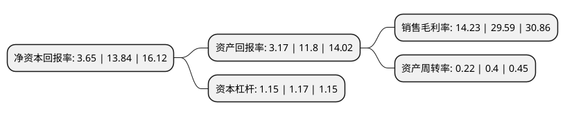

> 本页面由自动化程序生成于 2022年5月20日 01:13
> 内容可能存在错误，如有bug请提交issue至：https://github.com/Eroleice/doc-pi/issues
{.is-warning}

# 上市公司基本情况

## 基本资料

四川金时科技股份有限公司（以下简称“金时科技”）成立于2008年12月24日，成都市。于2019年03月15日在深交所中小板上市。

金时科技注册资本40,500万元，公司的主营业务为烟标等包装印刷品的研发，生产和销售。致力于为卷烟生产企业提供高品质的烟标产品，公司的主要产品为烟标，服务的卷烟品牌包括“芙蓉王”，“娇子”，“白沙”，“红塔山”，“云烟”，“利群”，“黄果树”，“黄山”，“红梅”，“宽窄”，“龙凤呈祥”，“天子”等。以下是详细信息：

- 公司名称: 四川金时科技股份有限公司
- 股票代码: 002951.SZ
- 所在地: 四川 - 成都市
- 成立日期: 2008年12月24日
- 注册资本: 40,500万元
- 法定代表人: 李海坚
- 主营业务: 公司的主营业务为烟标等包装印刷品的研发，生产和销售致力于为卷烟生产企业提供高品质的烟标产品，公司的主要产品为烟标，服务的卷烟品牌包括“芙蓉王”，“娇子”，“白沙”，“红塔山”，“云烟”，“利群”，“黄果树”，“黄山”，“红梅”，“宽窄”，“龙凤呈祥”，“天子”等
- 公司官网: www.jinshigp.com
- 公司介绍: 公司是一家以研发生产烟标等包装印刷品为主的企业，主要的包装印刷产品为烟标，是卷烟消费品的配套包装制品，具有防伪商标、外观形象、包装保护等功能。公司紧跟国内烟草行业的整合政策，积极应对国内卷烟行业向“大集团、大品牌”集中的趋势，采取“大市场”的策略，专业服务于大型烟草企业集团，为其高档卷烟提供配套的烟标产品。公司通过在高档烟标市场上的长期经营，与全国多个大型烟草集团建立了合作伙伴关系。公司目前主要客户包括湖南中烟、云南中烟、四川中烟、重庆中烟、贵州中烟、安徽中烟、河北中烟等，服务的卷烟品牌包括“芙蓉王”、“白沙”、“红塔山”、“云烟”、“玉溪”、“娇子”、“利群”、“黄果树”、“黄山”、“红梅”、“宽窄”、“龙凤呈祥”、“天子”、“钻石”等。

## 股东及高管情况

上市公司第一大股东为彩时集团有限公司，持股266,666,667股，占比65.84%，为上市公司实际控制人。

截至2022年03月31日，上市公司的前十大股东中，共有5名自然人股东，3名机构股东，1个产品账户，1个海外主体，其中5%以上大股东共有2名。上市公司前十大股东明细如下：

> 截至2022年03月31日，上市公司前十大股东信息如下：

| 股东名称 | 持股数量（股） | 持股比例 |
| --- | --- | --- |
| 彩时集团有限公司 | 266,666,667 | 65.84% |
| 深圳前海彩时投资管理有限公司 | 66,666,667 | 16.46% |
| 成都金时众志股权投资基金管理中心(有限合伙) | 1,948,233 | 0.48% |
| 郑荣岐 | 508,800 | 0.13% |
| 华泰证券股份有限公司 | 398,755 | 0.1% |
| 王圣翔 | 366,100 | 0.09% |
| 徐盈 | 294,200 | 0.07% |
| UBS AG | 293,178 | 0.07% |
| 王蕾 | 283,300 | 0.07% |
| 胡光辉 | 276,500 | 0.07% |

## 利润表分析

上市公司2021年总收入为3.86亿元，净利润为0.55亿元，实现盈利。

## 杜邦分析

> 数据列示周期：2021年 | 2020年 | 2019年
{.is-info}

上市公司的净资产收益率在近一年有所下降，下降幅度为-73.63%，其变化情况分解如下：
- 上市公司的销售毛利率在近一年下降了-51.91%，可能是生产效率的下降、商品原材料价格上涨或商品价格的下跌所致。
- 上市公司的资产周转率在近一年下降了-45%，可能是源自于更慢的销售回款或库存管理效果下降。
- 上市公司的财务杠杆比率在近一年下降了-1.71%，可能是减少负债降低财务费用。

