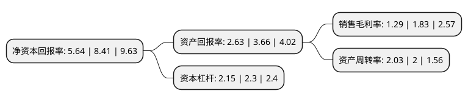

> 本页面由自动化程序生成于 2022年5月20日 01:14
> 内容可能存在错误，如有bug请提交issue至：https://github.com/Eroleice/doc-pi/issues
{.is-warning}

# 上市公司基本情况

## 基本资料

北京蓝色光标数据科技股份有限公司（以下简称“蓝色光标”）成立于2002年11月04日，北京市。于2010年02月26日在深交所创业板上市。

蓝色光标注册资本249,103.783万元，公司的主营业务属于公共关系服务，核心业务是为企业提供品牌管理服务，主要内容为品牌传播，产品推广，危机管理，活动管理，数字媒体营销，企业社会责任等一体化的链条式服务。以下是详细信息：

- 公司名称: 北京蓝色光标数据科技股份有限公司
- 股票代码: 300058.SZ
- 所在地: 北京 - 北京市
- 成立日期: 2002年11月04日
- 注册资本: 249,103.783万元
- 法定代表人: 潘安民
- 主营业务: 公司的主营业务属于公共关系服务，核心业务是为企业提供品牌管理服务，主要内容为品牌传播，产品推广，危机管理，活动管理，数字媒体营销，企业社会责任等一体化的链条式服务
- 公司官网: www.bluefocusgroup.com
- 公司介绍: 公司是一家在中国大陆为企业提供品牌管理服务的行业龙头企业，主要提供品牌传播、产品推广、危机管理、活动管理、数字媒体营销、企业社会责任等一体化的链条式服务。公司已在全国多个地区建立了服务网点，业务网络架构辐射面广。公司为最具竞争优势的公司之一，未来仍将保持较高速的发展态势。公司利用互联网技术，率先将公共关系服务与网络技术融合集成，创建了国内最早的互动营销部，是公共关系服务手段的创新。公司从事公共关系服务多年，通过大量成功案例积累了可复制的业务经验,部分案例评为中国公共关系案例大赛金奖，为开展业务提供了较好的借鉴经验。

## 股东及高管情况

上市公司第一大股东为赵文权，持股145,064,320股，占比5.82%，**疑似为**上市公司实际控制人。

截至2022年03月31日，上市公司的前十大股东中，共有7名自然人股东，1名机构股东，2个产品账户，其中5%以上大股东共有2名。上市公司前十大股东明细如下：

> 未能通过持股比例判定出上市公司实际控制人（持股30%以上）
> 可能存在通过间接持股、联合持股、协议控制等方式拥有实际控制权的主体，具体请参考上市公司定期公告！
{.is-warning}

> 上市公司第一大股东持股不超过10%，请检查是否存在公司控制权风险！
{.is-danger}

> 截至2022年03月31日，上市公司前十大股东信息如下：

| 股东名称 | 持股数量（股） | 持股比例 |
| --- | --- | --- |
| 赵文权 | 145,064,320 | 5.82% |
| 拉卡拉支付股份有限公司 | 144,000,000 | 5.78% |
| 孙陶然 | 80,636,314 | 3.24% |
| 李芃 | 78,573,211 | 3.15% |
| 建信基金-兴业银行-北京领瑞投资管理有限公司 | 68,801,016 | 2.76% |
| 吴铁 | 49,490,100 | 1.99% |
| 陈良华 | 44,822,016 | 1.8% |
| 上海浦东发展银行股份有限公司-中欧创新未来18个月封闭运作混合型证券投资基金 | 32,790,982 | 1.32% |
| 王舰 | 26,825,100 | 1.08% |
| 高鹏 | 26,036,626 | 1.05% |

## 利润表分析

上市公司2021年总收入为400.77亿元，净利润为5.18亿元，实现盈利。

## 杜邦分析

> 数据列示周期：2021年 | 2020年 | 2019年
{.is-info}

上市公司的净资产收益率在近一年有所下降，下降幅度为-32.94%，其变化情况分解如下：
- 上市公司的销售毛利率在近一年下降了-29.51%，可能是生产效率的下降、商品原材料价格上涨或商品价格的下跌所致。
- 上市公司的资产周转率在近一年上升了1.5%，可能是源自于更快的销售回款或库存管理效果提升。
- 上市公司的财务杠杆比率在近一年下降了-6.52%，可能是减少负债降低财务费用。

