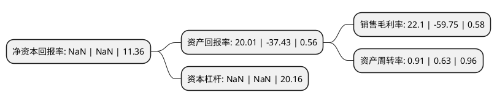

> 本页面由自动化程序生成于 2022年5月20日 01:14
> 内容可能存在错误，如有bug请提交issue至：https://github.com/Eroleice/doc-pi/issues
{.is-warning}

# 上市公司基本情况

## 基本资料

北京华谊嘉信整合营销顾问集团股份有限公司（以下简称“*ST嘉信”）成立于2003年01月23日，北京市。于2010年04月21日在深交所创业板上市。

*ST嘉信注册资本92,234.774万元，本公司的主要服务产品包括终端营销服务，活动营销服务和其他营销服务(互联网营销，促销品营销等)，为客户提供从营销策略，创意策划到执行管理的“一站式”营销服务。以下是详细信息：

- 公司名称: 北京华谊嘉信整合营销顾问集团股份有限公司
- 股票代码: 300071.SZ
- 所在地: 北京 - 北京市
- 成立日期: 2003年01月23日
- 注册资本: 92,234.774万元
- 法定代表人: 陈永亮
- 主营业务: 本公司的主要服务产品包括终端营销服务，活动营销服务和其他营销服务(互联网营销，促销品营销等)，为客户提供从营销策略，创意策划到执行管理的“一站式”营销服务
- 公司官网: www.spearhead.com.cn
- 公司介绍: 公司是本土最大的线下营销服务供应商之一，是业内少数具有整合营销传播服务能力的领军企业，依托优秀的策略创意能力和高效的执行管理能力等核心竞争优势，为客户提供从营销策略、创意策划到执行管理的“一站式”营销服务，帮助客户提升品牌形象、提高产品销量、提升营销活动的投入产出比，最大程度地为客户创造价值。公司已成功为众多国内外知名企业在提升品牌形象、提高产品销量方面提供了长期、稳定、优质的线下营销服务，其中包括惠普、微软、AMD、索尼爱立信、摩托罗拉、可口可乐、卡夫、吉百利、三星、飞利浦、西门子等世界500强企业，以及联想、伊利、王老吉、中粮集团等国内知名企业。

## 股东及高管情况

上市公司第一大股东为宋春静，持股76,831,967股，占比8.33%，**疑似为**上市公司实际控制人。

截至2022年05月16日，上市公司的前十大股东中，共有5名自然人股东，5名机构股东，其中5%以上大股东共有10名。上市公司前十大股东明细如下：

> 未能通过持股比例判定出上市公司实际控制人（持股30%以上）
> 可能存在通过间接持股、联合持股、协议控制等方式拥有实际控制权的主体，具体请参考上市公司定期公告！
{.is-warning}

> 上市公司第一大股东持股不超过10%，请检查是否存在公司控制权风险！
{.is-danger}

> 截至2022年05月16日，上市公司前十大股东信息如下：

| 股东名称 | 持股数量（股） | 持股比例 |
| --- | --- | --- |
| 宋春静 | 76,831,967 | 8.33% |
| 宋春静 | 76,831,967 | 8.33% |
| 杭州福石资产管理有限公司 | 75,725,147 | 8.21% |
| 杭州福石资产管理有限公司 | 75,725,147 | 8.21% |
| 刘伟 | 71,407,231 | 7.74% |
| 刘伟 | 71,406,639 | 7.74% |
| 刘伟 | 71,406,619 | 7.74% |
| 深圳市高新投集团有限公司 | 55,000,000 | 5.963% |
| 深圳市高新投集团有限公司 | 55,000,000 | 5.963% |
| 深圳市高新投集团有限公司 | 55,000,000 | 5.963% |

## 利润表分析

上市公司2021年总收入为10.35亿元，净利润为2.28亿元，实现盈利。

## 杜邦分析

> 数据列示周期：2021年 | 2020年 | 2019年
{.is-info}

上市公司的净资产收益率在近一年有所下降，下降幅度为NaN%，其变化情况分解如下：
- 上市公司的销售毛利率在近一年下降了-136.99%，可能是生产效率的下降、商品原材料价格上涨或商品价格的下跌所致。
- 上市公司的资产周转率在近一年上升了44.44%，可能是源自于更快的销售回款或库存管理效果提升。
- 上市公司的财务杠杆比率在近一年下降了NaN%，可能是减少负债降低财务费用。

