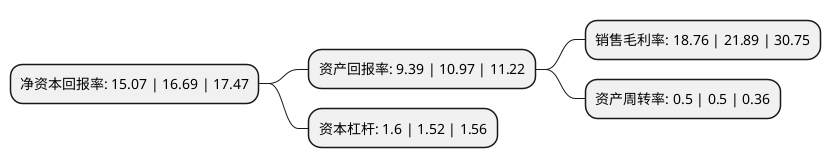

> 本页面由自动化程序生成于 2022年5月20日 01:16
> 内容可能存在错误，如有bug请提交issue至：https://github.com/Eroleice/doc-pi/issues
{.is-warning}

# 上市公司基本情况

## 基本资料

福建紫天传媒科技股份有限公司（以下简称“紫天科技”）成立于2002年03月21日，南通市。于2011年12月29日在深交所创业板上市。

紫天科技注册资本16,206.574万元，主营业务为专业从事锻压设备的研发，生产和销售，主要产品为液压机和机械压力机，属于国家重点鼓励和扶持的先进装备制造业，产品广泛应用于汽车，船舶，交通，能源，轻工家电，航空航天，军工，石油化工等重要行业或领域。以下是详细信息：

- 公司名称: 福建紫天传媒科技股份有限公司
- 股票代码: 300280.SZ
- 所在地: 江苏 - 南通市
- 成立日期: 2002年03月21日
- 注册资本: 16,206.574万元
- 法定代表人: 姚小欣
- 主营业务: 主营业务为专业从事锻压设备的研发，生产和销售，主要产品为液压机和机械压力机，属于国家重点鼓励和扶持的先进装备制造业，产品广泛应用于汽车，船舶，交通，能源，轻工家电，航空航天，军工，石油化工等重要行业或领域
- 公司官网: www.ntdy.com.cn
- 公司介绍: 公司是国内生产液压机三大龙头企业之一，专业从事锻压设备的研发、生产和销售，并为客户提供个性化、多样化、系统化金属及非金属成形解决方案。公司主要产品为各类液压机、机械压力机等数十个规格、上百个品种的锻压设备，拥有数十项授权专利、软件著作权，广泛用于汽车、航空航天、核电、军工、能源、化工、船舶等诸多行业和领域。公司项目“新型框架式数控液压机”、“双层摩擦材料自动成型液压机”被科技部列入国家火炬计划项目，“大型高性能框架精密成型液压机”被列入江苏省2010年重大科技成果转化专项资金项目。公司产品和品牌分别被评为“江苏省名牌产品”、“江苏省著名商标”。公司被认定为“高新技术企业”、“江苏省创新型企业”、“江苏省民营科技企业”、“江苏省科技型中小企业”。2018年公司通过重大资产重组收购亿家晶视70%股权,公司主营业务拓展至商务楼宇视频广告行业，打造具备国内领先的集楼宇视频媒体广告投放和移动互联网广告精准投放为一体的“全媒体”广告业务板块，进一步深化现代广告服务业产业布局。

## 股东及高管情况

上市公司第一大股东为新余市安常投资中心(有限合伙)，持股33,500,000股，占比20.67%，**疑似为**上市公司实际控制人。

截至2022年03月31日，上市公司的前十大股东中，共有3名自然人股东，1名机构股东，6个产品账户，其中5%以上大股东共有1名。上市公司前十大股东明细如下：

> 未能通过持股比例判定出上市公司实际控制人（持股30%以上）
> 可能存在通过间接持股、联合持股、协议控制等方式拥有实际控制权的主体，具体请参考上市公司定期公告！
{.is-warning}

> 截至2022年03月31日，上市公司前十大股东信息如下：

| 股东名称 | 持股数量（股） | 持股比例 |
| --- | --- | --- |
| 新余市安常投资中心(有限合伙) | 33,500,000 | 20.67% |
| 中国工商银行股份有限公司-诺安成长混合型证券投资基金 | 8,088,880 | 4.99% |
| 广发证券股份有限公司-中庚小盘价值股票型证券投资基金 | 4,410,780 | 2.72% |
| 中国银行股份有限公司-华夏行业景气混合型证券投资基金 | 3,524,400 | 2.17% |
| 华泰证券股份有限公司-中庚价值领航混合型证券投资基金 | 3,477,058 | 2.15% |
| 平安银行股份有限公司-中庚价值品质一年持有期混合型证券投资基金 | 3,304,111 | 2.04% |
| 周立军 | 3,150,900 | 1.94% |
| 蒋鹏 | 1,879,400 | 1.16% |
| 傅强 | 1,740,911 | 1.07% |
| 交通银行-汇丰晋信动态策略混合型证券投资基金 | 1,688,895 | 1.04% |

## 利润表分析

上市公司2021年总收入为16.5亿元，净利润为3.09亿元，实现盈利。

## 杜邦分析

> 数据列示周期：2021年 | 2020年 | 2019年
{.is-info}

上市公司的净资产收益率在近一年有所下降，下降幅度为-9.71%，其变化情况分解如下：
- 上市公司的销售毛利率在近一年下降了-14.3%，可能是生产效率的下降、商品原材料价格上涨或商品价格的下跌所致。
- 上市公司的资产周转率在近一年下降了0%，可能是源自于更慢的销售回款或库存管理效果下降。
- 上市公司的财务杠杆比率在近一年上升了5.26%，可能是增加负债扩大生产规模。

