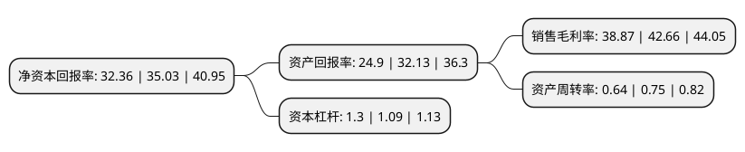

> 本页面由自动化程序生成于 2022年5月20日 01:22
> 内容可能存在错误，如有bug请提交issue至：https://github.com/Eroleice/doc-pi/issues
{.is-warning}

# 上市公司基本情况

## 基本资料

兆讯传媒广告股份有限公司（以下简称“兆讯传媒”）成立于2007年09月30日，天津市。于2022年03月28日在深交所创业板上市。

兆讯传媒注册资本20,000万元，从事高铁数字媒体资源的开发，运营和广告发布业务。公司主要通过高铁数字媒体网络为客户提供广告发布服务，采购的内容主要为高铁站的媒体资源和数字媒体设备。根据营销对象的区别，公司将客户分为广告主和广告代理公司两类，销售全部通过直接销售完成。以下是详细信息：

- 公司名称: 兆讯传媒广告股份有限公司
- 股票代码: 301102.SZ
- 所在地: 天津 - 天津市
- 成立日期: 2007年09月30日
- 注册资本: 20,000万元
- 法定代表人: 苏壮强
- 主营业务: 从事高铁数字媒体资源的开发，运营和广告发布业务公司主要通过高铁数字媒体网络为客户提供广告发布服务，采购的内容主要为高铁站的媒体资源和数字媒体设备根据营销对象的区别，公司将客户分为广告主和广告代理公司两类，销售全部通过直接销售完成
- 公司官网: www.zhaoxunmedia.com
- 公司介绍: 公司是国内专业的高铁数字媒体运营商，自2007年成立以来，一直专注开发铁路客运站数字媒体。本招股意向书签署日，公司已与国内18家铁路局集团中的17家签署了媒体资源使用协议，签约铁路客运站558个，开通运营铁路客运站432个，其中90%以上属于高铁站(含动车)，运营5,607块数字媒体屏幕，为高铁数字媒体广告行业中媒体资源覆盖最广泛的数字媒体运营商之一。

## 股东及高管情况

上市公司第一大股东为联美量子股份有限公司，持股148,500,000股，占比74.25%，为上市公司实际控制人。

截至2022年03月31日，上市公司的前十大股东中，共有1名自然人股东，3名机构股东，6个产品账户，其中5%以上大股东共有1名。上市公司前十大股东明细如下：

> 截至2022年03月31日，上市公司前十大股东信息如下：

| 股东名称 | 持股数量（股） | 持股比例 |
| --- | --- | --- |
| 联美量子股份有限公司 | 148,500,000 | 74.25% |
| 安信证券资管-农业银行-安信资管兆讯传媒高管参与创业板战略配售集合资产管理计划 | 2,507,522 | 1.25% |
| 沈阳华新联美资产管理有限公司 | 1,500,000 | 0.75% |
| 中信信托有限责任公司-中信信托成泉汇涌八期金融投资集合资金信托计划 | 595,200 | 0.3% |
| 安信证券股份有限公司 | 493,886 | 0.25% |
| 中信信托有限责任公司-中信信托鑫涌成泉金融投资集合资金信托计划 | 478,554 | 0.24% |
| 上海孝庸资产管理有限公司-孝庸资产-招享平衡1号私募证券投资基金 | 270,176 | 0.14% |
| 吴俊杰 | 251,473 | 0.13% |
| 北京成泉资本管理有限公司-裕霖1号私募证券投资基金 | 225,633 | 0.11% |
| 北京成泉资本管理有限公司-鑫沣1号私募证券投资基金 | 192,018 | 0.1% |

## 利润表分析

上市公司2021年总收入为6.19亿元，净利润为2.4亿元，实现盈利。

## 杜邦分析

> 数据列示周期：2021年 | 2020年 | 2019年
{.is-info}

上市公司的净资产收益率在近一年有所下降，下降幅度为-7.62%，其变化情况分解如下：
- 上市公司的销售毛利率在近一年下降了-8.88%，可能是生产效率的下降、商品原材料价格上涨或商品价格的下跌所致。
- 上市公司的资产周转率在近一年下降了-14.67%，可能是源自于更慢的销售回款或库存管理效果下降。
- 上市公司的财务杠杆比率在近一年上升了19.27%，可能是增加负债扩大生产规模。

