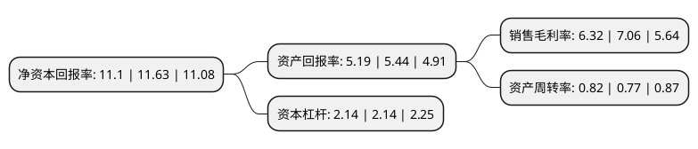

> 本页面由自动化程序生成于 2022年5月20日 01:25
> 内容可能存在错误，如有bug请提交issue至：https://github.com/Eroleice/doc-pi/issues
{.is-warning}

# 上市公司基本情况

## 基本资料

上海紫江企业集团股份有限公司（以下简称“紫江企业”）成立于1988年11月23日，上海市。于1999年08月24日在上交所主板上市。

紫江企业注册资本151,673.616万元，主要产品:PET瓶及瓶坯，皇冠盖，标签，塑料防盗盖，纸包装印刷。以下是详细信息：

- 公司名称: 上海紫江企业集团股份有限公司
- 股票代码: 600210.SH
- 所在地: 上海 - 上海市
- 成立日期: 1988年11月23日
- 注册资本: 151,673.616万元
- 法定代表人: 沈雯
- 主营业务: 主要产品:PET瓶及瓶坯，皇冠盖，标签，塑料防盗盖，纸包装印刷
- 公司官网: www.zijiangqy.com
- 公司介绍: 公司是具有环保概念的都市型创新材料产业。经过多年的发展，公司主营生产和销售各种PET瓶及瓶坯、皇冠盖、塑料防盗盖、标签、喷铝纸及纸板、彩色纸包装印刷、薄膜等包装材料以及饮料OEM等产品，在生产规模、技术水平、质量水平、销售收经济效益方面均处于国内同行业领先地位。公司始终保持着锐意进取的精神，以可持续发展为宗旨，以提高经济效益为目标，以客户增值服务为导向，不断完善管理与资源整合。在包装印刷及新材料制造领域，公司在引进国际先进设备和技术的基础上，结合国内食品饮料、包装材料及其它新型材料行业的发展趋势，加强产品的科研力度，提升产品科研含量。

## 股东及高管情况

上市公司第一大股东为上海紫江(集团)有限公司，持股395,207,773股，占比26.06%，**疑似为**上市公司实际控制人。

截至2022年03月31日，上市公司的前十大股东中，共有2名自然人股东，1名机构股东，6个产品账户，1个海外主体，其中5%以上大股东共有1名。上市公司前十大股东明细如下：

> 未能通过持股比例判定出上市公司实际控制人（持股30%以上）
> 可能存在通过间接持股、联合持股、协议控制等方式拥有实际控制权的主体，具体请参考上市公司定期公告！
{.is-warning}

> 截至2022年03月31日，上市公司前十大股东信息如下：

| 股东名称 | 持股数量（股） | 持股比例 |
| --- | --- | --- |
| 上海紫江(集团)有限公司 | 395,207,773 | 26.06% |
| 上海浦东发展银行股份有限公司-景顺长城新能源产业股票型证券投资基金 | 52,812,472 | 3.48% |
| 香港中央结算有限公司(陆股通) | 50,006,087 | 3.3% |
| 黄允革 | 27,056,349 | 1.78% |
| 上海浦东发展银行股份有限公司-易方达裕祥回报债券型证券投资基金 | 17,849,900 | 1.18% |
| 中国建设银行股份有限公司-广发科技创新混合型证券投资基金 | 9,349,600 | 0.62% |
| 中国人寿保险股份有限公司-传统-普通保险产品-005L-CT001沪 | 8,097,100 | 0.53% |
| 张萍英 | 8,068,972 | 0.53% |
| 上海浦东发展银行股份有限公司-易方达瑞程灵活配置混合型证券投资基金 | 7,236,500 | 0.48% |
| 中国建设银行股份有限公司-景顺长城环保优势股票型证券投资基金 | 6,069,531 | 0.4% |

## 利润表分析

上市公司2021年总收入为95.28亿元，净利润为6.02亿元，实现盈利。

## 杜邦分析

> 数据列示周期：2021年 | 2020年 | 2019年
{.is-info}

上市公司的净资产收益率在近一年有所下降，下降幅度为-4.56%，其变化情况分解如下：
- 上市公司的销售毛利率在近一年下降了-10.48%，可能是生产效率的下降、商品原材料价格上涨或商品价格的下跌所致。
- 上市公司的资产周转率在近一年上升了6.49%，可能是源自于更快的销售回款或库存管理效果提升。
- 上市公司的财务杠杆比率在近一年下降了0%，可能是减少负债降低财务费用。

