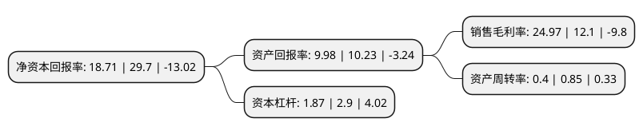

> 本页面由自动化程序生成于 2022年5月20日 01:29
> 内容可能存在错误，如有bug请提交issue至：https://github.com/Eroleice/doc-pi/issues
{.is-warning}

# 上市公司基本情况

## 基本资料

上海易连实业集团股份有限公司（以下简称“上海易连”）成立于1994年01月05日，上海市。于1994年02月24日在上交所主板上市。

上海易连注册资本67,105.307万元，主要业务:印刷包装装潢，PS版版材，商品房开发。以下是详细信息：

- 公司名称: 上海易连实业集团股份有限公司
- 股票代码: 600836.SH
- 所在地: 上海 - 上海市
- 成立日期: 1994年01月05日
- 注册资本: 67,105.307万元
- 法定代表人: 赵宏光
- 主营业务: 印刷包装装潢，PS版版材，商品房开发
- 公司官网: www.eliansy.com
- 公司介绍: 公司坚持走规模化和专业化发展道路，形成印刷包装和房地产开发两大主业，兼营食品饮料、金属制品、酒店与休闲等多元产业。公司印刷包装主业发展迅速，实力雄厚，有多家专门从事各类包装印刷、书刊、报纸、商业票据等的生产企业，形成了创意策划、设计、制版、印刷及印后加工、物流配送一体化服务的产业链。公司先后获评上海市著名商标、中国驰名商标、中国出版奖先进出版单位、国家文化出口重点企业、国家印刷复制示范企业、中国印刷行业企业信用AAA级、全国轻工业卓越绩效先进企业奖。

## 股东及高管情况

上市公司第一大股东为杭州浙发易连商务管理合伙企业(有限合伙)，持股180,468,652股，占比26.89%，**疑似为**上市公司实际控制人。

截至2022年03月31日，上市公司的前十大股东中，共有8名自然人股东，1名机构股东，1个产品账户，其中5%以上大股东共有1名。上市公司前十大股东明细如下：

> 未能通过持股比例判定出上市公司实际控制人（持股30%以上）
> 可能存在通过间接持股、联合持股、协议控制等方式拥有实际控制权的主体，具体请参考上市公司定期公告！
{.is-warning}

> 截至2022年03月31日，上市公司前十大股东信息如下：

| 股东名称 | 持股数量（股） | 持股比例 |
| --- | --- | --- |
| 杭州浙发易连商务管理合伙企业(有限合伙) | 180,468,652 | 26.89% |
| 俞习文 | 7,586,000 | 1.13% |
| 龚圣平 | 7,236,460 | 1.08% |
| 张爱芬 | 5,252,002 | 0.78% |
| 温州启元资产管理有限公司-启元尊享7号私募证券投资基金 | 4,360,220 | 0.65% |
| 沈忠彬 | 4,051,874 | 0.6% |
| 姜胜军 | 4,000,000 | 0.6% |
| 王德辉 | 3,485,000 | 0.52% |
| 朱红美 | 3,411,200 | 0.51% |
| 王薇 | 3,163,900 | 0.47% |

## 利润表分析

上市公司2021年总收入为8.33亿元，净利润为2.08亿元，实现盈利。

## 杜邦分析

> 数据列示周期：2021年 | 2020年 | 2019年
{.is-info}

上市公司的净资产收益率在近一年有所下降，下降幅度为-37%，其变化情况分解如下：
- 上市公司的销售毛利率在近一年上升了106.36%，可能是生产效率的提升、商品原材料价格下跌或商品价格的上涨所致。
- 上市公司的资产周转率在近一年下降了-52.94%，可能是源自于更慢的销售回款或库存管理效果下降。
- 上市公司的财务杠杆比率在近一年下降了-35.52%，可能是减少负债降低财务费用。

