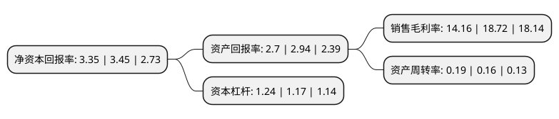

> 本页面由自动化程序生成于 2022年5月20日 01:29
> 内容可能存在错误，如有bug请提交issue至：https://github.com/Eroleice/doc-pi/issues
{.is-warning}

# 上市公司基本情况

## 基本资料

成都博瑞传播股份有限公司（以下简称“博瑞传播”）成立于1966年10月19日，成都市。于1995年11月15日在上交所主板上市。

博瑞传播注册资本109,333.209万元，主要业务:印刷业务，广告业务，新闻纸销售业务，发行投递业务。以下是详细信息：

- 公司名称: 成都博瑞传播股份有限公司
- 股票代码: 600880.SH
- 所在地: 四川 - 成都市
- 成立日期: 1966年10月19日
- 注册资本: 109,333.209万元
- 法定代表人: 母涛
- 主营业务: 印刷业务，广告业务，新闻纸销售业务，发行投递业务
- 公司官网: www.b-raymedia.com
- 公司介绍: 公司是一家大型媒体经营集团。主营业务为教育、游戏、广告。公司主要以K12教育为主展开学校及培训机构业务；以自主研发游戏产品，与一流游戏运营平台联合运营游戏项目，自主推进游戏产品的海外发行等方式拓展公司的新媒体游戏业务；以竞拍、自建等方式获取、经营户外广告业务；同时兼营小额贷款、楼宇租赁等业务。

## 股东及高管情况

上市公司第一大股东为成都博瑞投资控股集团有限公司，持股255,519,676股，占比23.37%，**疑似为**上市公司实际控制人。

截至2022年03月31日，上市公司的前十大股东中，共有7名自然人股东，1名机构股东，1个产品账户，1名其他股东，其中5%以上大股东共有2名。上市公司前十大股东明细如下：

> 未能通过持股比例判定出上市公司实际控制人（持股30%以上）
> 可能存在通过间接持股、联合持股、协议控制等方式拥有实际控制权的主体，具体请参考上市公司定期公告！
{.is-warning}

> 截至2022年03月31日，上市公司前十大股东信息如下：

| 股东名称 | 持股数量（股） | 持股比例 |
| --- | --- | --- |
| 成都博瑞投资控股集团有限公司 | 255,519,676 | 23.37% |
| 成都传媒集团 | 133,612,937 | 12.22% |
| 顾青 | 33,234,600 | 3.04% |
| 易方达基金-中央汇金资产管理有限责任公司-易方达基金-汇金资管单一资产管理计划 | 16,853,900 | 1.54% |
| 杨杰 | 13,200,000 | 1.21% |
| 顾国绵 | 12,510,100 | 1.14% |
| 戴隆兰 | 9,873,702 | 0.9% |
| 陈长志 | 9,356,600 | 0.86% |
| 徐嫣婷 | 8,281,854 | 0.76% |
| 黄笑 | 6,096,645 | 0.56% |

## 利润表分析

上市公司2021年总收入为6.98亿元，净利润为0.9亿元，实现盈利。

## 杜邦分析

> 数据列示周期：2021年 | 2020年 | 2019年
{.is-info}

上市公司的净资产收益率在近一年有所下降，下降幅度为-2.9%，其变化情况分解如下：
- 上市公司的销售毛利率在近一年下降了-24.36%，可能是生产效率的下降、商品原材料价格上涨或商品价格的下跌所致。
- 上市公司的资产周转率在近一年上升了18.75%，可能是源自于更快的销售回款或库存管理效果提升。
- 上市公司的财务杠杆比率在近一年上升了5.98%，可能是增加负债扩大生产规模。

