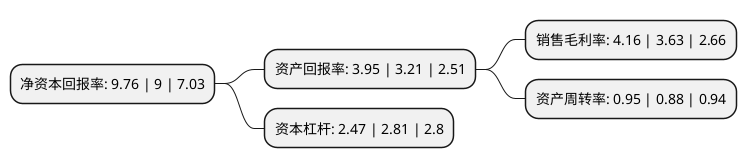

> 本页面由自动化程序生成于 2022年5月20日 01:32
> 内容可能存在错误，如有bug请提交issue至：https://github.com/Eroleice/doc-pi/issues
{.is-warning}

# 上市公司基本情况

## 基本资料

上海宝钢包装股份有限公司（以下简称“宝钢包装”）成立于2004年03月26日，上海市。于2015年06月11日在上交所主板上市。

宝钢包装注册资本113,303.917万元，主营业务:公司主要致力于高端金属包装产品的研制，生产与销售。主要产品:经过多年的发展，公司形成并发展了金属二片饮料罐，印铁以及易拉盖等业务和产品。以下是详细信息：

- 公司名称: 上海宝钢包装股份有限公司
- 股票代码: 601968.SH
- 所在地: 上海 - 上海市
- 成立日期: 2004年03月26日
- 注册资本: 113,303.917万元
- 法定代表人: 曹清
- 主营业务: 主营业务:公司主要致力于高端金属包装产品的研制，生产与销售主要产品:经过多年的发展，公司形成并发展了金属二片饮料罐，印铁以及易拉盖等业务和产品
- 公司官网: www.baosteelpackaging.com
- 公司介绍: 公司前身为上海宝钢包装有限公司。公司是国内专业从事生产饮料、食品等快速消费品金属包装的龙头企业，产品包括金属二片罐及配套易拉盖和印铁产品，为国内快速消费品高端金属包装领域的领导者和行业标准制定者之一。目前，公司的二片罐产品拥有可口可乐、百事可乐、百威啤酒、喜力啤酒、青岛啤酒等国内外知名饮料品牌客户，并与可口可乐、百威啤酒和奥瑞金等结成了战略同盟，供罐数量近年来持续稳定增长。印铁产品广泛应用于红牛、旺旺、露露、惠尔康等国内外知名饮料品牌，梅林和古龙等国内知名食品品牌以及中石化等国内知名化工品牌。公司是国内一家同时具备钢制二片罐和铝制二片罐生产能力的企业，同时公司还拥有国内规模大、技术领先、装备先进的印铁业务。公司定位于国内乃至世界的金属包装行业领导者，引导新产品发展方向，开拓金属包装新领域，为客户提供全方位、一体化的精品金属包装服务。

## 股东及高管情况

上市公司第一大股东为宝钢金属有限公司，持股470,368,593股，占比41.51%，为上市公司实际控制人。

截至2022年03月31日，上市公司的前十大股东中，共有1名自然人股东，4名机构股东，5个产品账户，其中5%以上大股东共有3名。上市公司前十大股东明细如下：

> 截至2022年03月31日，上市公司前十大股东信息如下：

| 股东名称 | 持股数量（股） | 持股比例 |
| --- | --- | --- |
| 宝钢金属有限公司 | 470,368,593 | 41.51% |
| 中国宝武钢铁集团有限公司 | 186,443,738 | 16.46% |
| 三峡金石(武汉)股权投资基金合伙企业(有限合伙) | 82,926,002 | 7.32% |
| 中国工商银行股份有限公司-中欧价值智选回报混合型证券投资基金 | 37,145,384 | 3.28% |
| 安徽交控金石并购基金合伙企业(有限合伙) | 25,914,400 | 2.29% |
| 华宝投资有限公司 | 19,198,718 | 1.69% |
| 平安银行股份有限公司-中欧新兴价值一年持有期混合型证券投资基金 | 11,171,200 | 0.99% |
| 宝钢集团南通线材制品有限公司 | 9,599,359 | 0.85% |
| 谢志远 | 9,380,000 | 0.83% |
| 上海珺容资产管理有限公司-珺容聚金1号私募证券投资基金 | 9,250,000 | 0.82% |

## 利润表分析

上市公司2021年总收入为69.68亿元，净利润为2.89亿元，实现盈利。

## 杜邦分析

> 数据列示周期：2021年 | 2020年 | 2019年
{.is-info}

上市公司的净资产收益率在近一年有所上升，上升幅度为8.44%，其变化情况分解如下：
- 上市公司的销售毛利率在近一年上升了14.6%，可能是生产效率的提升、商品原材料价格下跌或商品价格的上涨所致。
- 上市公司的资产周转率在近一年上升了7.95%，可能是源自于更快的销售回款或库存管理效果提升。
- 上市公司的财务杠杆比率在近一年下降了-12.1%，可能是减少负债降低财务费用。

