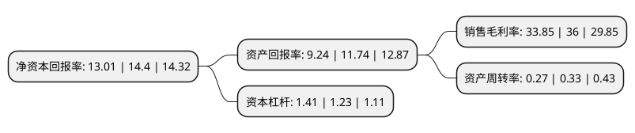

> 本页面由自动化程序生成于 2022年5月20日 01:32
> 内容可能存在错误，如有bug请提交issue至：https://github.com/Eroleice/doc-pi/issues
{.is-warning}

# 上市公司基本情况

## 基本资料

贵州永吉印务股份有限公司（以下简称“永吉股份”）成立于1997年03月12日，贵阳市。于2016年12月23日在上交所主板上市。

永吉股份注册资本41,907.44万元，主要产品:以烟标产品为主，兼顾药包的产品线。主营业务:烟标和其他包装印刷品的设计，生产和销售。以下是详细信息：

- 公司名称: 贵州永吉印务股份有限公司
- 股票代码: 603058.SH
- 所在地: 贵州 - 贵阳市
- 成立日期: 1997年03月12日
- 注册资本: 41,907.44万元
- 法定代表人: 邓代兴
- 主营业务: 主要产品:以烟标产品为主，兼顾药包的产品线主营业务:烟标和其他包装印刷品的设计，生产和销售
- 公司官网: www.yongjigf.com
- 公司介绍: 公司创建于1997年，是集卷烟商标设计、技术开发、印刷为主的大型包装企业，主要从事商标包装印刷业务，长期为贵州省中烟工业公司提供烟用物资(卷烟盒、条包装纸)的印刷配套业务。公司通过了ISO9001：2015《质量管理体系》、GB/T28001：2011《职业健康安全管理体系》、ISO14001：2016《环境管理体系》等多项体系认证。公司先后获得“贵州省重合同守信用企业”、“贵州省民营经济百强企业”、“贵州省文化产业示范基地”、“贵州省安全标准化三级企业”、“贵州省诚信示范企业”“贵阳市生态文明企业”、“贵阳市纳税百强企业”、“云岩区纳税十强企业”等多项殊荣。

## 股东及高管情况

上市公司第一大股东为贵州永吉控股有限责任公司，持股172,566,200股，占比41.18%，为上市公司实际控制人。

截至2022年04月08日，上市公司的前十大股东中，共有3名自然人股东，7名机构股东，其中5%以上大股东共有10名。上市公司前十大股东明细如下：

> 截至2022年04月08日，上市公司前十大股东信息如下：

| 股东名称 | 持股数量（股） | 持股比例 |
| --- | --- | --- |
| 贵州永吉控股有限责任公司 | 172,566,200 | 41.18% |
| 贵州永吉控股有限责任公司 | 172,566,200 | 41.18% |
| 贵州云商印务有限公司 | 32,639,900 | 7.7886% |
| 贵州云商印务有限公司 | 28,845,900 | 6.88% |
| 贵州云商印务有限公司 | 28,845,900 | 6.88% |
| 贵州裕美纸业有限责任公司 | 28,434,000 | 6.785% |
| 贵州裕美纸业有限责任公司 | 28,434,000 | 6.785% |
| 邓维加 | 22,000,000 | 5.25% |
| 邓维加 | 22,000,000 | 5.25% |
| 邓维加 | 22,000,000 | 5.25% |

## 利润表分析

上市公司2021年总收入为4.35亿元，净利润为1.47亿元，实现盈利。

## 杜邦分析

> 数据列示周期：2021年 | 2020年 | 2019年
{.is-info}

上市公司的净资产收益率在近一年有所下降，下降幅度为-9.65%，其变化情况分解如下：
- 上市公司的销售毛利率在近一年下降了-5.97%，可能是生产效率的下降、商品原材料价格上涨或商品价格的下跌所致。
- 上市公司的资产周转率在近一年下降了-18.18%，可能是源自于更慢的销售回款或库存管理效果下降。
- 上市公司的财务杠杆比率在近一年上升了14.63%，可能是增加负债扩大生产规模。

