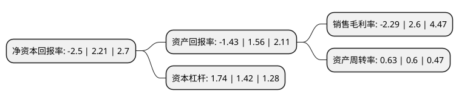

> 本页面由自动化程序生成于 2022年5月20日 01:34
> 内容可能存在错误，如有bug请提交issue至：https://github.com/Eroleice/doc-pi/issues
{.is-warning}

# 上市公司基本情况

## 基本资料

上海翔港包装科技股份有限公司（以下简称“翔港科技”）成立于2006年08月30日，上海市。于2017年10月16日在上交所主板上市。

翔港科技注册资本20,118.192万元，主营业务:主要从事彩盒，标签等相关包装印刷产品的研发，生产和销售，主要为日化，食品生产企业提供全方位的包装印刷服务。主要产品:包装印刷产品主要包括彩盒，标签两大系列。以下是详细信息：

- 公司名称: 上海翔港包装科技股份有限公司
- 股票代码: 603499.SH
- 所在地: 上海 - 上海市
- 成立日期: 2006年08月30日
- 注册资本: 20,118.192万元
- 法定代表人: 董建军
- 主营业务: 主营业务:主要从事彩盒，标签等相关包装印刷产品的研发，生产和销售，主要为日化，食品生产企业提供全方位的包装印刷服务主要产品:包装印刷产品主要包括彩盒，标签两大系列
- 公司官网: www.sunglow-tec.com
- 公司介绍: 公司是国内优秀的包装印刷一体化解决方案供应商，公司主要从事彩盒、标签等相关包装印刷产品的研发、生产和销售，主要为日化、食品生产企业提供全方位的包装印刷服务。公司成立以来，以对印刷包装效果、质量、功能性要求较高的日化行业为核心，通过多年的研发及技术积累，将产品从单一的基础纸质基材拓展到以卡纸、复合纸、环保纸、微细瓦楞纸、塑料等多种材料为基材的包装印刷产品，并且形成了从产品设计、方案优化、加工生产到第三方采购与包装产品物流配送、供应商库存管理以及辅助包装作业的一体化业务模式。公司先后被评为“上海市优秀印刷企业”、“中国纸包装工业纸箱彩盒50强企业”等诸多荣誉。

## 股东及高管情况

上市公司第一大股东为董建军，持股72,681,300股，占比36.13%，为上市公司实际控制人。

截至2022年03月31日，上市公司的前十大股东中，共有6名自然人股东，2名机构股东，2个产品账户，其中5%以上大股东共有3名。上市公司前十大股东明细如下：

> 截至2022年03月31日，上市公司前十大股东信息如下：

| 股东名称 | 持股数量（股） | 持股比例 |
| --- | --- | --- |
| 董建军 | 72,681,300 | 36.13% |
| 上海翔湾投资咨询有限公司 | 42,638,100 | 21.19% |
| 上海牧鑫资产管理有限公司-牧鑫青铜2号私募证券投资基金 | 17,600,000 | 8.75% |
| 上海通怡投资管理有限公司-通怡东风12号私募证券投资基金 | 6,490,000 | 3.23% |
| 董旺生 | 5,787,100 | 2.88% |
| 孙建昌 | 2,532,354 | 1.26% |
| 黄业琼 | 1,800,000 | 0.89% |
| 孙延昌 | 1,523,252 | 0.76% |
| 北京雅宝路老番街服装市场有限公司 | 808,216 | 0.4% |
| 蔡文燕 | 789,520 | 0.39% |

## 利润表分析

上市公司2021年总收入为6.47亿元，净利润为-0.15亿元，**未实现盈利**。

## 杜邦分析

> 数据列示周期：2021年 | 2020年 | 2019年
{.is-info}

上市公司的净资产收益率在近一年有所下降，下降幅度为-213.12%，其变化情况分解如下：
- 上市公司的销售毛利率在近一年下降了-188.08%，可能是生产效率的下降、商品原材料价格上涨或商品价格的下跌所致。
- 上市公司的资产周转率在近一年上升了5%，可能是源自于更快的销售回款或库存管理效果提升。
- 上市公司的财务杠杆比率在近一年上升了22.54%，可能是增加负债扩大生产规模。

