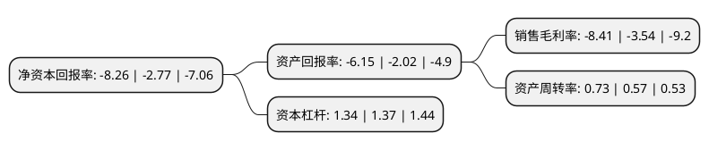

> 本页面由自动化程序生成于 2022年5月20日 01:35
> 内容可能存在错误，如有bug请提交issue至：https://github.com/Eroleice/doc-pi/issues
{.is-warning}

# 上市公司基本情况

## 基本资料

上海龙韵文创科技集团股份有限公司（以下简称“ST龙韵”）成立于2003年06月10日，上海市。于2015年03月24日在上交所主板上市。

ST龙韵注册资本9,333.8万元，公司主营业务包括电视广告媒介代理和广告全案服务业务。电视广告媒介代理业务，主要指公司代理客户进行媒介购买，媒介执行，以赚取差价的业务模式。广告全案服务业务是整合营销传播的应用，主要指公司为客户提供市场研究，品牌管理，创意设计，影视制作，广告策略，广告执行，广告评估等工作。以下是详细信息：

- 公司名称: 上海龙韵文创科技集团股份有限公司
- 股票代码: 603729.SH
- 所在地: 上海 - 上海市
- 成立日期: 2003年06月10日
- 注册资本: 9,333.8万元
- 法定代表人: 余亦坤
- 主营业务: 公司主营业务包括电视广告媒介代理和广告全案服务业务电视广告媒介代理业务，主要指公司代理客户进行媒介购买，媒介执行，以赚取差价的业务模式广告全案服务业务是整合营销传播的应用，主要指公司为客户提供市场研究，品牌管理，创意设计，影视制作，广告策略，广告执行，广告评估等工作
- 公司官网: www.obm.com.cn
- 公司介绍: 公司是专业从事品牌管理、广告全案服务及电视媒体广告经营的综合型广告公司。公司不断提升公司核心竞争力，为客户提供市场研究、品牌管理、创意设计、影视制作、广告策略、广告执行、广告评估的一站式全方位广告服务。与国际及本土客户的全案合作伙伴包括：美国亨氏、瑞士先正达、德国拜耳、青蛙王子、上海家化、中山榄菊、两面针芳草、绿源电动车、雁皇羽绒等众多国内外知名品牌。公司建立了“央视、省级(省级卫视及省级地面频道)、地市级”全国三级电视媒体广告资源平台，专为客户提供快捷、全面、科学的电视媒体代理服务。同时，公司稳步扩大、完善赋予电视广告代理经营差异化价值的媒体广告资源经营模式，通过与区域电视媒体签订长期独家代理协议，获得国际4A公司广告独家经营权及全频道广告独家经营权。公司在本土广告公司中的行业地位显著，公司先后获得“中国最具成长性本土广告公司100强”“中国本土广告公司综合实力50强”、“中国本土广告公司媒介代理10强”、“中国本土广告公司影视制作10强”；“中国最具影响力的广告公司100强”等诸多荣誉。

## 股东及高管情况

上市公司第一大股东为段佩璋，持股23,094,300股，占比24.74%，**疑似为**上市公司实际控制人。

截至2022年04月06日，上市公司的前十大股东中，共有9名自然人股东，1名机构股东，其中5%以上大股东共有5名。上市公司前十大股东明细如下：

> 未能通过持股比例判定出上市公司实际控制人（持股30%以上）
> 可能存在通过间接持股、联合持股、协议控制等方式拥有实际控制权的主体，具体请参考上市公司定期公告！
{.is-warning}

> 截至2022年04月06日，上市公司前十大股东信息如下：

| 股东名称 | 持股数量（股） | 持股比例 |
| --- | --- | --- |
| 段佩璋 | 23,094,300 | 24.74% |
| 卓淑英 | 5,899,460 | 6.3205% |
| 卓淑英 | 5,807,960 | 6.22% |
| 方小琴 | 4,746,000 | 5.08% |
| 方小琴 | 4,746,000 | 5.08% |
| 圣地亚哥科技(深圳)有限公司 | 2,401,580 | 2.57% |
| 许龙 | 2,170,000 | 2.32% |
| 严斌 | 1,300,698 | 1.39% |
| 彭前 | 1,105,000 | 1.18% |
| 庞德华 | 745,900 | 0.8% |

## 利润表分析

上市公司2021年总收入为7.39亿元，净利润为-0.63亿元，**未实现盈利**。

## 杜邦分析

> 数据列示周期：2021年 | 2020年 | 2019年
{.is-info}

上市公司的净资产收益率在近一年有所上升，上升幅度为198.19%，其变化情况分解如下：
- 上市公司的销售毛利率在近一年上升了137.57%，可能是生产效率的提升、商品原材料价格下跌或商品价格的上涨所致。
- 上市公司的资产周转率在近一年上升了28.07%，可能是源自于更快的销售回款或库存管理效果提升。
- 上市公司的财务杠杆比率在近一年下降了-2.19%，可能是减少负债降低财务费用。

