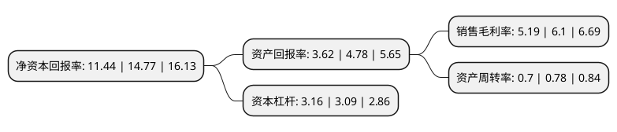

> 本页面由自动化程序生成于 2022年5月20日 01:01
> 内容可能存在错误，如有bug请提交issue至：https://github.com/Eroleice/doc-pi/issues
{.is-warning}

# 上市公司基本情况

## 基本资料

北方国际合作股份有限公司（以下简称“北方国际”）成立于1986年04月05日，北京市。于1998年06月05日在深交所主板上市。

北方国际注册资本77,448.351万元，主要业务:国际工程承包，国内建筑安装，产品生产销售。以下是详细信息：

- 公司名称: 北方国际合作股份有限公司
- 股票代码: 000065.SZ
- 所在地: 北京 - 北京市
- 成立日期: 1986年04月05日
- 注册资本: 77,448.351万元
- 法定代表人: 原军
- 主营业务: 国际工程承包，国内建筑安装，产品生产销售
- 公司官网: www.norinco-intl.com
- 公司介绍: 公司专注于国际市场的经营，多年来建立了遍布全球的营销网络，培育了强大的国际化经营能力和投融资能力，具有优秀的全球资源配置能力和项目管理能力。公司实现了国际工程与专业化产品贸易的有机融合，充分发挥投资的驱动作用，在轨道交通、电力工程、石油矿产设施建设、市政房建、房地产开发、重型车辆与装备、包装容器研发与生产、物流一体化服务、太阳能产品应用等方面具有优秀业绩与较强竞争力。公司业务范围广泛、专业能力突出，并具有强大的系统集成能力，可以为业主提供一体化和全方位的服务。公司高度重视企业信誉和企业社会责任，连续多年被中国对外承包工程商会和中国机电产品进出口商会评为“AAA级信用企业”。公司还通过了质量(GB/T19001-2008)、环境(GB/T24001-2004)、职业健康(GB/T28001-2011)管理体系认证、工程建设施工企业质量管理规范(GB/T50430-2007)认证。

## 股东及高管情况

上市公司第一大股东为中国北方工业有限公司，持股431,872,107股，占比43.11%，为上市公司实际控制人。

截至2022年04月25日，上市公司的前十大股东中，共有3名自然人股东，6名机构股东，1个产品账户，其中5%以上大股东共有3名。上市公司前十大股东明细如下：

> 截至2022年04月25日，上市公司前十大股东信息如下：

| 股东名称 | 持股数量（股） | 持股比例 |
| --- | --- | --- |
| 中国北方工业有限公司 | 431,872,107 | 43.11% |
| 北方工业科技有限公司 | 125,350,662 | 12.51% |
| 江苏悦达集团有限公司 | 52,439,094 | 5.23% |
| 中兵投资管理有限责任公司 | 30,010,711 | 3% |
| 西安北方惠安化学工业有限公司 | 19,928,789 | 1.99% |
| 交通银行股份有限公司-广发中证基建工程交易型开放式指数证券投资基金 | 6,274,195 | 0.63% |
| 靳晓齐 | 4,225,000 | 0.42% |
| 中车长春轨道客车股份有限公司 | 3,538,663 | 0.35% |
| 王淑月 | 2,824,445 | 0.28% |
| 孟地维 | 2,041,000 | 0.2% |

## 利润表分析

上市公司2021年总收入为130.5亿元，净利润为6.77亿元，实现盈利。

## 杜邦分析

> 数据列示周期：2021年 | 2020年 | 2019年
{.is-info}

上市公司的净资产收益率在近一年有所下降，下降幅度为-22.55%，其变化情况分解如下：
- 上市公司的销售毛利率在近一年下降了-14.92%，可能是生产效率的下降、商品原材料价格上涨或商品价格的下跌所致。
- 上市公司的资产周转率在近一年下降了-10.26%，可能是源自于更慢的销售回款或库存管理效果下降。
- 上市公司的财务杠杆比率在近一年上升了2.27%，可能是增加负债扩大生产规模。

