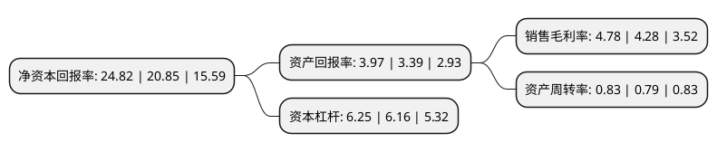

> 本页面由自动化程序生成于 2022年5月20日 01:01
> 内容可能存在错误，如有bug请提交issue至：https://github.com/Eroleice/doc-pi/issues
{.is-warning}

# 上市公司基本情况

## 基本资料

山东高速路桥集团股份有限公司（以下简称“山东路桥”）成立于1994年01月10日，济南市。于1997年06月09日在深交所主板上市。

山东路桥注册资本155,868.95万元，主营业务:路桥工程施工和养护施工以下是详细信息：

- 公司名称: 山东高速路桥集团股份有限公司
- 股票代码: 000498.SZ
- 所在地: 山东 - 济南市
- 成立日期: 1994年01月10日
- 注册资本: 155,868.95万元
- 法定代表人: 周新波
- 主营业务: 主营业务:路桥工程施工和养护施工
- 公司官网: www.sdlqgf.com
- 公司介绍: 公司具有多年从事路桥项目承揽、施工的业务经验，具备完整的业务体系和直接面向市场独立经营的能力，以路桥工程施工与养护施工为主营业务。公司先后四获国家建筑工程最高奖鲁班奖，十获国家优质工程金质奖和银质奖，两获国家科技进步奖，一获中国土木工程詹天佑奖，并创下我国公路与桥梁建设史上的诸多“第一”和“之最”。并通过ISO9001国际质量体系、ISO14001国际环境体系和OHSAS18000职业健康安全体系认证。近年来，公司先后获得“中国500家最佳经济效益建筑一级企业第10名”、“全国交通系统最佳经济效益建筑一级企业第2名”、“山东省加快公路建设先进单位”、“中国桥梁建设十大优秀团队”、“省级文明单位”、“全省思想政治工作优秀企业”、“中国建设银行AAA信用等级企业”、“全国守合同重信用企业”、“全国质量效益型先进企业”、“全国建筑业质量名牌企业”、“全国企业文化建设先进单位”、“全国建筑业诚信企业”、“全国模范职工之家”等称号。

## 股东及高管情况

上市公司第一大股东为山东高速集团有限公司，持股776,564,176股，占比49.78%，为上市公司实际控制人。

截至2022年04月08日，上市公司的前十大股东中，共有4名机构股东，5个产品账户，1个海外主体，其中5%以上大股东共有6名。上市公司前十大股东明细如下：

> 截至2022年04月08日，上市公司前十大股东信息如下：

| 股东名称 | 持股数量（股） | 持股比例 |
| --- | --- | --- |
| 山东高速集团有限公司 | 776,564,176 | 49.78% |
| 山东高速集团有限公司 | 776,564,176 | 49.78% |
| 山东铁路发展基金有限公司 | 138,368,604 | 8.87% |
| 山东铁路发展基金有限公司 | 122,946,104 | 7.88% |
| 山东高速投资控股有限公司 | 92,497,537 | 5.93% |
| 山东高速投资控股有限公司 | 92,497,537 | 5.93% |
| 香港中央结算有限公司(陆股通) | 14,093,982 | 0.9% |
| 中国建设银行股份有限公司-博时主题行业混合型证券投资基金(LOF) | 13,466,992 | 0.86% |
| 招商银行股份有限公司-工银瑞信战略远见混合型证券投资基金 | 11,423,541 | 0.73% |
| 全国社保基金一一六组合 | 7,635,393 | 0.49% |

## 利润表分析

上市公司2021年总收入为575.22亿元，净利润为27.51亿元，实现盈利。

## 杜邦分析

> 数据列示周期：2021年 | 2020年 | 2019年
{.is-info}

上市公司的净资产收益率在近一年有所上升，上升幅度为19.04%，其变化情况分解如下：
- 上市公司的销售毛利率在近一年上升了11.68%，可能是生产效率的提升、商品原材料价格下跌或商品价格的上涨所致。
- 上市公司的资产周转率在近一年上升了5.06%，可能是源自于更快的销售回款或库存管理效果提升。
- 上市公司的财务杠杆比率在近一年上升了1.46%，可能是增加负债扩大生产规模。

