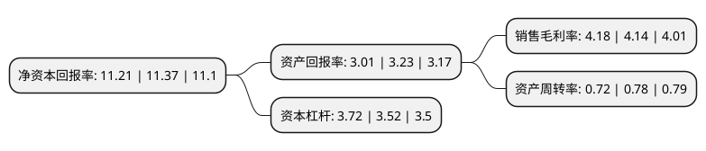

> 本页面由自动化程序生成于 2022年5月20日 01:04
> 内容可能存在错误，如有bug请提交issue至：https://github.com/Eroleice/doc-pi/issues
{.is-warning}

# 上市公司基本情况

## 基本资料

中钢国际工程技术股份有限公司（以下简称“中钢国际”）成立于1999年04月15日，吉林市。于1999年03月12日在深交所主板上市。

中钢国际注册资本128,091.91万元，主要业务:以钢铁，电力，煤焦化工和矿山项目建设为主的工业工程和工业服务，以城市基础设施PPP和城市轨道交通为主的市政工程和投资运营，以大气及固废治理，清洁能源利用为主的节能环保，以智能制造和新材料为核心的高新技术以下是详细信息：

- 公司名称: 中钢国际工程技术股份有限公司
- 股票代码: 000928.SZ
- 所在地: 吉林 - 吉林市
- 成立日期: 1999年04月15日
- 注册资本: 128,091.91万元
- 法定代表人: 陆鹏程
- 主营业务: 以钢铁，电力，煤焦化工和矿山项目建设为主的工业工程和工业服务，以城市基础设施PPP和城市轨道交通为主的市政工程和投资运营，以大气及固废治理，清洁能源利用为主的节能环保，以智能制造和新材料为核心的高新技术
- 公司官网: mecc.sinosteel.com
- 公司介绍: 公司定位于钢铁领域业务特强，矿业、电力、煤焦化工及其它非钢铁领域业务协调发展的工程技术公司，致力于打造中国一流、国际知名并具有一定投资运营能力的国际工程承包商。业务布局主要分为以钢铁、电力、煤焦化工和矿业为主的工业工程及工业服务、以城市基础设施和轨道交通为主的市政工程及投资运营、以大气及固废治理、清洁能源利用为主的节能环保、以智能制造和新材料开发为核心的高新技术四个方向。公司为中国首批对外承包工程AAA级信用企业，并先后被评为中国机电进出口企业(大型成套设备)AAA级信用企业、中国对外贸易AAA级信用企业和国际经营信用AAAAA级企业。

## 股东及高管情况

上市公司第一大股东为中国中钢股份有限公司，持股406,262,246股，占比31.71%，为上市公司实际控制人。

截至2022年03月31日，上市公司的前十大股东中，共有2名自然人股东，4名机构股东，3个产品账户，1个海外主体，其中5%以上大股东共有2名。上市公司前十大股东明细如下：

> 截至2022年03月31日，上市公司前十大股东信息如下：

| 股东名称 | 持股数量（股） | 持股比例 |
| --- | --- | --- |
| 中国中钢股份有限公司 | 406,262,246 | 31.71% |
| 中国中钢集团有限公司 | 247,723,642 | 19.34% |
| 中钢资产管理有限责任公司 | 44,016,017 | 3.44% |
| 金坚强 | 10,851,500 | 0.85% |
| 上海琦轩投资管理有限公司-琦轩乘时顺势3号私募证券投资基金 | 9,309,219 | 0.73% |
| 汤长征 | 9,025,680 | 0.7% |
| 交通银行股份有限公司-广发中证基建工程交易型开放式指数证券投资基金 | 9,005,153 | 0.7% |
| 上海琦轩投资管理有限公司-琦轩博弈5号私募证券投资基金 | 8,230,400 | 0.64% |
| 香港中央结算有限公司(陆股通) | 7,878,496 | 0.62% |
| 深圳市柏霖资产管理有限公司 | 6,405,808 | 0.5% |

## 利润表分析

上市公司2021年总收入为158.62亿元，净利润为6.62亿元，实现盈利。

## 杜邦分析

> 数据列示周期：2021年 | 2020年 | 2019年
{.is-info}

上市公司的净资产收益率在近一年有所下降，下降幅度为-1.41%，其变化情况分解如下：
- 上市公司的销售毛利率在近一年上升了0.97%，可能是生产效率的提升、商品原材料价格下跌或商品价格的上涨所致。
- 上市公司的资产周转率在近一年下降了-7.69%，可能是源自于更慢的销售回款或库存管理效果下降。
- 上市公司的财务杠杆比率在近一年上升了5.68%，可能是增加负债扩大生产规模。

