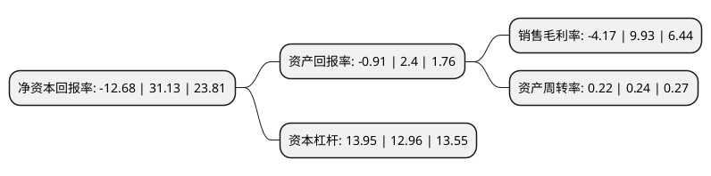

> 本页面由自动化程序生成于 2022年5月20日 01:04
> 内容可能存在错误，如有bug请提交issue至：https://github.com/Eroleice/doc-pi/issues
{.is-warning}

# 上市公司基本情况

## 基本资料

江苏中南建设集团股份有限公司（以下简称“中南建设”）成立于1998年07月28日，南通市。于2000年03月01日在深交所主板上市。

中南建设注册资本382,655.89万元，主营业务:土木工程建筑和房地产开发。以下是详细信息：

- 公司名称: 江苏中南建设集团股份有限公司
- 股票代码: 000961.SZ
- 所在地: 江苏 - 南通市
- 成立日期: 1998年07月28日
- 注册资本: 382,655.89万元
- 法定代表人: 陈锦石
- 主营业务: 主营业务:土木工程建筑和房地产开发
- 公司官网: www.zhongnangroup.cn
- 公司介绍: 公司成立于1988年2月，现有员工60000余人，其中博士、硕士600余人，本科7000余人。公司业务涵盖房地产开发、工程总承包、海绵城市建设、地下管廊建造、市政工程、安装等领域，业务遍及全国20多个省、100多个地县级城市。中南置地是集团旗下房地产旗舰品牌，公司建构起“美好就现在”的企业理念，率先推出健康住宅标准体系，为全国100城、300个项目、80万业主提供健康、智慧、人文的新城市美好生活方式，位列“2019中国房企综合实力TOP17”，同时荣获“2018中国商业地产TOP10”、“2019中国房企品牌价值TOP18”等殊荣。公司是国家特一级资质企业，中国建筑企业500强第8名，荣获鲁班奖25项、特别鲁班奖1项、詹天佑奖15项，以及钢结构金奖、中国建筑装饰奖等国家级大奖计50余项，获得扬子杯、长城杯、白玉兰杯、泰山杯等省级优质工程奖100余项。

## 股东及高管情况

上市公司第一大股东为中南城市建设投资有限公司，持股2,071,061,687股，占比54.12%，为上市公司实际控制人。

截至2022年03月31日，上市公司的前十大股东中，共有3名自然人股东，2名机构股东，4个产品账户，1个海外主体，其中5%以上大股东共有1名。上市公司前十大股东明细如下：

> 截至2022年03月31日，上市公司前十大股东信息如下：

| 股东名称 | 持股数量（股） | 持股比例 |
| --- | --- | --- |
| 中南城市建设投资有限公司 | 2,071,061,687 | 54.12% |
| 香港中央结算有限公司(陆股通) | 87,924,677 | 2.3% |
| 江伟朋 | 32,208,312 | 0.84% |
| 上海浦东发展银行股份有限公司-中欧创新未来18个月封闭运作混合型证券投资基金 | 28,144,700 | 0.74% |
| 瑞银资产管理(新加坡)有限公司-瑞银卢森堡投资SICAV | 26,423,867 | 0.69% |
| 陈昱含 | 14,413,997 | 0.38% |
| 国寿安保基金-中国人寿保险股份有限公司-万能险-国寿股份委托国寿安保红利增长股票组合单一资产管理计划 | 14,042,400 | 0.37% |
| 中国工商银行股份有限公司-富国中证红利指数增强型证券投资基金 | 9,829,192 | 0.26% |
| 中国农业银行股份有限公司-中证500交易型开放式指数证券投资基金 | 9,443,529 | 0.25% |
| 陈智颖 | 8,972,200 | 0.23% |

## 利润表分析

上市公司2021年总收入为792.1亿元，净利润为-33.06亿元，**未实现盈利**。

## 杜邦分析

> 数据列示周期：2021年 | 2020年 | 2019年
{.is-info}

上市公司的净资产收益率在近一年有所下降，下降幅度为-140.73%，其变化情况分解如下：
- 上市公司的销售毛利率在近一年下降了-141.99%，可能是生产效率的下降、商品原材料价格上涨或商品价格的下跌所致。
- 上市公司的资产周转率在近一年下降了-8.33%，可能是源自于更慢的销售回款或库存管理效果下降。
- 上市公司的财务杠杆比率在近一年上升了7.64%，可能是增加负债扩大生产规模。

