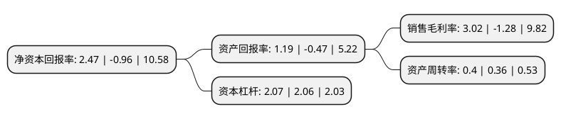

> 本页面由自动化程序生成于 2022年5月20日 01:05
> 内容可能存在错误，如有bug请提交issue至：https://github.com/Eroleice/doc-pi/issues
{.is-warning}

# 上市公司基本情况

## 基本资料

中工国际工程股份有限公司（以下简称“中工国际”）成立于2001年05月22日，北京市。于2006年06月19日在深交所中小板上市。

中工国际注册资本123,740.894万元，主营业务:国际工程总承包，即采用分包方式执行项目所需的设计，设备与材料出口(习惯称其为成套设备与技术出口)，包括设计，供货，施工，安装，调试，试车，验收，移交等一系列工作，项目建成投产后还要常年提供有偿零配件，技术与管理等售后服务。以下是详细信息：

- 公司名称: 中工国际工程股份有限公司
- 股票代码: 002051.SZ
- 所在地: 北京 - 北京市
- 成立日期: 2001年05月22日
- 注册资本: 123,740.894万元
- 法定代表人: 王博
- 主营业务: 主营业务:国际工程总承包，即采用分包方式执行项目所需的设计，设备与材料出口(习惯称其为成套设备与技术出口)，包括设计，供货，施工，安装，调试，试车，验收，移交等一系列工作，项目建成投产后还要常年提供有偿零配件，技术与管理等售后服务
- 公司官网: www.camce.com.cn
- 公司介绍: 公司是经中华人民共和国商务部批准，由国内著名的外贸公司、设计院、机械制造商和施工单位共同发起设立的股份有限公司。主营业务是国际工程总承包，公司具有丰富的国际工程总承包管理经验，近年来，已完成了数十个大型交钥匙工程和成套设备进出口项目。业务范围涉及东南亚、南亚、中亚、中东、非洲、南美洲及加勒比地区诸国，业务领域涉及交通运输、市政建设、水利工程、电力工程、建筑材料、食品加工、轻工纺织、电信、石油化工、农业机械与工程设备等领域，已完成的项目获得了所在国家业主的广泛认可和好评。

## 股东及高管情况

上市公司第一大股东为中国机械工业集团有限公司，持股777,853,876股，占比62.86%，为上市公司实际控制人。

截至2022年03月31日，上市公司的前十大股东中，共有2名自然人股东，3名机构股东，4个产品账户，1个海外主体，其中5%以上大股东共有1名。上市公司前十大股东明细如下：

> 截至2022年03月31日，上市公司前十大股东信息如下：

| 股东名称 | 持股数量（股） | 持股比例 |
| --- | --- | --- |
| 中国机械工业集团有限公司 | 777,853,876 | 62.86% |
| 香港中央结算有限公司(陆股通) | 10,638,724 | 0.86% |
| 广发中证基建工程交易型开放式指数证券投资基金 | 6,836,700 | 0.55% |
| 中元国际工程设计研究院有限公司 | 6,765,445 | 0.55% |
| 杜程鹏 | 6,485,286 | 0.52% |
| 上海明河投资管理有限公司-明河2016私募证券投资基金 | 4,900,000 | 0.4% |
| 杨雅婷 | 4,600,055 | 0.37% |
| 上海明河投资管理有限公司-明河成长2号私募证券投资基金 | 3,350,000 | 0.27% |
| 广州电器科学研究院有限公司 | 2,880,000 | 0.23% |
| 上海明河投资管理有限公司-明河优质企业证券投资基金 | 2,150,000 | 0.17% |

## 利润表分析

上市公司2021年总收入为86.39亿元，净利润为2.6亿元，实现盈利。

## 杜邦分析

> 数据列示周期：2021年 | 2020年 | 2019年
{.is-info}

上市公司的净资产收益率在近一年有所下降，下降幅度为-357.29%，其变化情况分解如下：
- 上市公司的销售毛利率在近一年下降了-335.94%，可能是生产效率的下降、商品原材料价格上涨或商品价格的下跌所致。
- 上市公司的资产周转率在近一年上升了11.11%，可能是源自于更快的销售回款或库存管理效果提升。
- 上市公司的财务杠杆比率在近一年上升了0.49%，可能是增加负债扩大生产规模。

