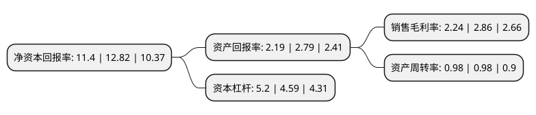

> 本页面由自动化程序生成于 2022年5月20日 01:05
> 内容可能存在错误，如有bug请提交issue至：https://github.com/Eroleice/doc-pi/issues
{.is-warning}

# 上市公司基本情况

## 基本资料

浙江交通科技股份有限公司（以下简称“浙江交科”）成立于1998年11月23日，衢州市。于2006年08月16日在深交所中小板上市。

浙江交科注册资本151,650.292万元，化工业务，基建工程业务以下是详细信息：

- 公司名称: 浙江交通科技股份有限公司
- 股票代码: 002061.SZ
- 所在地: 浙江 - 衢州市
- 成立日期: 1998年11月23日
- 注册资本: 151,650.292万元
- 法定代表人: 吴伟
- 主营业务: 化工业务，基建工程业务
- 公司官网: www.zjjiaoke.com
- 公司介绍: 公司是首批认定的国家高新技术企业、省级企业技术中心，建有浙江省博士后科研工作站、浙江省有机胺工程技术研究中心、浙江省有机胺及C1化学省级高新技术研究开发中心等多个省级研发平台。公司主要从事化工产品的开发、生产和销售，主要产品有DMF、DMAC、顺酐、聚碳酸酯(PC)。公司有机胺业务是DMAC、DMF产品行业标准的制定者，《工业用二甲基甲酰胺》列入2018年第三批“浙江制造”标准制订计划；浙铁江宁化工正丁烷法制顺酐，装置采用国际先进的正丁烷氧化、溶剂吸收制顺酐工艺，产品顺利进入不饱和树脂、酒石酸、四氢苯酐等行业高端客户；浙铁大风打破国际巨头技术垄断，拥有国产首套拥有自主知识产权的大型聚碳酸酯装置，产品采用国际先进的非光气法生产工艺，代表行业生产技术的未来发展方向。

## 股东及高管情况

上市公司第一大股东为浙江省交通投资集团有限公司，持股786,220,976股，占比51.17%，为上市公司实际控制人。

截至2022年03月31日，上市公司的前十大股东中，共有1名自然人股东，8名机构股东，1个海外主体，其中5%以上大股东共有1名。上市公司前十大股东明细如下：

> 截至2022年03月31日，上市公司前十大股东信息如下：

| 股东名称 | 持股数量（股） | 持股比例 |
| --- | --- | --- |
| 浙江省交通投资集团有限公司 | 786,220,976 | 51.17% |
| 浙江海港资产管理有限公司 | 66,880,790 | 4.35% |
| 浙江省中医药健康产业集团有限公司 | 34,544,562 | 2.25% |
| 中航国际成套设备有限公司 | 31,680,589 | 2.06% |
| 浙江省国有资本运营有限公司 | 17,952,095 | 1.17% |
| 绍兴市城市建设投资集团有限公司 | 14,581,066 | 0.95% |
| 香港中央结算有限公司(陆股通) | 11,497,948 | 0.75% |
| 宁波汇众贰号股权投资合伙企业(有限合伙) | 9,565,261 | 0.62% |
| 宁波汇众壹号股权投资合伙企业(有限合伙) | 9,031,279 | 0.59% |
| 徐开东 | 6,677,700 | 0.43% |

## 利润表分析

上市公司2021年总收入为460.57亿元，净利润为10.31亿元，实现盈利。

## 杜邦分析

> 数据列示周期：2021年 | 2020年 | 2019年
{.is-info}

上市公司的净资产收益率在近一年有所下降，下降幅度为-11.08%，其变化情况分解如下：
- 上市公司的销售毛利率在近一年下降了-21.68%，可能是生产效率的下降、商品原材料价格上涨或商品价格的下跌所致。
- 上市公司的资产周转率在近一年下降了0%，可能是源自于更慢的销售回款或库存管理效果下降。
- 上市公司的财务杠杆比率在近一年上升了13.29%，可能是增加负债扩大生产规模。

