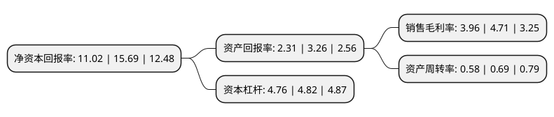

> 本页面由自动化程序生成于 2022年5月20日 01:05
> 内容可能存在错误，如有bug请提交issue至：https://github.com/Eroleice/doc-pi/issues
{.is-warning}

# 上市公司基本情况

## 基本资料

宏润建设集团股份有限公司（以下简称“宏润建设”）成立于1994年12月29日，宁波市。于2006年08月16日在深交所中小板上市。

宏润建设注册资本110,250万元，主要产品为市政工程，房屋建筑工程以下是详细信息：

- 公司名称: 宏润建设集团股份有限公司
- 股票代码: 002062.SZ
- 所在地: 浙江 - 宁波市
- 成立日期: 1994年12月29日
- 注册资本: 110,250万元
- 法定代表人: 郑宏舫
- 主营业务: 主要产品为市政工程，房屋建筑工程
- 公司官网: www.chinahongrun.com
- 公司介绍: 公司为国家高新技术企业。公司主营市政路桥、轨道交通、地下空间(地下综合管廊)、房屋建筑、生态环保等工程施工，房地产开发，基础设施项目投资建设，太阳能产业，国际教育。公司拥有市政公用工程施工总承包特级、建筑工程施工总承包特级和工程设计市政行业甲级、建筑行业甲级资质，可以承接市政公用、房屋建筑、公路、铁路、港口与航道、水利水电等各类别工程的施工总承包、工程总承包和项目管理业务，以及公路工程施工总承包、机电工程施工总承包、建筑装修装饰工程专业承包、地基基础工程专业承包等壹级资质，城市轨道交通工程专业承包资质。公司拥有省级企业技术中心，持续研发了行业领先和独创的先进技术。

## 股东及高管情况

上市公司第一大股东为浙江宏润控股有限公司，持股432,363,593股，占比39.22%，为上市公司实际控制人。

截至2022年03月31日，上市公司的前十大股东中，共有8名自然人股东，1名机构股东，1个海外主体，其中5%以上大股东共有2名。上市公司前十大股东明细如下：

> 截至2022年03月31日，上市公司前十大股东信息如下：

| 股东名称 | 持股数量（股） | 持股比例 |
| --- | --- | --- |
| 浙江宏润控股有限公司 | 432,363,593 | 39.22% |
| 郑宏舫 | 159,084,924 | 14.43% |
| 赵熙逸 | 11,111,900 | 1.01% |
| 严帮吉 | 9,572,313 | 0.87% |
| 葛立敏 | 9,500,000 | 0.86% |
| 郑建国 | 8,092,862 | 0.73% |
| 尹芳达 | 7,004,215 | 0.64% |
| 李张敏 | 6,670,400 | 0.61% |
| 高华-汇丰-GOLDMAN, SACHS & CO.LLC | 6,670,031 | 0.6% |
| 林备战 | 6,009,480 | 0.55% |

## 利润表分析

上市公司2021年总收入为103.21亿元，净利润为4.08亿元，实现盈利。

## 杜邦分析

> 数据列示周期：2021年 | 2020年 | 2019年
{.is-info}

上市公司的净资产收益率在近一年有所下降，下降幅度为-29.76%，其变化情况分解如下：
- 上市公司的销售毛利率在近一年下降了-15.92%，可能是生产效率的下降、商品原材料价格上涨或商品价格的下跌所致。
- 上市公司的资产周转率在近一年下降了-15.94%，可能是源自于更慢的销售回款或库存管理效果下降。
- 上市公司的财务杠杆比率在近一年下降了-1.24%，可能是减少负债降低财务费用。

