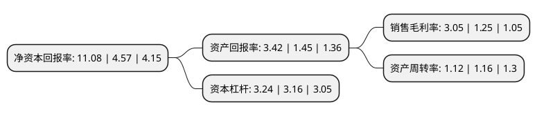

> 本页面由自动化程序生成于 2022年5月20日 01:06
> 内容可能存在错误，如有bug请提交issue至：https://github.com/Eroleice/doc-pi/issues
{.is-warning}

# 上市公司基本情况

## 基本资料

中国海诚工程科技股份有限公司（以下简称“中国海诚”）成立于1993年02月17日，上海市。于2007年02月15日在深交所中小板上市。

中国海诚注册资本41,762.894万元，主营业务:工程设计，工程咨询，工程监理和工程总承包以下是详细信息：

- 公司名称: 中国海诚工程科技股份有限公司
- 股票代码: 002116.SZ
- 所在地: 上海 - 上海市
- 成立日期: 1993年02月17日
- 注册资本: 41,762.894万元
- 法定代表人: 赵国昂
- 主营业务: 主营业务:工程设计，工程咨询，工程监理和工程总承包
- 公司官网: www.haisum.com
- 公司介绍: 公司是国内第一家专业设计服务业上市公司，也是国内最大的综合性股份制工程科技上市公司之一。公司主要从事工程总承包、设计、咨询和监理，服务领域涵盖轻纺、商物粮、农林、机械、市政公用、化工医药、建筑等行业，客户遍及亚、欧、非、美及大洋洲等地。公司总部设在上海，并在北京、广州、长沙、武汉、南宁、成都、西安等地拥有多家全资子公司，目前控股股东为国务院国有资产监督管理委员会监管的中国轻工集团公司。

## 股东及高管情况

上市公司第一大股东为中国轻工集团有限公司，持股216,769,435股，占比51.9%，为上市公司实际控制人。

截至2022年03月31日，上市公司的前十大股东中，共有6名自然人股东，3名机构股东，1名其他股东，其中5%以上大股东共有2名。上市公司前十大股东明细如下：

> 截至2022年03月31日，上市公司前十大股东信息如下：

| 股东名称 | 持股数量（股） | 持股比例 |
| --- | --- | --- |
| 中国轻工集团有限公司 | 216,769,435 | 51.9% |
| 上海第一医药股份有限公司 | 22,889,860 | 5.48% |
| 上海上报资产管理有限公司 | 14,806,512 | 3.55% |
| 上海市徐汇区国有资产监督管理委员会 | 14,304,582 | 3.43% |
| 谢慧明 | 6,074,600 | 1.45% |
| 沈东容 | 5,515,900 | 1.32% |
| 王秀琴 | 5,027,267 | 1.2% |
| 刘兆水 | 4,022,400 | 0.96% |
| 邓美真 | 1,569,600 | 0.38% |
| 马明秋 | 947,065 | 0.23% |

## 利润表分析

上市公司2021年总收入为52.65亿元，净利润为1.6亿元，实现盈利。

## 杜邦分析

> 数据列示周期：2021年 | 2020年 | 2019年
{.is-info}

上市公司的净资产收益率在近一年有所上升，上升幅度为142.45%，其变化情况分解如下：
- 上市公司的销售毛利率在近一年上升了144%，可能是生产效率的提升、商品原材料价格下跌或商品价格的上涨所致。
- 上市公司的资产周转率在近一年下降了-3.45%，可能是源自于更慢的销售回款或库存管理效果下降。
- 上市公司的财务杠杆比率在近一年上升了2.53%，可能是增加负债扩大生产规模。

