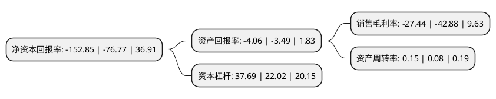

> 本页面由自动化程序生成于 2022年5月20日 01:07
> 内容可能存在错误，如有bug请提交issue至：https://github.com/Eroleice/doc-pi/issues
{.is-warning}

# 上市公司基本情况

## 基本资料

云南云投生态环境科技股份有限公司（以下简称“ST云投”）成立于2001年08月07日，昆明市。于2007年12月21日在深交所中小板上市。

ST云投注册资本18,413.289万元，主营业务为绿化苗木种植及销售，绿化工程设计及施工。主要产品:盆栽植物及观赏苗木。以下是详细信息：

- 公司名称: 云南云投生态环境科技股份有限公司
- 股票代码: 002200.SZ
- 所在地: 云南 - 昆明市
- 成立日期: 2001年08月07日
- 注册资本: 18,413.289万元
- 法定代表人: 马福斌
- 主营业务: 主营业务为绿化苗木种植及销售，绿化工程设计及施工主要产品:盆栽植物及观赏苗木
- 公司官网: www.yt-eco.com
- 公司介绍: 公司具有国家园林绿化施工一级资质、市政公用工程总承包贰级资质、环保工程专业承包贰级资质、风景园林工程设计专项乙级资质、古建筑工程专业承包三级资质、城市及道路照明工程专业承包三级资质、云南省环境保护行业污染治理乙级资质、林业调查规划设计丙级资质等资质，是云南省最大的国有控股园林绿化上市企业，同时，也是云南省农业产业化省级重点龙头企业，云南省林业产业化省级龙头企业，云南省高原特色现代农业花卉产业重点企业。公司拥有“品种研发-种苗培育-苗木种植基地-工程设计及施工”完整产业链，坚持以发展和保护相统一，实现生态财富增值为理念，致力于提供生态绿色产品和服务。

## 股东及高管情况

上市公司第一大股东为云南省交通投资建设集团有限公司，持股42,685,927股，占比23.18%，**疑似为**上市公司实际控制人。

截至2022年04月27日，上市公司的前十大股东中，共有9名自然人股东，1名机构股东，其中5%以上大股东共有7名。上市公司前十大股东明细如下：

> 未能通过持股比例判定出上市公司实际控制人（持股30%以上）
> 可能存在通过间接持股、联合持股、协议控制等方式拥有实际控制权的主体，具体请参考上市公司定期公告！
{.is-warning}

> 截至2022年04月27日，上市公司前十大股东信息如下：

| 股东名称 | 持股数量（股） | 持股比例 |
| --- | --- | --- |
| 云南省交通投资建设集团有限公司 | 42,685,927 | 23.18% |
| 沈亚飞 | 13,697,962 | 7.44% |
| 张国英 | 12,229,660 | 6.64% |
| 何学葵 | 11,824,100 | 6.42% |
| 何学葵 | 11,824,100 | 6.42% |
| 徐洪尧 | 10,943,702 | 5.94% |
| 张国英 | 9,475,400 | 5.146% |
| 方陶 | 4,650,018 | 2.53% |
| 潘梅英 | 3,131,622 | 1.7% |
| 陈国玲 | 3,105,200 | 1.69% |

## 利润表分析

上市公司2021年总收入为3.92亿元，净利润为-1.08亿元，**未实现盈利**。

## 杜邦分析

> 数据列示周期：2021年 | 2020年 | 2019年
{.is-info}

上市公司的净资产收益率在近一年有所上升，上升幅度为99.1%，其变化情况分解如下：
- 上市公司的销售毛利率在近一年下降了-36.01%，可能是生产效率的下降、商品原材料价格上涨或商品价格的下跌所致。
- 上市公司的资产周转率在近一年上升了87.5%，可能是源自于更快的销售回款或库存管理效果提升。
- 上市公司的财务杠杆比率在近一年上升了71.16%，可能是增加负债扩大生产规模。

