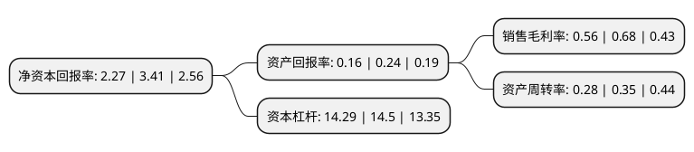

> 本页面由自动化程序生成于 2022年5月20日 01:08
> 内容可能存在错误，如有bug请提交issue至：https://github.com/Eroleice/doc-pi/issues
{.is-warning}

# 上市公司基本情况

## 基本资料

新疆北新路桥集团股份有限公司（以下简称“北新路桥”）成立于2001年08月07日，乌鲁木齐市。于2009年11月11日在深交所中小板上市。

北新路桥注册资本120,892.193万元，高等级道路工程，桥梁工程及水利工程的施工。以下是详细信息：

- 公司名称: 新疆北新路桥集团股份有限公司
- 股票代码: 002307.SZ
- 所在地: 新疆 - 乌鲁木齐市
- 成立日期: 2001年08月07日
- 注册资本: 120,892.193万元
- 法定代表人: 张斌
- 主营业务: 高等级道路工程，桥梁工程及水利工程的施工
- 公司官网: www.bxlq.com
- 公司介绍: 公司是新疆最大的路桥施工企业之一，实力最强的大型公路工程施工企业之一，拥有国家公路工程施工总承包一级资质，公路路面工程专业承包一级资质，公路路基工程专业承包一级，主营高等级道路工程、桥梁工程及水利工程的施工。公司在国内已完成了多项公路工程施工，同时利用自身优势极开拓中亚、南亚、非洲等地区的境外公路工程建设市场，参与世界公路工程建设市场的竞争。与国际知名的筑路机械设备制造企业戴纳派克压实摊铺设备有限公司签订了合作协议。

## 股东及高管情况

上市公司第一大股东为新疆生产建设兵团建设工程(集团)有限责任公司，持股579,776,147股，占比47.96%，为上市公司实际控制人。

截至2022年03月31日，上市公司的前十大股东中，共有5名自然人股东，2名机构股东，3个产品账户，其中5%以上大股东共有1名。上市公司前十大股东明细如下：

> 截至2022年03月31日，上市公司前十大股东信息如下：

| 股东名称 | 持股数量（股） | 持股比例 |
| --- | --- | --- |
| 新疆生产建设兵团建设工程(集团)有限责任公司 | 579,776,147 | 47.96% |
| 易方达基金-中央汇金资产管理有限责任公司-易方达基金-汇金资管单一资产管理计划 | 11,073,760 | 0.92% |
| 杨钧 | 4,932,899 | 0.41% |
| 湖南世纪祥峰实业发展有限公司 | 4,360,659 | 0.36% |
| 财通基金-高彩娥-财通基金天禧定增6号单一资产管理计划 | 2,570,694 | 0.21% |
| 白苹 | 2,544,200 | 0.21% |
| 白文麟 | 2,459,700 | 0.2% |
| 宁波银行股份有限公司-鹏华产业升级混合型证券投资基金 | 2,383,700 | 0.2% |
| 刘杯 | 2,164,520 | 0.18% |
| 孔红兵 | 2,143,582 | 0.18% |

## 利润表分析

上市公司2021年总收入为123.2亿元，净利润为0.68亿元，实现盈利。

## 杜邦分析

> 数据列示周期：2021年 | 2020年 | 2019年
{.is-info}

上市公司的净资产收益率在近一年有所下降，下降幅度为-33.43%，其变化情况分解如下：
- 上市公司的销售毛利率在近一年下降了-17.65%，可能是生产效率的下降、商品原材料价格上涨或商品价格的下跌所致。
- 上市公司的资产周转率在近一年下降了-20%，可能是源自于更慢的销售回款或库存管理效果下降。
- 上市公司的财务杠杆比率在近一年下降了-1.45%，可能是减少负债降低财务费用。

