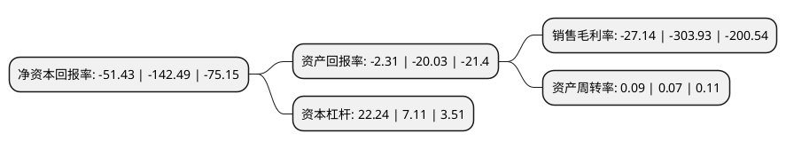

> 本页面由自动化程序生成于 2022年5月20日 01:08
> 内容可能存在错误，如有bug请提交issue至：https://github.com/Eroleice/doc-pi/issues
{.is-warning}

# 上市公司基本情况

## 基本资料

山东雅博科技股份有限公司（以下简称“*ST雅博”）成立于2002年10月21日，枣庄市。于2009年12月18日在深交所中小板上市。

*ST雅博注册资本212,085.514万元，主要产品:雅百特独有的可呼吸式移动金属节能屋面系统，自清洁屋面系统，直立锁边屋面系统，360度咬边屋面系统，太阳能分布式电站屋面系统等的相关服务以下是详细信息：

- 公司名称: 山东雅博科技股份有限公司
- 股票代码: 002323.SZ
- 所在地: 山东 - 枣庄市
- 成立日期: 2002年10月21日
- 注册资本: 212,085.514万元
- 法定代表人: 唐继勇
- 主营业务: 主要产品:雅百特独有的可呼吸式移动金属节能屋面系统，自清洁屋面系统，直立锁边屋面系统，360度咬边屋面系统，太阳能分布式电站屋面系统等的相关服务
- 公司官网: www.yaboo-cn.com
- 公司介绍: 公司是一家全球化综合性建筑金融科技服务企业。公司提出“新行业、新材料、新工艺、新能源”的“四新”理念，依托于金属屋面围护系统和分布式光伏的实体经营，着重科技创新和高新技术研发，成为企业的核心竞争力。作为行业内少见的轻资产企业，在多年的发展中，公司凭借专业化的服务和自身的竞争力，成为以金属屋面围护系统、智能金属屋面系统和分布式光伏发电系统为主营业务的综合性系统集成商。作为业内知名企业，在国家“一带一路”的政策引领下和当前智能互联网的重要战略机遇期，公司积极发展产业基金和并购基金，通过强大金融资本支持，融合实体经营，推动产业链上下游资产和资源的有效配置，促进金融资本和产业资本的完美融合，践行社会价值，创造社会财富。

## 股东及高管情况

上市公司第一大股东为山东泉兴科技有限公司，持股445,379,580股，占比21%，**疑似为**上市公司实际控制人。

截至2022年05月10日，上市公司的前十大股东中，共有9名机构股东，1个产品账户，其中5%以上大股东共有7名。上市公司前十大股东明细如下：

> 未能通过持股比例判定出上市公司实际控制人（持股30%以上）
> 可能存在通过间接持股、联合持股、协议控制等方式拥有实际控制权的主体，具体请参考上市公司定期公告！
{.is-warning}

> 截至2022年05月10日，上市公司前十大股东信息如下：

| 股东名称 | 持股数量（股） | 持股比例 |
| --- | --- | --- |
| 山东泉兴科技有限公司 | 445,379,580 | 21% |
| 山东泉兴科技有限公司 | 445,379,580 | 21% |
| 山东泉兴科技有限公司 | 445,379,580 | 21% |
| 拉萨瑞鸿投资管理有限公司 | 333,179,376 | 15.71% |
| 拉萨瑞鸿投资管理有限公司 | 333,179,376 | 15.71% |
| 深圳市招平协进二号投资中心(有限合伙) | 177,182,900 | 8.3543% |
| 深圳市招平协进二号投资中心(有限合伙) | 177,182,900 | 8.3543% |
| 枣庄朴凡建筑咨询有限责任公司 | 86,000,000 | 4.05% |
| 拉萨智度德诚创业投资合伙企业(有限合伙) | 50,636,985 | 2.39% |
| 山东雅博科技股份有限公司破产企业财产处置专用账户 | 34,575,456 | 1.63% |

## 利润表分析

上市公司2021年总收入为1.25亿元，净利润为-9.85亿元，**未实现盈利**。

## 杜邦分析

> 数据列示周期：2020年 | 2019年 | 2018年
{.is-info}

上市公司的净资产收益率在近一年有所下降，下降幅度为-63.91%，其变化情况分解如下：
- 上市公司的销售毛利率在近一年下降了-91.07%，可能是生产效率的下降、商品原材料价格上涨或商品价格的下跌所致。
- 上市公司的资产周转率在近一年上升了28.57%，可能是源自于更快的销售回款或库存管理效果提升。
- 上市公司的财务杠杆比率在近一年上升了212.8%，可能是增加负债扩大生产规模。

