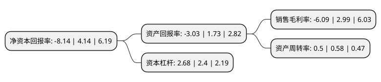

> 本页面由自动化程序生成于 2022年5月20日 01:10
> 内容可能存在错误，如有bug请提交issue至：https://github.com/Eroleice/doc-pi/issues
{.is-warning}

# 上市公司基本情况

## 基本资料

中化岩土集团股份有限公司（以下简称“中化岩土”）成立于2001年12月06日，北京市。于2011年01月28日在深交所中小板上市。

中化岩土注册资本180,533.975万元，主营业务是为国内石油石化建设项目，国家石油战略储备基地，港口，机场等基础设施，城镇发展建设用地开发等建设项目提供强夯等地基处理服务，包括工程勘察，方案设计，技术咨询，工程施工等综合服务。以下是详细信息：

- 公司名称: 中化岩土集团股份有限公司
- 股票代码: 002542.SZ
- 所在地: 北京 - 北京市
- 成立日期: 2001年12月06日
- 注册资本: 180,533.975万元
- 法定代表人: 邓明长
- 主营业务: 主营业务是为国内石油石化建设项目，国家石油战略储备基地，港口，机场等基础设施，城镇发展建设用地开发等建设项目提供强夯等地基处理服务，包括工程勘察，方案设计，技术咨询，工程施工等综合服务
- 公司官网: www.cge.com.cn
- 公司介绍: 公司是一家具有强夯工艺自主创新和专用设备研发能力的高新技术企业。主营业务是为国内石油石化建设项目、国家石油战略储备基地、港口、机场等大型建设项目提供强夯地基处理服务，包括方案设计、技术咨询、工程施工等。公司在强夯地基处理细分市场中具有国内领先地位，是行业技术革新的引领者和高能级强夯技术标准的制定者。公司依靠领先的强夯专利设备，改变了国内强夯地基处理能级最高只能达到10,000kN.m的局面，开创了国内强夯地基处理工程的高端市场(10,000kN.m以上)，提高了整个行业的技术水平。公司连续多年获全国优秀施工企业称号、全国用户满意企业称号。

## 股东及高管情况

上市公司第一大股东为成都兴城投资集团有限公司，持股528,632,766股，占比29.28%，**疑似为**上市公司实际控制人。

截至2022年03月31日，上市公司的前十大股东中，共有8名自然人股东，1名机构股东，1个产品账户，其中5%以上大股东共有2名。上市公司前十大股东明细如下：

> 未能通过持股比例判定出上市公司实际控制人（持股30%以上）
> 可能存在通过间接持股、联合持股、协议控制等方式拥有实际控制权的主体，具体请参考上市公司定期公告！
{.is-warning}

> 截至2022年03月31日，上市公司前十大股东信息如下：

| 股东名称 | 持股数量（股） | 持股比例 |
| --- | --- | --- |
| 成都兴城投资集团有限公司 | 528,632,766 | 29.28% |
| 吴延炜 | 202,585,307 | 11.22% |
| 刘忠池 | 38,071,191 | 2.11% |
| 宋伟民 | 36,052,982 | 2% |
| 柴建军 | 25,000,000 | 1.38% |
| 王亚凌 | 22,000,000 | 1.22% |
| 王锡良 | 19,070,000 | 1.06% |
| 交通银行股份有限公司-广发中证基建工程交易型开放式指数证券投资基金 | 16,914,900 | 0.94% |
| 梁富华 | 14,868,560 | 0.82% |
| 王秀格 | 14,848,200 | 0.82% |

## 利润表分析

上市公司2021年总收入为51.73亿元，净利润为-3.15亿元，**未实现盈利**。

## 杜邦分析

> 数据列示周期：2021年 | 2020年 | 2019年
{.is-info}

上市公司的净资产收益率在近一年有所下降，下降幅度为-296.62%，其变化情况分解如下：
- 上市公司的销售毛利率在近一年下降了-303.68%，可能是生产效率的下降、商品原材料价格上涨或商品价格的下跌所致。
- 上市公司的资产周转率在近一年下降了-13.79%，可能是源自于更慢的销售回款或库存管理效果下降。
- 上市公司的财务杠杆比率在近一年上升了11.67%，可能是增加负债扩大生产规模。

