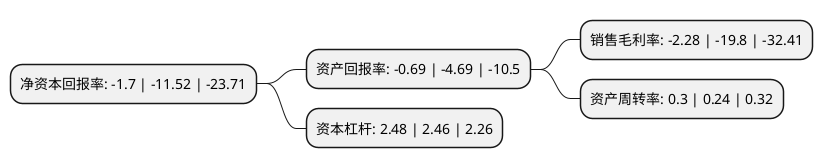

> 本页面由自动化程序生成于 2022年5月20日 01:10
> 内容可能存在错误，如有bug请提交issue至：https://github.com/Eroleice/doc-pi/issues
{.is-warning}

# 上市公司基本情况

## 基本资料

浙江省围海建设集团股份有限公司（以下简称“*ST围海”）成立于1988年06月25日，宁波市。于2011年06月02日在深交所中小板上市。

*ST围海注册资本114,422.371万元，主营业务:建筑施工及其相关的技术服务(勘测，设计等)为主营业务，一直专注于为业主提供海堤，河道，水库，城市防洪等工程施工服务。以下是详细信息：

- 公司名称: 浙江省围海建设集团股份有限公司
- 股票代码: 002586.SZ
- 所在地: 浙江 - 宁波市
- 成立日期: 1988年06月25日
- 注册资本: 114,422.371万元
- 法定代表人: 汪文强
- 主营业务: 主营业务:建筑施工及其相关的技术服务(勘测，设计等)为主营业务，一直专注于为业主提供海堤，河道，水库，城市防洪等工程施工服务
- 公司官网: www.weihaigufen.com.cn
- 公司介绍: 公司一直专注于为业主提供海堤、河道、水库、城市防洪等工程施工服务，是国内现代海堤工程施工专业化水平位居前列的企业之一。公司具有水利水电工程施工总承包壹级、港口与航道工程施工总承包贰级、房屋建筑工程施工总承包贰级、市政公用工程施工总承包三级以及土石方工程专业承包、爆破与拆除工程专业承包等十余项建筑业资质及承包境外水利水电工程和境内国际招标工程的资格。公司长期以来一直秉承“科技为先”的发展理念，公司的“水下塑料排水板加固软基专用插板船”、“一种复杂软基上进行爆破挤淤筑堤方法”等2项核心技术已经获得国家发明专利。公司先后荣获“全国优秀施工企业”、“全国优秀水利企业”、“全国文明单位”、“重合同、守信用企业”、“浙江省优秀建筑施工企业”、“宁波市支援青川县灾后恢复重建先进单位”等多项荣誉称号，被浙江省人民政府誉为“千里标准海塘建设的一支劲旅”。2018年公司通过重大资产重组收购千年设计部分股权,进一步拓展了工程设计咨询服务业务,进一步延伸与完善其上下游产业链，充分发挥上市公司与标的公司的协同效应，加快实现公司从施工总承包到工程总承包的经营模式转变，提升公司的核心竞争力。

## 股东及高管情况

上市公司第一大股东为浙江围海控股集团有限公司，持股492,677,204股，占比43.06%，为上市公司实际控制人。

截至2022年03月31日，上市公司的前十大股东中，共有7名自然人股东，3名机构股东，其中5%以上大股东共有2名。上市公司前十大股东明细如下：

> 截至2022年03月31日，上市公司前十大股东信息如下：

| 股东名称 | 持股数量（股） | 持股比例 |
| --- | --- | --- |
| 浙江围海控股集团有限公司 | 492,677,204 | 43.06% |
| 上海千年工程投资管理有限公司 | 59,101,557 | 5.17% |
| 浙江东睿资产管理有限公司 | 41,296,060 | 3.61% |
| 陈德海 | 14,639,190 | 1.28% |
| 仲成荣 | 13,510,540 | 1.18% |
| 邱春方 | 12,825,000 | 1.12% |
| 罗全民 | 12,145,668 | 1.06% |
| 王永春 | 11,224,779 | 0.98% |
| 王文君 | 9,000,000 | 0.79% |
| 许喆 | 8,630,000 | 0.75% |

## 利润表分析

上市公司2021年总收入为25.8亿元，净利润为-0.59亿元，**未实现盈利**。

## 杜邦分析

> 数据列示周期：2021年 | 2020年 | 2019年
{.is-info}

上市公司的净资产收益率在近一年有所下降，下降幅度为-85.24%，其变化情况分解如下：
- 上市公司的销售毛利率在近一年下降了-88.48%，可能是生产效率的下降、商品原材料价格上涨或商品价格的下跌所致。
- 上市公司的资产周转率在近一年上升了25%，可能是源自于更快的销售回款或库存管理效果提升。
- 上市公司的财务杠杆比率在近一年上升了0.81%，可能是增加负债扩大生产规模。

