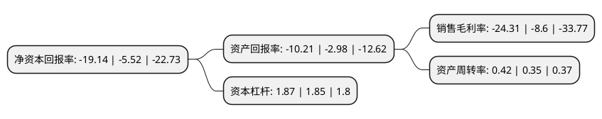

> 本页面由自动化程序生成于 2022年5月20日 01:11
> 内容可能存在错误，如有bug请提交issue至：https://github.com/Eroleice/doc-pi/issues
{.is-warning}

# 上市公司基本情况

## 基本资料

广州普邦园林股份有限公司（以下简称“普邦股份”）成立于1995年07月19日，广州市。于2012年03月16日在深交所中小板上市。

普邦股份注册资本179,589.045万元，公司主要从事园林工程施工，园林景观设计，苗木种植以及园林养护业务，建筑设计业务，可为客户提供包括建筑设计，景观设计，园林工程在内的一体化综合服务。以下是详细信息：

- 公司名称: 广州普邦园林股份有限公司
- 股票代码: 002663.SZ
- 所在地: 广东 - 广州市
- 成立日期: 1995年07月19日
- 注册资本: 179,589.045万元
- 法定代表人: 杨国龙
- 主营业务: 公司主要从事园林工程施工，园林景观设计，苗木种植以及园林养护业务，建筑设计业务，可为客户提供包括建筑设计，景观设计，园林工程在内的一体化综合服务
- 公司官网: www.pblandscape.com
- 公司介绍: 公司多年来专注于生态环境的建设和运营。作为国内行业龙头企业之一，普邦股份坚持可持续发展战略，以园林产业为基础，切入环境保护、城市双修(生态修复、城市修补)领域，充分践行生态文明建设，依靠供应链金融、互联网+技术提升企业核心竞争力，实现“生态景观、绿色环保、智慧民生”三大业务板块协同发展，为客户提供高品质、多元化的产品和服务，全力打造国内领先的平台型企业。

## 股东及高管情况

上市公司第一大股东为涂善忠，持股410,630,418股，占比22.87%，**疑似为**上市公司实际控制人。

截至2022年03月31日，上市公司的前十大股东中，共有6名自然人股东，3名机构股东，1个产品账户，其中5%以上大股东共有2名。上市公司前十大股东明细如下：

> 未能通过持股比例判定出上市公司实际控制人（持股30%以上）
> 可能存在通过间接持股、联合持股、协议控制等方式拥有实际控制权的主体，具体请参考上市公司定期公告！
{.is-warning}

> 截至2022年03月31日，上市公司前十大股东信息如下：

| 股东名称 | 持股数量（股） | 持股比例 |
| --- | --- | --- |
| 涂善忠 | 410,630,418 | 22.87% |
| 黄庆和 | 211,444,914 | 11.77% |
| 深圳市博益投资发展有限公司 | 28,739,543 | 1.6% |
| 山东省国有资产投资控股有限公司 | 25,446,470 | 1.42% |
| 梁定文 | 20,950,934 | 1.17% |
| 涂文哲 | 12,880,319 | 0.72% |
| 华泰证券资管-招商银行-华泰聚力8号集合资产管理计划 | 9,779,190 | 0.54% |
| 葛中伟 | 9,060,000 | 0.5% |
| 上海宜基投资有限公司 | 8,440,528 | 0.47% |
| 肖荣英 | 8,350,000 | 0.46% |

## 杜邦分析

> 数据列示周期：2021年 | 2020年 | 2019年
{.is-info}

上市公司的净资产收益率在近一年有所上升，上升幅度为246.74%，其变化情况分解如下：
- 上市公司的销售毛利率在近一年上升了182.67%，可能是生产效率的提升、商品原材料价格下跌或商品价格的上涨所致。
- 上市公司的资产周转率在近一年上升了20%，可能是源自于更快的销售回款或库存管理效果提升。
- 上市公司的财务杠杆比率在近一年上升了1.08%，可能是增加负债扩大生产规模。

