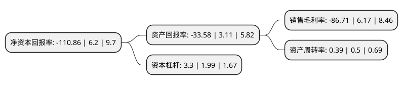

> 本页面由自动化程序生成于 2022年5月20日 01:12
> 内容可能存在错误，如有bug请提交issue至：https://github.com/Eroleice/doc-pi/issues
{.is-warning}

# 上市公司基本情况

## 基本资料

深圳文科园林股份有限公司（以下简称“文科园林”）成立于1996年12月05日，深圳市。于2015年06月29日在深交所中小板上市。

文科园林注册资本51,276.705万元，主营业务是园林绿化工程施工，园林景观设计，园林养护及绿化苗木种植，主要为房地产景观工程及政府公共园林工程等项目提供园林景观设计，园林工程施工及园林养护服务。以下是详细信息：

- 公司名称: 深圳文科园林股份有限公司
- 股票代码: 002775.SZ
- 所在地: 广东 - 深圳市
- 成立日期: 1996年12月05日
- 注册资本: 51,276.705万元
- 法定代表人: 李从文
- 主营业务: 主营业务是园林绿化工程施工，园林景观设计，园林养护及绿化苗木种植，主要为房地产景观工程及政府公共园林工程等项目提供园林景观设计，园林工程施工及园林养护服务
- 公司官网: www.wkyy.com
- 公司介绍: 公司专注环境事业多年，现主要从事风景园林规划设计、旅游景区规划设计、城乡规划编制设计、生态环保技术研发、景观及市政工程施工、生态环境综合治理、文化旅游项目投资开发、PPP项目投资及运营等业务。公司拥有风景园林设计专项甲级资质、城乡规划编制乙级资质、市政公用工程施工总承包贰级资质，是广东省500强企业、中国城市园林绿化综合竞争力十强企业、广东省环境保护骨干企业和国家高新技术企业。公司将质量作为企业发展的核心竞争力，已通过GB/T19001-2016、GB/T24001-2016及GB/T28001-2011认证。公司长期注重产品品质，已获广东省著名商标认证，并已成为中国园林行业的知名品牌。

## 股东及高管情况

上市公司第一大股东为佛山市建设开发投资有限公司，持股117,936,422股，占比23%，**疑似为**上市公司实际控制人。

截至2022年04月27日，上市公司的前十大股东中，共有8名自然人股东，2名机构股东，其中5%以上大股东共有5名。上市公司前十大股东明细如下：

> 未能通过持股比例判定出上市公司实际控制人（持股30%以上）
> 可能存在通过间接持股、联合持股、协议控制等方式拥有实际控制权的主体，具体请参考上市公司定期公告！
{.is-warning}

> 截至2022年04月27日，上市公司前十大股东信息如下：

| 股东名称 | 持股数量（股） | 持股比例 |
| --- | --- | --- |
| 佛山市建设开发投资有限公司 | 117,936,422 | 23% |
| 深圳市文科控股有限公司 | 106,496,000 | 20.77% |
| 李从文 | 84,344,000 | 16.45% |
| 李从文 | 84,344,000 | 16.45% |
| 赵文凤 | 30,950,400 | 6.04% |
| 胡元明 | 11,567,153 | 2.26% |
| 陈桂兰 | 2,700,000 | 0.53% |
| 高育慧 | 2,496,000 | 0.49% |
| 孙潜 | 2,415,000 | 0.47% |
| 蔡融 | 2,164,084 | 0.42% |

## 利润表分析

上市公司2021年总收入为19.26亿元，净利润为-16.71亿元，**未实现盈利**。

## 杜邦分析

> 数据列示周期：2021年 | 2020年 | 2019年
{.is-info}

上市公司的净资产收益率在近一年有所下降，下降幅度为-1888.06%，其变化情况分解如下：
- 上市公司的销售毛利率在近一年下降了-1505.35%，可能是生产效率的下降、商品原材料价格上涨或商品价格的下跌所致。
- 上市公司的资产周转率在近一年下降了-22%，可能是源自于更慢的销售回款或库存管理效果下降。
- 上市公司的财务杠杆比率在近一年上升了65.83%，可能是增加负债扩大生产规模。

