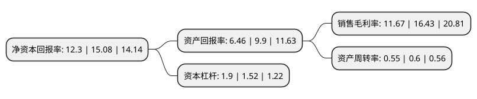

> 本页面由自动化程序生成于 2022年5月20日 01:12
> 内容可能存在错误，如有bug请提交issue至：https://github.com/Eroleice/doc-pi/issues
{.is-warning}

# 上市公司基本情况

## 基本资料

江苏中设集团股份有限公司（以下简称“中设股份”）成立于1987年08月20日，无锡市。于2017年06月20日在深交所中小板上市。

中设股份注册资本13,025.785万元，主营业务:公司坚持以“笃志图新，励业求精，打造中国一流的工程咨询集团”为愿景，以“立足江苏，面向全国，走向国际”为目标，围绕“交通，市政，建筑，环境”四大业务板块，从事相应的规划，研究，设计，咨询，勘察，检测，工程监理，项目管理等业务。以下是详细信息：

- 公司名称: 江苏中设集团股份有限公司
- 股票代码: 002883.SZ
- 所在地: 江苏 - 无锡市
- 成立日期: 1987年08月20日
- 注册资本: 13,025.785万元
- 法定代表人: 陈凤军
- 主营业务: 主营业务:公司坚持以“笃志图新，励业求精，打造中国一流的工程咨询集团”为愿景，以“立足江苏，面向全国，走向国际”为目标，围绕“交通，市政，建筑，环境”四大业务板块，从事相应的规划，研究，设计，咨询，勘察，检测，工程监理，项目管理等业务
- 公司官网: www.jszs-group.com
- 公司介绍: 公司通过多年的成长，公司已发展成为一家能够围绕“交通、市政、建筑、环境”四大行业领域从事规划、设计、咨询、勘察、监理、项目管理、工程总承包等业务的综合性工程咨询集团，拥有城乡规划、交通、市政、建筑、环境等多行业甲级资质，是全国首家提出为“宜居城市”建设提供多专业、全过程智力服务的综合性工程咨询集团。公司的主要业务模块包括规划咨询及勘察设计、工程监理、项目管理等。

## 股东及高管情况

上市公司第一大股东为陈凤军，持股19,777,920股，占比15.18%，**疑似为**上市公司实际控制人。

截至2022年04月27日，上市公司的前十大股东中，共有6名自然人股东，4名机构股东，其中5%以上大股东共有6名。上市公司前十大股东明细如下：

> 未能通过持股比例判定出上市公司实际控制人（持股30%以上）
> 可能存在通过间接持股、联合持股、协议控制等方式拥有实际控制权的主体，具体请参考上市公司定期公告！
{.is-warning}

> 截至2022年04月27日，上市公司前十大股东信息如下：

| 股东名称 | 持股数量（股） | 持股比例 |
| --- | --- | --- |
| 陈凤军 | 19,777,920 | 15.18% |
| 陈凤军 | 19,777,920 | 15.18% |
| 无锡市交通产业集团有限公司 | 11,199,960 | 8.6% |
| 无锡市交通产业集团有限公司 | 11,199,960 | 8.6% |
| 无锡中设创投管理中心(有限合伙) | 7,289,020 | 5.5958% |
| 无锡中设创投管理中心(有限合伙) | 7,289,020 | 5.6% |
| 廖芳龄 | 6,259,840 | 4.81% |
| 周晓慧 | 4,540,040 | 3.49% |
| 王明昌 | 3,421,320 | 2.63% |
| 孙家骏 | 3,309,120 | 2.54% |

## 利润表分析

上市公司2021年总收入为6.06亿元，净利润为0.7亿元，实现盈利。

## 杜邦分析

> 数据列示周期：2021年 | 2020年 | 2019年
{.is-info}

上市公司的净资产收益率在近一年有所下降，下降幅度为-18.44%，其变化情况分解如下：
- 上市公司的销售毛利率在近一年下降了-28.97%，可能是生产效率的下降、商品原材料价格上涨或商品价格的下跌所致。
- 上市公司的资产周转率在近一年下降了-8.33%，可能是源自于更慢的销售回款或库存管理效果下降。
- 上市公司的财务杠杆比率在近一年上升了25%，可能是增加负债扩大生产规模。

