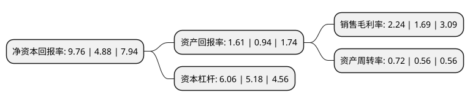

> 本页面由自动化程序生成于 2022年5月20日 01:13
> 内容可能存在错误，如有bug请提交issue至：https://github.com/Eroleice/doc-pi/issues
{.is-warning}

# 上市公司基本情况

## 基本资料

新疆交通建设集团股份有限公司（以下简称“新疆交建”）成立于1999年01月27日，乌鲁木齐市。于2018年11月28日在深交所中小板上市。

新疆交建注册资本64,504.689万元，公司的主营业务为公路，桥梁，隧道，市政工程等基础设施的施工，勘察设计与试验检测，以及路桥工程施工主材料的贸易业务。以下是详细信息：

- 公司名称: 新疆交通建设集团股份有限公司
- 股票代码: 002941.SZ
- 所在地: 新疆 - 乌鲁木齐市
- 成立日期: 1999年01月27日
- 注册资本: 64,504.689万元
- 法定代表人: 沈金生
- 主营业务: 公司的主营业务为公路，桥梁，隧道，市政工程等基础设施的施工，勘察设计与试验检测，以及路桥工程施工主材料的贸易业务
- 公司官网: www.xjjtjt.com
- 公司介绍: 公司是自治区交通建设行业大型企业集团，隶属于自治区国资委，主要以公路、桥梁、交通安全设施、科技养护、路桥试验检测等经营项目为主，具有公路工程施工总承包一级、桥梁一级及市政、水利、铁路、交通安全设施试验检测等资质，此外，公司经营范围还包括设备物资采购、科技养护、交通工程、仓储物流、智能交通、工程造价、机械租赁、设计咨询等多个领域。公司注重科技创新与技术研发工作，依托重点公路工程引进推广新技术、新工艺、新材料，联络相关大学院校科研设计机构共同合作研发，有效拓展了企业多元发展道路。

## 股东及高管情况

上市公司第一大股东为新疆维吾尔自治区人民政府国有资产监督管理委员会，持股300,000,000股，占比46.51%，为上市公司实际控制人。

截至2022年03月31日，上市公司的前十大股东中，共有3名自然人股东，3名机构股东，1个产品账户，1个海外主体，2名其他股东，其中5%以上大股东共有2名。上市公司前十大股东明细如下：

> 截至2022年03月31日，上市公司前十大股东信息如下：

| 股东名称 | 持股数量（股） | 持股比例 |
| --- | --- | --- |
| 新疆维吾尔自治区人民政府国有资产监督管理委员会 | 300,000,000 | 46.51% |
| 新疆特变电工集团有限公司 | 106,274,606 | 16.48% |
| 新疆通海股权投资合伙企业(有限合伙) | 30,000,000 | 4.65% |
| 新疆新业盛融创业投资有限责任公司 | 12,500,000 | 1.94% |
| 香港中央结算有限公司(陆股通) | 3,595,750 | 0.56% |
| 交通银行股份有限公司-广发中证基建工程交易型开放式指数证券投资基金 | 3,017,753 | 0.47% |
| 沈金生 | 2,250,000 | 0.35% |
| 赛力克·阿吾哈力 | 1,500,000 | 0.23% |
| 熊刚 | 1,456,500 | 0.23% |
| 程传波 | 1,144,300 | 0.18% |

## 利润表分析

上市公司2021年总收入为116.17亿元，净利润为2.6亿元，实现盈利。

## 杜邦分析

> 数据列示周期：2021年 | 2020年 | 2019年
{.is-info}

上市公司的净资产收益率在近一年有所上升，上升幅度为100%，其变化情况分解如下：
- 上市公司的销售毛利率在近一年上升了32.54%，可能是生产效率的提升、商品原材料价格下跌或商品价格的上涨所致。
- 上市公司的资产周转率在近一年上升了28.57%，可能是源自于更快的销售回款或库存管理效果提升。
- 上市公司的财务杠杆比率在近一年上升了16.99%，可能是增加负债扩大生产规模。

