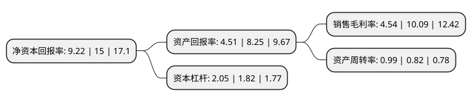

> 本页面由自动化程序生成于 2022年5月20日 01:13
> 内容可能存在错误，如有bug请提交issue至：https://github.com/Eroleice/doc-pi/issues
{.is-warning}

# 上市公司基本情况

## 基本资料

深圳市华阳国际工程设计股份有限公司（以下简称“华阳国际”）成立于1993年08月09日，深圳市。于2019年02月26日在深交所中小板上市。

华阳国际注册资本19,603.566万元，主营业务为建筑设计和研发及其延伸业务，目前主要包括建筑设计，造价咨询，工程总承包，全过程工程咨询等业务。以下是详细信息：

- 公司名称: 深圳市华阳国际工程设计股份有限公司
- 股票代码: 002949.SZ
- 所在地: 广东 - 深圳市
- 成立日期: 1993年08月09日
- 注册资本: 19,603.566万元
- 法定代表人: 唐崇武
- 主营业务: 主营业务为建筑设计和研发及其延伸业务，目前主要包括建筑设计，造价咨询，工程总承包，全过程工程咨询等业务
- 公司官网: www.capol.cn
- 公司介绍: 公司是一家建筑设计公司，致力于建筑设计全过程服务，具有完整的团队配置和丰富的行业经验。主要业务涵盖城市规划、建筑设计(居住建筑、公共建筑、商业综合体)、建筑产业化设计与咨询、BIM设计与咨询、工程造价与咨询。根据客户需求为其提供概念设计、方案设计、初步设计、施工图设计、施工配合的全过程或分阶段的设计等专业技术服务及咨询。公司具有建筑行业(建筑工程)甲级资质、工程造价咨询甲级资质以及城乡规划乙级资质，可从事资质证书许可范围内所有建筑工程设计总承包业务、项目管理及技术管理和咨询服务，提供全流程的设计服务。建筑设计业务类型主要包括民用建筑设计和工业建筑设计，目前本公司业务主要集中在民用建筑设计领域。公司是国家高新技术企业、建筑设计行业首家“国家住宅产业化基地”、首批“装配式建筑产业基地”、首批“全过程工程咨询试点单位”。

## 股东及高管情况

上市公司第一大股东为唐崇武，持股51,903,000股，占比26.48%，**疑似为**上市公司实际控制人。

截至2022年03月31日，上市公司的前十大股东中，共有4名自然人股东，3名机构股东，3个产品账户，其中5%以上大股东共有4名。上市公司前十大股东明细如下：

> 未能通过持股比例判定出上市公司实际控制人（持股30%以上）
> 可能存在通过间接持股、联合持股、协议控制等方式拥有实际控制权的主体，具体请参考上市公司定期公告！
{.is-warning}

> 截至2022年03月31日，上市公司前十大股东信息如下：

| 股东名称 | 持股数量（股） | 持股比例 |
| --- | --- | --- |
| 唐崇武 | 51,903,000 | 26.48% |
| 徐华芳 | 27,810,000 | 14.19% |
| 广西华阳旭日企业管理合伙企业(有限合伙) | 18,000,000 | 9.18% |
| 广西华阳中天企业管理合伙企业(有限合伙) | 15,800,000 | 8.06% |
| 交通银行股份有限公司-创金合信数字经济主题股票型发起式证券投资基金 | 5,845,773 | 2.98% |
| 西藏赢悦投资管理有限公司 | 5,191,330 | 2.65% |
| 田晓秋 | 3,550,000 | 1.81% |
| 中国建设银行股份有限公司-中欧价值发现股票型证券投资基金 | 2,894,000 | 1.48% |
| 中国工商银行股份有限公司-中欧潜力价值灵活配置混合型证券投资基金 | 2,861,429 | 1.46% |
| 薛升伟 | 2,420,000 | 1.23% |

## 利润表分析

上市公司2021年总收入为28.76亿元，净利润为1.3亿元，实现盈利。

## 杜邦分析

> 数据列示周期：2021年 | 2020年 | 2019年
{.is-info}

上市公司的净资产收益率在近一年有所下降，下降幅度为-38.53%，其变化情况分解如下：
- 上市公司的销售毛利率在近一年下降了-55%，可能是生产效率的下降、商品原材料价格上涨或商品价格的下跌所致。
- 上市公司的资产周转率在近一年上升了20.73%，可能是源自于更快的销售回款或库存管理效果提升。
- 上市公司的财务杠杆比率在近一年上升了12.64%，可能是增加负债扩大生产规模。

