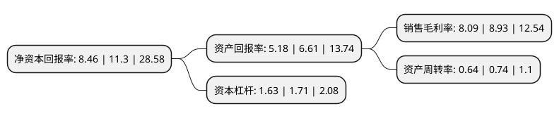

> 本页面由自动化程序生成于 2022年5月20日 01:13
> 内容可能存在错误，如有bug请提交issue至：https://github.com/Eroleice/doc-pi/issues
{.is-warning}

# 上市公司基本情况

## 基本资料

北京中岩大地科技股份有限公司（以下简称“中岩大地”）成立于2008年12月19日，北京市。于2020年10月13日在深交所中小板上市。

中岩大地注册资本12,792.68万元，主营业务为岩土工程，环境修复等领域的服务，公司的产品及服务主要应用于工业与民用建筑领域，基础设施领域及环境与节能领域等建设项目的岩土工程服务。以下是详细信息：

- 公司名称: 北京中岩大地科技股份有限公司
- 股票代码: 003001.SZ
- 所在地: 北京 - 北京市
- 成立日期: 2008年12月19日
- 注册资本: 12,792.68万元
- 法定代表人: 王立建
- 主营业务: 主营业务为岩土工程，环境修复等领域的服务，公司的产品及服务主要应用于工业与民用建筑领域，基础设施领域及环境与节能领域等建设项目的岩土工程服务
- 公司官网: www.zydd.com
- 公司介绍: 公司自成立以来一直从事岩土工程的技术与施工服务，主要包括桩基工程、地基处理工程、基坑支护工程等岩土工程服务，并形成系列技术解决方案，能根据客户提供的项目情况、工程地质情况、施工工况等基础资料，在定性及定量分析的基础上，在质量安全、绿色环保的前提下，形成相应的设计施工或技术咨询方案，通过技术创新不断降低工程造价，节约工期，解决工程难题，提高工程效率。面对传统的岩土工程技术存在的一些问题，如施工效率低、地层适用性受限、资源浪费、污染环境等，公司在多年的科研与工程实践过程中，不断创新，开发了多项高效、节能、环保的岩土工程新技术，如计算分析技术、止水帷幕系列技术、桩基系列技术、岩土锚固系列技术、地下空间开发系统技术等。这些技术均已在多个工程项目成功应用，取得了良好的社会效益和经济效益。

## 股东及高管情况

上市公司第一大股东为王立建，持股34,504,227股，占比26.97%，**疑似为**上市公司实际控制人。

截至2022年03月31日，上市公司的前十大股东中，共有6名自然人股东，3名机构股东，1个海外主体，其中5%以上大股东共有4名。上市公司前十大股东明细如下：

> 未能通过持股比例判定出上市公司实际控制人（持股30%以上）
> 可能存在通过间接持股、联合持股、协议控制等方式拥有实际控制权的主体，具体请参考上市公司定期公告！
{.is-warning}

> 截至2022年03月31日，上市公司前十大股东信息如下：

| 股东名称 | 持股数量（股） | 持股比例 |
| --- | --- | --- |
| 王立建 | 34,504,227 | 26.97% |
| 吴剑波 | 17,248,260 | 13.48% |
| 武思宇 | 13,912,548 | 10.88% |
| 石家庄中岩投资管理中心(有限合伙) | 7,622,305 | 5.96% |
| 上海复星高科技(集团)有限公司 | 5,101,556 | 3.99% |
| 刘光磊 | 1,723,984 | 1.35% |
| 柳建国 | 1,698,185 | 1.33% |
| 师子刚 | 968,404 | 0.76% |
| 财通创新投资有限公司 | 823,016 | 0.64% |
| 高华-汇丰-GOLDMAN, SACHS & CO.LLC | 808,130 | 0.63% |

## 利润表分析

上市公司2021年总收入为13.77亿元，净利润为1.11亿元，实现盈利。

## 杜邦分析

> 数据列示周期：2021年 | 2020年 | 2019年
{.is-info}

上市公司的净资产收益率在近一年有所下降，下降幅度为-25.13%，其变化情况分解如下：
- 上市公司的销售毛利率在近一年下降了-9.41%，可能是生产效率的下降、商品原材料价格上涨或商品价格的下跌所致。
- 上市公司的资产周转率在近一年下降了-13.51%，可能是源自于更慢的销售回款或库存管理效果下降。
- 上市公司的财务杠杆比率在近一年下降了-4.68%，可能是减少负债降低财务费用。

