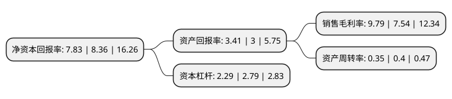

> 本页面由自动化程序生成于 2022年5月20日 01:16
> 内容可能存在错误，如有bug请提交issue至：https://github.com/Eroleice/doc-pi/issues
{.is-warning}

# 上市公司基本情况

## 基本资料

苏交科集团股份有限公司（以下简称“苏交科”）成立于2002年08月29日，南京市。于2012年01月10日在深交所创业板上市。

苏交科注册资本126,282.777万元，公司主营业务为交通工程咨询与工程承包业务，主要提供交通项目前期咨询和科研，道路，桥梁，铁路与轨道交通，岩土与隧道工程，水运工程与市政工程的勘察，设计，咨询，试验检测，监理，相关技术服务，工程总承包及其他承包业务等服务。本公司提供的服务产品主要包括:工程咨询报告，项目可行性研究报告;初步设计文件和工程图纸，项目概算书;施工图设计文件和图纸;在建设与运营期提供检测，试验报告;专业技术人员在项目建设现场提供工程监理服务;向客户提供完整的建设成果，包括建设项目全过程的承包服务;道路检测系统产品和新材料开发;以及其他形式的工程承包和工程技术服务等。以下是详细信息：

- 公司名称: 苏交科集团股份有限公司
- 股票代码: 300284.SZ
- 所在地: 江苏 - 南京市
- 成立日期: 2002年08月29日
- 注册资本: 126,282.777万元
- 法定代表人: 李大鹏
- 主营业务: 公司主营业务为交通工程咨询与工程承包业务，主要提供交通项目前期咨询和科研，道路，桥梁，铁路与轨道交通，岩土与隧道工程，水运工程与市政工程的勘察，设计，咨询，试验检测，监理，相关技术服务，工程总承包及其他承包业务等服务本公司提供的服务产品主要包括:工程咨询报告，项目可行性研究报告;初步设计文件和工程图纸，项目概算书;施工图设计文件和图纸;在建设与运营期提供检测，试验报告;专业技术人员在项目建设现场提供工程监理服务;向客户提供完整的建设成果，包括建设项目全过程的承包服务;道路检测系统产品和新材料开发;以及其他形式的工程承包和工程技术服务等
- 公司官网: www.jsti.com
- 公司介绍: 公司是基础设施领域综合解决方案提供商，始终致力于“为客户价值持续创新”。公司业务涉及公路、市政、水运、铁路、城市轨道、环境、航空和水利、建筑、电力等行业，提供包括投融资、项目投资分析、规划咨询、勘察设计、施工监理、工程检测、项目管理、运营养护、新材料研发的全产业链服务。公司在美国《工程新闻记录》(ENR)“全球工程设计公司150强”、美国《工程新闻纪录》(ENR)“国际工程设计公司225强”以及美国《工程新闻记录》(ENR)/中国《建筑时报》“中国工程设计企业60强”中，都名列前茅；同时在“最具国际拓展力工程设计企业”中位居前列。

## 股东及高管情况

上市公司第一大股东为广州珠江实业集团有限公司，持股291,421,794股，占比23.08%，**疑似为**上市公司实际控制人。

截至2022年03月31日，上市公司的前十大股东中，共有4名自然人股东，1名机构股东，4个产品账户，1名其他股东，其中5%以上大股东共有3名。上市公司前十大股东明细如下：

> 未能通过持股比例判定出上市公司实际控制人（持股30%以上）
> 可能存在通过间接持股、联合持股、协议控制等方式拥有实际控制权的主体，具体请参考上市公司定期公告！
{.is-warning}

> 截至2022年03月31日，上市公司前十大股东信息如下：

| 股东名称 | 持股数量（股） | 持股比例 |
| --- | --- | --- |
| 广州珠江实业集团有限公司 | 291,421,794 | 23.08% |
| 符冠华 | 174,984,531 | 13.86% |
| 王军华 | 97,357,750 | 7.71% |
| 广州市中小企业发展基金有限公司-广州国资产业发展并购基金合伙企业(有限合伙) | 48,570,299 | 3.85% |
| 上海通怡投资管理有限公司-通怡杏春1号私募证券投资基金 | 25,000,000 | 1.98% |
| 阿布达比投资局 | 13,239,269 | 1.05% |
| 潘岭松 | 12,227,738 | 0.97% |
| 华泰证券资管-黄亚曼-华泰尊享稳进50号单一资产管理计划 | 11,045,000 | 0.87% |
| 黄孙俊 | 10,214,760 | 0.81% |
| 珠海阿巴马资产管理有限公司-阿巴马悦享红利29号私募证券投资基金 | 10,200,000 | 0.81% |

## 杜邦分析

> 数据列示周期：2021年 | 2020年 | 2019年
{.is-info}

上市公司的净资产收益率在近一年有所下降，下降幅度为-6.34%，其变化情况分解如下：
- 上市公司的销售毛利率在近一年上升了29.84%，可能是生产效率的提升、商品原材料价格下跌或商品价格的上涨所致。
- 上市公司的资产周转率在近一年下降了-12.5%，可能是源自于更慢的销售回款或库存管理效果下降。
- 上市公司的财务杠杆比率在近一年下降了-17.92%，可能是减少负债降低财务费用。

