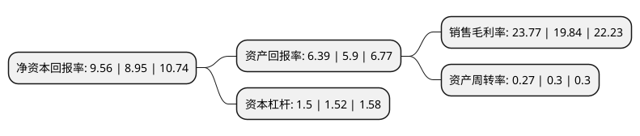

> 本页面由自动化程序生成于 2022年5月20日 01:17
> 内容可能存在错误，如有bug请提交issue至：https://github.com/Eroleice/doc-pi/issues
{.is-warning}

# 上市公司基本情况

## 基本资料

北京三联虹普新合纤技术服务股份有限公司（以下简称“三联虹普”）成立于1999年10月12日，北京市。于2014年08月01日在深交所创业板上市。

三联虹普注册资本31,859.844万元，主要产品是锦纶聚合和纺丝生产线，其用途是生产锦纶切片和锦纶纤维。主营业务:为锦纶切片及纤维生产厂商建立生产线提供技术方案设计，设备集成服务，最终以“交钥匙工程”形式向客户交付(具体服务内容包括技术方案设计，工程设计，主工艺非标设备设计及制造，技术实施，系统集成，运营技术支持和后续服务等)。以下是详细信息：

- 公司名称: 北京三联虹普新合纤技术服务股份有限公司
- 股票代码: 300384.SZ
- 所在地: 北京 - 北京市
- 成立日期: 1999年10月12日
- 注册资本: 31,859.844万元
- 法定代表人: 刘迪
- 主营业务: 主要产品是锦纶聚合和纺丝生产线，其用途是生产锦纶切片和锦纶纤维主营业务:为锦纶切片及纤维生产厂商建立生产线提供技术方案设计，设备集成服务，最终以“交钥匙工程”形式向客户交付(具体服务内容包括技术方案设计，工程设计，主工艺非标设备设计及制造，技术实施，系统集成，运营技术支持和后续服务等)
- 公司官网: www.slhpcn.com
- 公司介绍: 公司是国内为合成纤维及其原材料行业提供工程技术整体解决方案的上市公司。利用公司自有知识产权的聚酰胺聚合、聚酰胺纺丝、瓶级聚酯切片及再生聚酯等具有世界领先水平的全套工艺技术，为合成纤维生产企业提供集工程化、自动化和数字化于一体，涵盖企业全生产价值链的一站式“交钥匙”工程解决方案及服务，满足客户多样化的生产需求，用科技为客户创造价值。公司经过多年的发展和积累，已经汇集了一批资深网站策划师、设计师、专业的网站实施团队以及高素质售后服务人员，并且完全形成了一套成熟的业务流程，能够完全依照客户要求对网站进行建设、维护、更新和改版，实现客户网站对外宣传展示的首要目的，并为客户企业品牌互联网化提供全面的解决方案。

## 股东及高管情况

上市公司第一大股东为刘迪，持股128,720,797股，占比40.4%，为上市公司实际控制人。

截至2022年03月31日，上市公司的前十大股东中，共有2名自然人股东，2名机构股东，5个产品账户，1个海外主体，其中5%以上大股东共有2名。上市公司前十大股东明细如下：

> 截至2022年03月31日，上市公司前十大股东信息如下：

| 股东名称 | 持股数量（股） | 持股比例 |
| --- | --- | --- |
| 刘迪 | 128,720,797 | 40.4% |
| 刘学斌 | 43,680,734 | 13.71% |
| 中国工商银行股份有限公司-广发多因子灵活配置混合型证券投资基金 | 9,669,060 | 3.03% |
| 中国工商银行股份有限公司-交银施罗德趋势优先混合型证券投资基金 | 5,195,152 | 1.63% |
| 中国国际金融香港资产管理有限公司-客户资金 | 3,713,753 | 1.17% |
| 中国农业银行-华夏平稳增长混合型证券投资基金 | 3,336,494 | 1.05% |
| 南京银行股份有限公司-博时优质鑫选一年持有期混合型证券投资基金 | 3,078,270 | 0.97% |
| 香港中央结算有限公司(陆股通) | 2,945,102 | 0.92% |
| 招商银行股份有限公司-华安安华灵活配置混合型证券投资基金 | 2,565,400 | 0.81% |
| 北京建元金诺投资中心(有限合伙) | 2,439,800 | 0.77% |

## 利润表分析

上市公司2021年总收入为8.4亿元，净利润为1.99亿元，实现盈利。

## 杜邦分析

> 数据列示周期：2021年 | 2020年 | 2019年
{.is-info}

上市公司的净资产收益率在近一年有所上升，上升幅度为6.82%，其变化情况分解如下：
- 上市公司的销售毛利率在近一年上升了19.81%，可能是生产效率的提升、商品原材料价格下跌或商品价格的上涨所致。
- 上市公司的资产周转率在近一年下降了-10%，可能是源自于更慢的销售回款或库存管理效果下降。
- 上市公司的财务杠杆比率在近一年下降了-1.32%，可能是减少负债降低财务费用。

