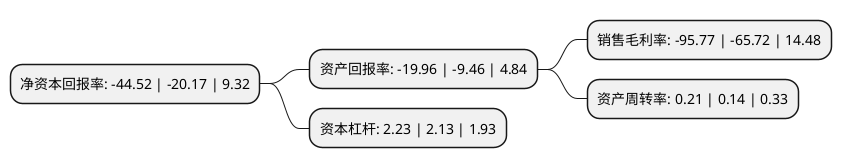

> 本页面由自动化程序生成于 2022年5月20日 01:18
> 内容可能存在错误，如有bug请提交issue至：https://github.com/Eroleice/doc-pi/issues
{.is-warning}

# 上市公司基本情况

## 基本资料

深圳市名家汇科技股份有限公司（以下简称“名家汇”）成立于2001年05月08日，深圳市。于2016年03月24日在深交所创业板上市。

名家汇注册资本69,559.657万元，主营业务:照明工程业务及与之相关的照明工程设计，照明产品的研发，生产，销售及合同能源管理业务;主要产品:照明工程业务，照明工程设计，照明产品销售，合同能源管理。以下是详细信息：

- 公司名称: 深圳市名家汇科技股份有限公司
- 股票代码: 300506.SZ
- 所在地: 广东 - 深圳市
- 成立日期: 2001年05月08日
- 注册资本: 69,559.657万元
- 法定代表人: 程宗玉
- 主营业务: 主营业务:照明工程业务及与之相关的照明工程设计，照明产品的研发，生产，销售及合同能源管理业务;主要产品:照明工程业务，照明工程设计，照明产品销售，合同能源管理
- 公司官网: www.minkave.com
- 公司介绍: 公司是照明工程行业的知名品牌，主营业务为照明工程业务及与之相关的照明工程设计、照明产品的研发、生产、销售及合同能源管理业务。公司拥有行业领先的“设计—生产—施工”全产业链、一体化综合服务能力，已取得我国照明工程行业的《城市及道路照明工程专业承包壹级》和《照明工程设计专项甲级》高等级资质，拥有文旅产业与光环境规划设计院、光文化与光经济研究院。公司是国家高新技术企业，通过设计方案的实施，成功将高科技照明产品和智能化控制技术应用于照明工程行业，顺应了节能环保、绿色照明的潮流。公司致力于成为中国领先的城市光艺术作品综合解决方案提供商，坚持“精准营销”战略，聚焦“文旅夜游经济”和“智慧城市建设”两大需求，全面发挥“科技+艺术+平台+资本”的核心竞争力，为客户打造高端化、差异化的灯光工程——城市光艺术作品，创造美和智慧的艺术体验。

## 股东及高管情况

上市公司第一大股东为程宗玉，持股143,761,996股，占比20.67%，**疑似为**上市公司实际控制人。

截至2022年03月31日，上市公司的前十大股东中，共有8名自然人股东，2名机构股东，其中5%以上大股东共有2名。上市公司前十大股东明细如下：

> 未能通过持股比例判定出上市公司实际控制人（持股30%以上）
> 可能存在通过间接持股、联合持股、协议控制等方式拥有实际控制权的主体，具体请参考上市公司定期公告！
{.is-warning}

> 截至2022年03月31日，上市公司前十大股东信息如下：

| 股东名称 | 持股数量（股） | 持股比例 |
| --- | --- | --- |
| 程宗玉 | 143,761,996 | 20.67% |
| 中国新兴集团有限责任公司 | 74,556,697 | 10.72% |
| 张经时 | 20,343,488 | 2.92% |
| 贺洁 | 15,794,275 | 2.27% |
| 徐建平 | 10,866,652 | 1.56% |
| 刘成林 | 10,173,030 | 1.46% |
| 吕强 | 6,349,206 | 0.91% |
| 陈传兴 | 6,190,476 | 0.89% |
| 王赤平 | 4,774,603 | 0.69% |
| 比亚迪股份有限公司 | 4,761,904 | 0.68% |

## 利润表分析

上市公司2021年总收入为5.54亿元，净利润为-5.31亿元，**未实现盈利**。

## 杜邦分析

> 数据列示周期：2021年 | 2020年 | 2019年
{.is-info}

上市公司的净资产收益率在近一年有所上升，上升幅度为120.72%，其变化情况分解如下：
- 上市公司的销售毛利率在近一年上升了45.72%，可能是生产效率的提升、商品原材料价格下跌或商品价格的上涨所致。
- 上市公司的资产周转率在近一年上升了50%，可能是源自于更快的销售回款或库存管理效果提升。
- 上市公司的财务杠杆比率在近一年上升了4.69%，可能是增加负债扩大生产规模。

