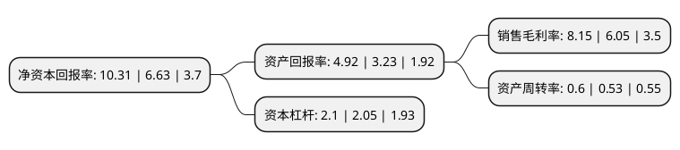

> 本页面由自动化程序生成于 2022年5月20日 01:18
> 内容可能存在错误，如有bug请提交issue至：https://github.com/Eroleice/doc-pi/issues
{.is-warning}

# 上市公司基本情况

## 基本资料

海波重型工程科技股份有限公司（以下简称“海波重科”）成立于1997年04月11日，武汉市。于2016年07月19日在深交所创业板上市。

海波重科注册资本19,218.316万元，主营业务:主营桥梁钢结构工程业务。业务范围主要包括桥梁钢结构的制作和安装，以及相应的技术研究，工艺设计及技术服务。以下是详细信息：

- 公司名称: 海波重型工程科技股份有限公司
- 股票代码: 300517.SZ
- 所在地: 湖北 - 武汉市
- 成立日期: 1997年04月11日
- 注册资本: 19,218.316万元
- 法定代表人: 张海波
- 主营业务: 主营业务:主营桥梁钢结构工程业务业务范围主要包括桥梁钢结构的制作和安装，以及相应的技术研究，工艺设计及技术服务
- 公司官网: www.haiod.com
- 公司介绍: 公司主营桥梁钢结构工程业务，业务范围主要包括桥梁钢结构的制作和安装，以及相应的技术研究、工艺设计及技术服务。目前，公司具有钢结构工程专业承包壹级资质，具备年产数万吨桥梁钢结构的工程能力，在桥梁钢结构的工艺设计、钢梁制作、桥位安装等工程重要环节具有丰富的经验，以参建的桥梁数量多、桥型全、桥址广、质量高享誉桥梁钢结构工程领域，并以雄厚的技术实力得到市场的高度认可。未来，公司积极开拓桥梁钢结构工程市场，成为国内综合竞争实力最强的桥梁钢结构工程企业之一。

## 股东及高管情况

上市公司第一大股东为张海波，持股101,826,000股，占比52.98%，为上市公司实际控制人。

截至2022年03月31日，上市公司的前十大股东中，共有9名自然人股东，1个产品账户，其中5%以上大股东共有1名。上市公司前十大股东明细如下：

> 截至2022年03月31日，上市公司前十大股东信息如下：

| 股东名称 | 持股数量（股） | 持股比例 |
| --- | --- | --- |
| 张海波 | 101,826,000 | 52.98% |
| 林俊秀 | 5,990,360 | 3.12% |
| 张学军 | 3,352,682 | 1.74% |
| 张丽 | 2,890,000 | 1.5% |
| 王希 | 2,402,100 | 1.25% |
| 潘富生 | 1,442,420 | 0.75% |
| 李龙 | 1,399,120 | 0.73% |
| 宁波梅山保税港区极简资产管理有限责任公司-极简新价值3号私募证券投资基金 | 1,355,740 | 0.71% |
| 杜金钇 | 1,331,900 | 0.69% |
| 张斌 | 1,227,100 | 0.64% |

## 利润表分析

上市公司2021年总收入为11.17亿元，净利润为0.91亿元，实现盈利。

## 杜邦分析

> 数据列示周期：2021年 | 2020年 | 2019年
{.is-info}

上市公司的净资产收益率在近一年有所上升，上升幅度为55.51%，其变化情况分解如下：
- 上市公司的销售毛利率在近一年上升了34.71%，可能是生产效率的提升、商品原材料价格下跌或商品价格的上涨所致。
- 上市公司的资产周转率在近一年上升了13.21%，可能是源自于更快的销售回款或库存管理效果提升。
- 上市公司的财务杠杆比率在近一年上升了2.44%，可能是增加负债扩大生产规模。

