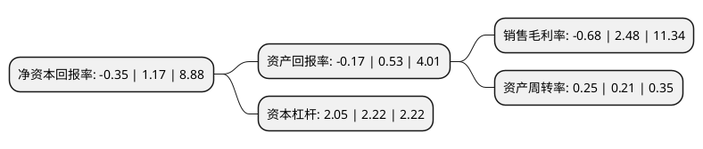

> 本页面由自动化程序生成于 2022年5月20日 01:18
> 内容可能存在错误，如有bug请提交issue至：https://github.com/Eroleice/doc-pi/issues
{.is-warning}

# 上市公司基本情况

## 基本资料

武汉农尚环境股份有限公司（以下简称“农尚环境”）成立于2000年04月28日，武汉市。于2016年09月20日在深交所创业板上市。

农尚环境注册资本29,328.813万元，主营业务:园林绿化工程设计，施工，养护及苗木培育业务。业务类别:园林绿化施工，园林景观设计，苗木销售。以下是详细信息：

- 公司名称: 武汉农尚环境股份有限公司
- 股票代码: 300536.SZ
- 所在地: 湖北 - 武汉市
- 成立日期: 2000年04月28日
- 注册资本: 29,328.813万元
- 法定代表人: 林峰
- 主营业务: 主营业务:园林绿化工程设计，施工，养护及苗木培育业务业务类别:园林绿化施工，园林景观设计，苗木销售
- 公司官网: www.nusunlandscape.com
- 公司介绍: 公司从事园林绿化工程设计、施工、养护及苗木培育业务，其中园林绿化工程施工业务为公司收入和利润的主要来源，园林绿化工程设计、苗木培育和园林养护主要服务于公司园林绿化工程施工业务。公司拥有城市园林绿化企业壹级、风景园林工程设计专项乙级、市政公用工程施工总承包三级、园林古建筑工程专业承包三级和建筑装修装饰工程专业承包贰级等专业资质，通过了ISO9001：2008、ISO14001：2004、GB/T28001-2011管理体系认证，是国家高新技术企业，是湖北省风景园林学会副理事长单位和武汉市城市园林绿化企业协会副会长单位，中国民族建筑研究会绿色建筑与节能专业委员会副主任单位。

## 股东及高管情况

上市公司第一大股东为吴亮，持股70,875,000股，占比24.17%，**疑似为**上市公司实际控制人。

截至2022年04月07日，上市公司的前十大股东中，共有7名自然人股东，1名机构股东，2个产品账户，其中5%以上大股东共有4名。上市公司前十大股东明细如下：

> 未能通过持股比例判定出上市公司实际控制人（持股30%以上）
> 可能存在通过间接持股、联合持股、协议控制等方式拥有实际控制权的主体，具体请参考上市公司定期公告！
{.is-warning}

> 截至2022年04月07日，上市公司前十大股东信息如下：

| 股东名称 | 持股数量（股） | 持股比例 |
| --- | --- | --- |
| 吴亮 | 70,875,000 | 24.17% |
| 吴亮 | 70,875,000 | 24.17% |
| 深圳前海银湖资本有限公司-银湖麒麟2号私募证券投资基金 | 18,257,400 | 6.23% |
| 贾菊 | 15,000,000 | 5.11% |
| 上海皓华弘道企业管理咨询合伙企业(有限合伙) | 14,622,700 | 4.99% |
| 黄蓓 | 9,837,476 | 3.35% |
| 北京福睿德投资管理有限公司-福睿德成长型私募证券投资基金 | 4,610,000 | 1.57% |
| 唐良春 | 4,130,000 | 1.41% |
| 郑文涌 | 2,116,300 | 0.72% |
| 温世兰 | 1,993,000 | 0.68% |

## 利润表分析

上市公司2021年总收入为3.07亿元，净利润为-0.03亿元，**未实现盈利**。

## 杜邦分析

> 数据列示周期：2021年 | 2020年 | 2019年
{.is-info}

上市公司的净资产收益率在近一年有所下降，下降幅度为-129.91%，其变化情况分解如下：
- 上市公司的销售毛利率在近一年下降了-127.42%，可能是生产效率的下降、商品原材料价格上涨或商品价格的下跌所致。
- 上市公司的资产周转率在近一年上升了19.05%，可能是源自于更快的销售回款或库存管理效果提升。
- 上市公司的财务杠杆比率在近一年下降了-7.66%，可能是减少负债降低财务费用。

