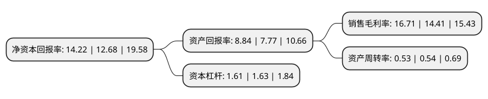

> 本页面由自动化程序生成于 2022年5月20日 01:18
> 内容可能存在错误，如有bug请提交issue至：https://github.com/Eroleice/doc-pi/issues
{.is-warning}

# 上市公司基本情况

## 基本资料

筑博设计股份有限公司（以下简称“筑博设计”）成立于1996年03月25日，拉萨市。于2019年11月08日在深交所创业板上市。

筑博设计注册资本10,293万元，主要业务:公司的主营业务为建筑设计及相关业务的设计与咨询，业务涵盖建筑设计，城市规划，风景园林设计，室内设计等以下是详细信息：

- 公司名称: 筑博设计股份有限公司
- 股票代码: 300564.SZ
- 所在地: 西藏 - 拉萨市
- 成立日期: 1996年03月25日
- 注册资本: 10,293万元
- 法定代表人: 徐先林
- 主营业务: 公司的主营业务为建筑设计及相关业务的设计与咨询，业务涵盖建筑设计，城市规划，风景园林设计，室内设计等
- 公司官网: www.zhubo.com
- 公司介绍: 公司是具有建筑设计甲级资质、城市规划甲级资质、市政(道路、桥梁、给水工程)乙级资质和风景园林乙级资质的综合设计机构。一直以来，公司致力于打造设计全产业链与建筑技术开发综合解决方案服务商，业务范围涵盖了城市规划、建筑工程、建筑智能化、室内装饰、风景园林、照明工程、设计咨询。公司不断加大装配式建筑、BIM技术、绿色建筑、海绵城市、建筑智能化等前沿技术领域的研究与成果应用，获得国家高新技术企业认证，获颁国家首批“装配式建筑产业基地”；公司的项目覆盖全国30个省级行政区和100个地级市，多个项目获得殊荣，成为全国颇具影响力的精品工程。

## 股东及高管情况

上市公司第一大股东为徐先林，持股21,079,000股，占比20.48%，**疑似为**上市公司实际控制人。

截至2022年03月31日，上市公司的前十大股东中，共有5名自然人股东，4名机构股东，1个产品账户，其中5%以上大股东共有6名。上市公司前十大股东明细如下：

> 未能通过持股比例判定出上市公司实际控制人（持股30%以上）
> 可能存在通过间接持股、联合持股、协议控制等方式拥有实际控制权的主体，具体请参考上市公司定期公告！
{.is-warning}

> 截至2022年03月31日，上市公司前十大股东信息如下：

| 股东名称 | 持股数量（股） | 持股比例 |
| --- | --- | --- |
| 徐先林 | 21,079,000 | 20.48% |
| 杨为众 | 10,731,000 | 10.43% |
| 徐江 | 8,765,000 | 8.52% |
| 深圳市筑先投资管理企业(有限合伙) | 8,400,000 | 8.16% |
| 深圳市筑为投资管理企业(有限合伙) | 7,600,000 | 7.38% |
| 深圳市筑就投资管理企业(有限合伙) | 7,600,000 | 7.38% |
| 拉萨城投金融投资控股集团有限公司 | 2,419,200 | 2.35% |
| 马镇炎 | 2,075,000 | 2.02% |
| 阳光资产-工商银行-主动量化1号资产管理产品 | 340,000 | 0.33% |
| 吴建光 | 270,000 | 0.26% |

## 利润表分析

上市公司2021年总收入为10.26亿元，净利润为1.71亿元，实现盈利。

## 杜邦分析

> 数据列示周期：2021年 | 2020年 | 2019年
{.is-info}

上市公司的净资产收益率在近一年有所上升，上升幅度为12.15%，其变化情况分解如下：
- 上市公司的销售毛利率在近一年上升了15.96%，可能是生产效率的提升、商品原材料价格下跌或商品价格的上涨所致。
- 上市公司的资产周转率在近一年下降了-1.85%，可能是源自于更慢的销售回款或库存管理效果下降。
- 上市公司的财务杠杆比率在近一年下降了-1.23%，可能是减少负债降低财务费用。

