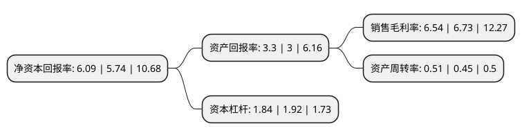

> 本页面由自动化程序生成于 2022年5月20日 01:19
> 内容可能存在错误，如有bug请提交issue至：https://github.com/Eroleice/doc-pi/issues
{.is-warning}

# 上市公司基本情况

## 基本资料

中达安股份有限公司（以下简称“中达安”）成立于2000年08月08日，广州市。于2017年03月31日在深交所创业板上市。

中达安注册资本13,632.2万元，主要从事以工程监理业务为主的项目管理服务，具体包括通信监理，土建监理，招标代理，工程咨询，项目代建，政府采购代理等项目管理服务。以下是详细信息：

- 公司名称: 中达安股份有限公司
- 股票代码: 300635.SZ
- 所在地: 广东 - 广州市
- 成立日期: 2000年08月08日
- 注册资本: 13,632.2万元
- 法定代表人: 吴君晔
- 主营业务: 主要从事以工程监理业务为主的项目管理服务，具体包括通信监理，土建监理，招标代理，工程咨询，项目代建，政府采购代理等项目管理服务
- 公司官网: www.sino-daan.com
- 公司介绍: 公司是广东省建设监理协会常务理事单位、是中国通信企业协会会员单位、广东省工程咨询协会会员单位。公司自成立以来主要从事以工程监理为主的建设工程项目管理服务业务，在工程监理行业，公司处于行业领先地位。公司的工程监理收入连续多年进入全国工程监理收入百强企业前10强。公司主要从事以工程监理业务为主的项目管理服务，具体包括通信监理、土建监理、招标代理、工程咨询、项目代建、政府采购代理等项目管理服务。

## 股东及高管情况

上市公司第一大股东为吴君晔，持股14,619,525股，占比10.7243%，**疑似为**上市公司实际控制人。

截至2022年04月22日，上市公司的前十大股东中，共有8名自然人股东，1名机构股东，1个产品账户，其中5%以上大股东共有4名。上市公司前十大股东明细如下：

> 未能通过持股比例判定出上市公司实际控制人（持股30%以上）
> 可能存在通过间接持股、联合持股、协议控制等方式拥有实际控制权的主体，具体请参考上市公司定期公告！
{.is-warning}

> 截至2022年04月22日，上市公司前十大股东信息如下：

| 股东名称 | 持股数量（股） | 持股比例 |
| --- | --- | --- |
| 吴君晔 | 14,619,525 | 10.7243% |
| 吴君晔 | 14,619,525 | 10.72% |
| 李涛 | 13,137,600 | 9.6372% |
| 上海春山新棠投资管理有限公司—春山新棠事件驱动型私募投资基金 | 6,820,000 | 5.0029% |
| 新国融(广州)管理咨询合伙企业(有限合伙) | 4,869,421 | 3.57% |
| 甘露 | 4,717,600 | 3.46% |
| 王胜 | 3,615,336 | 2.65% |
| 陆酉教 | 3,431,000 | 2.52% |
| 陈志雄 | 2,084,778 | 1.53% |
| 罗晚霞 | 2,046,000 | 1.5% |

## 利润表分析

上市公司2021年总收入为6.04亿元，净利润为0.39亿元，实现盈利。

## 杜邦分析

> 数据列示周期：2021年 | 2020年 | 2019年
{.is-info}

上市公司的净资产收益率在近一年有所上升，上升幅度为6.1%，其变化情况分解如下：
- 上市公司的销售毛利率在近一年下降了-2.82%，可能是生产效率的下降、商品原材料价格上涨或商品价格的下跌所致。
- 上市公司的资产周转率在近一年上升了13.33%，可能是源自于更快的销售回款或库存管理效果提升。
- 上市公司的财务杠杆比率在近一年下降了-4.17%，可能是减少负债降低财务费用。

