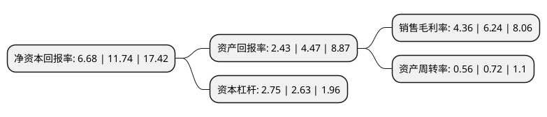

> 本页面由自动化程序生成于 2022年5月20日 01:19
> 内容可能存在错误，如有bug请提交issue至：https://github.com/Eroleice/doc-pi/issues
{.is-warning}

# 上市公司基本情况

## 基本资料

杭州园林设计院股份有限公司（以下简称“杭州园林”）成立于2001年11月13日，杭州市。于2017年05月05日在深交所创业板上市。

杭州园林注册资本13,241.661万元，主要产品:园林设计，园林施工，其他项目;主营业务:风景园林设计。以下是详细信息：

- 公司名称: 杭州园林设计院股份有限公司
- 股票代码: 300649.SZ
- 所在地: 浙江 - 杭州市
- 成立日期: 2001年11月13日
- 注册资本: 13,241.661万元
- 法定代表人: 吕明华
- 主营业务: 主要产品:园林设计，园林施工，其他项目;主营业务:风景园林设计
- 公司官网: www.hzyly.com
- 公司介绍: 公司主要提供以整体性解决方案为核心的风景园林设计服务，具体包括前期设计、方案设计、扩初设计、施工图设计、施工配合等。公司业务以风景园林学、建筑学、城市规划学为核心，集成了以地质学、自然地理学、土壤学、气象学为代表的自然科学，以生物学、植物学、生态学为代表的生物科学，以园艺学、林学为代表的农业应用科学，以文学、艺术、美学为代表的人文科学，具有多学科综合交叉、多技术综合集成的典型特征。公司从事风景园林设计行业多年，凭借西湖风景名胜区综合保护工程、西溪国家湿地公园等作品，“杭州园林设计院”已在全国享有一定的知名度。

## 股东及高管情况

上市公司第一大股东为云南园展企业管理有限公司，持股11,520,000股，占比8.7%，**疑似为**上市公司实际控制人。

截至2022年03月31日，上市公司的前十大股东中，共有8名自然人股东，2名机构股东，其中5%以上大股东共有5名。上市公司前十大股东明细如下：

> 未能通过持股比例判定出上市公司实际控制人（持股30%以上）
> 可能存在通过间接持股、联合持股、协议控制等方式拥有实际控制权的主体，具体请参考上市公司定期公告！
{.is-warning}

> 上市公司第一大股东持股不超过10%，请检查是否存在公司控制权风险！
{.is-danger}

> 截至2022年03月31日，上市公司前十大股东信息如下：

| 股东名称 | 持股数量（股） | 持股比例 |
| --- | --- | --- |
| 云南园展企业管理有限公司 | 11,520,000 | 8.7% |
| 葛荣 | 10,768,622 | 8.13% |
| 何韦 | 10,051,839 | 7.59% |
| 吕明华 | 8,517,758 | 6.43% |
| 刘克章 | 7,629,030 | 5.76% |
| 周为 | 6,169,900 | 4.66% |
| 云南鸿园企业管理有限公司 | 6,080,000 | 4.59% |
| 邓冶 | 3,270,080 | 2.47% |
| 童存志 | 3,219,195 | 2.43% |
| 李勇 | 2,920,000 | 2.21% |

## 利润表分析

上市公司2021年总收入为7.48亿元，净利润为0.32亿元，实现盈利。

## 杜邦分析

> 数据列示周期：2021年 | 2020年 | 2019年
{.is-info}

上市公司的净资产收益率在近一年有所下降，下降幅度为-43.1%，其变化情况分解如下：
- 上市公司的销售毛利率在近一年下降了-30.13%，可能是生产效率的下降、商品原材料价格上涨或商品价格的下跌所致。
- 上市公司的资产周转率在近一年下降了-22.22%，可能是源自于更慢的销售回款或库存管理效果下降。
- 上市公司的财务杠杆比率在近一年上升了4.56%，可能是增加负债扩大生产规模。

