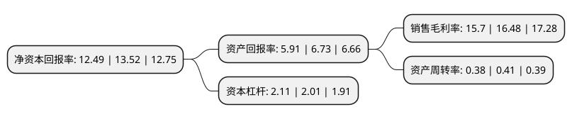

> 本页面由自动化程序生成于 2022年5月20日 01:20
> 内容可能存在错误，如有bug请提交issue至：https://github.com/Eroleice/doc-pi/issues
{.is-warning}

# 上市公司基本情况

## 基本资料

河南省交通规划设计研究院股份有限公司（以下简称“设研院”）成立于2007年08月22日，郑州市。于2017年12月12日在深交所创业板上市。

设研院注册资本27,406.334万元，咨询，规划，勘察，设计，测绘，试验，检测，监测，监理，项目管理等工程咨询服务。以下是详细信息：

- 公司名称: 河南省交通规划设计研究院股份有限公司
- 股票代码: 300732.SZ
- 所在地: 河南 - 郑州市
- 成立日期: 2007年08月22日
- 注册资本: 27,406.334万元
- 法定代表人: 汤意
- 主营业务: 咨询，规划，勘察，设计，测绘，试验，检测，监测，监理，项目管理等工程咨询服务
- 公司官网: www.hnrbi.com
- 公司介绍: 公司的前身河南省交通规划勘察设计院，是河南省专门从事公路工程的规划、可行性研究、勘察、设计、技术咨询、施工监理的综合性技术单位，持有国家颁发的公路行业(公路、特大桥梁、特长隧道、交通工程)甲级、市政行业(道路工程、桥梁工程)甲级、建筑行业(建筑工程)甲级设计资质，工程咨询(公路、市政公用工程)甲级咨询资质，并持有工程勘察综合类甲级、工程试验检测甲级、公路工程监理甲级、测绘甲级等资质证书以及《中华人民共和国对外承包工程资格证书》，是全省交通勘察设计、试验检测、工程监理的龙头企业。

## 股东及高管情况

上市公司第一大股东为河南交院投资控股有限公司，持股90,280,164股，占比32.94%，为上市公司实际控制人。

截至2022年03月31日，上市公司的前十大股东中，共有8名自然人股东，1名机构股东，1名其他股东，其中5%以上大股东共有2名。上市公司前十大股东明细如下：

> 截至2022年03月31日，上市公司前十大股东信息如下：

| 股东名称 | 持股数量（股） | 持股比例 |
| --- | --- | --- |
| 河南交院投资控股有限公司 | 90,280,164 | 32.94% |
| 河南省交通运输厅机关服务中心 | 39,191,040 | 14.3% |
| 杨彬 | 1,797,702 | 0.66% |
| 周小卞 | 935,300 | 0.34% |
| 张伟 | 770,000 | 0.28% |
| 李孟绪 | 694,725 | 0.25% |
| 吴声耀 | 692,533 | 0.25% |
| 徐国华 | 656,038 | 0.24% |
| 王金艳 | 642,298 | 0.23% |
| 李宏瑾 | 602,099 | 0.22% |

## 利润表分析

上市公司2021年总收入为20.52亿元，净利润为3.22亿元，实现盈利。

## 杜邦分析

> 数据列示周期：2021年 | 2020年 | 2019年
{.is-info}

上市公司的净资产收益率在近一年有所下降，下降幅度为-7.62%，其变化情况分解如下：
- 上市公司的销售毛利率在近一年下降了-4.73%，可能是生产效率的下降、商品原材料价格上涨或商品价格的下跌所致。
- 上市公司的资产周转率在近一年下降了-7.32%，可能是源自于更慢的销售回款或库存管理效果下降。
- 上市公司的财务杠杆比率在近一年上升了4.98%，可能是增加负债扩大生产规模。

