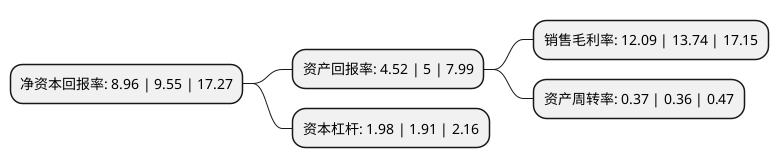

> 本页面由自动化程序生成于 2022年5月20日 01:20
> 内容可能存在错误，如有bug请提交issue至：https://github.com/Eroleice/doc-pi/issues
{.is-warning}

# 上市公司基本情况

## 基本资料

南京市测绘勘察研究院股份有限公司（以下简称“测绘股份”）成立于1991年04月08日，南京市。于2020年04月03日在深交所创业板上市。

测绘股份注册资本11,200万元，主要从事地理信息产业中的测绘地理信息服务业务。以下是详细信息：

- 公司名称: 南京市测绘勘察研究院股份有限公司
- 股票代码: 300826.SZ
- 所在地: 江苏 - 南京市
- 成立日期: 1991年04月08日
- 注册资本: 11,200万元
- 法定代表人: 左都美
- 主营业务: 主要从事地理信息产业中的测绘地理信息服务业务
- 公司官网: www.njcky.com
- 公司介绍: 公司作为专业的地理信息技术服务提供商，主要利用时空信息的现代专业测勘方法、先进的数据处理技术以及信息化技术，为建设工程、城市精细化及智能化管理、空间位置信息的行业应用提供包括地理信息数据采集、加工处理、集成服务等在内的专业技术服务。公司从事地理信息产业中的测绘地理信息服务业务，该业务以地理信息资源开发利用为核心特征。按照服务领域、信息化程度，公司业务具体细分为工程测勘技术服务、测绘服务、地理信息系统集成与服务三类，可为城市管理从规划设计、建设施工到运营管理的全生命周期，以及企业工程建设、基于时空信息的资源运营、维护、服务等行业应用提供从时空信息数据采集、多源数据整合、数据处理、数据分析及产品化应用的一体化服务。经过多年经营，公司业务规模及范围不断扩大，已在行业内形成一定的影响力，2017年度位列中国地理信息产业百强企业第17名，位列其中测绘地理信息服务细分行业第5名。

## 股东及高管情况

上市公司第一大股东为南京高投科技有限公司，持股55,438,734股，占比49.5%，为上市公司实际控制人。

截至2022年03月31日，上市公司的前十大股东中，共有8名自然人股东，1名机构股东，1个海外主体，其中5%以上大股东共有1名。上市公司前十大股东明细如下：

> 截至2022年03月31日，上市公司前十大股东信息如下：

| 股东名称 | 持股数量（股） | 持股比例 |
| --- | --- | --- |
| 南京高投科技有限公司 | 55,438,734 | 49.5% |
| 储征伟 | 5,001,788 | 4.47% |
| 胡凯蕾 | 1,016,511 | 0.91% |
| 侯兆泰 | 830,691 | 0.74% |
| 李勇 | 813,312 | 0.73% |
| 尚明 | 770,956 | 0.69% |
| 张金伙 | 519,800 | 0.46% |
| MORGAN STANLEY &CO.INTERNATIONAL PLC | 349,380 | 0.31% |
| 王勇 | 346,728 | 0.31% |
| 丁善祥 | 346,122 | 0.31% |

## 利润表分析

上市公司2021年总收入为7.63亿元，净利润为0.92亿元，实现盈利。

## 杜邦分析

> 数据列示周期：2021年 | 2020年 | 2019年
{.is-info}

上市公司的净资产收益率在近一年有所下降，下降幅度为-6.18%，其变化情况分解如下：
- 上市公司的销售毛利率在近一年下降了-12.01%，可能是生产效率的下降、商品原材料价格上涨或商品价格的下跌所致。
- 上市公司的资产周转率在近一年上升了2.78%，可能是源自于更快的销售回款或库存管理效果提升。
- 上市公司的财务杠杆比率在近一年上升了3.66%，可能是增加负债扩大生产规模。

