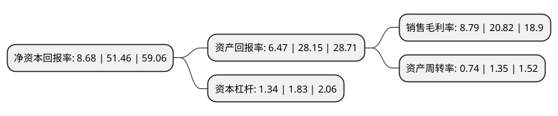

> 本页面由自动化程序生成于 2022年5月20日 01:20
> 内容可能存在错误，如有bug请提交issue至：https://github.com/Eroleice/doc-pi/issues
{.is-warning}

# 上市公司基本情况

## 基本资料

广州山水比德设计股份有限公司（以下简称“山水比德”）成立于2007年04月09日，广州市。于2021年08月13日在深交所创业板上市。

山水比德注册资本4,040万元，专注于园林景观设计业务，是一家以“新山水”设计方法论为指导，贯彻落实国家“生态文明建设”理念，为社区景观，文化旅游，商业空间，市政公共等领域提供整体性解决方案。以下是详细信息：

- 公司名称: 广州山水比德设计股份有限公司
- 股票代码: 300844.SZ
- 所在地: 广东 - 广州市
- 成立日期: 2007年04月09日
- 注册资本: 4,040万元
- 法定代表人: 孙虎
- 主营业务: 专注于园林景观设计业务，是一家以“新山水”设计方法论为指导，贯彻落实国家“生态文明建设”理念，为社区景观，文化旅游，商业空间，市政公共等领域提供整体性解决方案
- 公司官网: www.gz-spi.com
- 公司介绍: 公司专注于园林景观设计业务，是一家以“新山水”设计方法论为指导，贯彻落实国家“生态文明建设”理念，为社区景观、文化旅游、商业空间、市政公共等领域提供整体性解决方案的景观设计综合服务商，已形成“山水地产”和“山水文旅”两大核心板块。公司总部位于广州，已在北京、上海、深圳、青岛、昆明、长沙、武汉、重庆、成都、南京等10个城市成立分公司。公司自设立以来一直专注于园林景观设计业务，拥有“风景园林工程设计专项甲级”资质，获得“中国房地产景观设计竞争力排名第一名”“中国建筑规划设计最佳创意品牌机构”、“全国十佳园林设计企业”等荣誉称号。公司设计项目获得被誉为“风景园林行业的奥林匹克奖”的国际风景园林师联合会(IFLA)国际大奖、美国IDA国际设计大奖以及亚洲设计大奖等，位列“金盘奖”2017-2019年景观设计类累计获奖总数第一，以及园冶杯、勘察设计奖、地产设计大奖等多项国内外设计奖项。

## 股东及高管情况

上市公司第一大股东为山水比德集团有限公司，持股16,300,000股，占比40.35%，为上市公司实际控制人。

截至2022年03月31日，上市公司的前十大股东中，共有7名自然人股东，3名机构股东，其中5%以上大股东共有2名。上市公司前十大股东明细如下：

> 截至2022年03月31日，上市公司前十大股东信息如下：

| 股东名称 | 持股数量（股） | 持股比例 |
| --- | --- | --- |
| 山水比德集团有限公司 | 16,300,000 | 40.35% |
| 孙虎 | 8,500,000 | 21.04% |
| 珠海山盛投资合伙企业(有限合伙) | 2,000,000 | 4.95% |
| 广州硕煜投资合伙企业(有限合伙) | 1,550,000 | 3.84% |
| 秦鹏 | 600,000 | 1.49% |
| 利征 | 500,000 | 1.24% |
| 蔡彬 | 450,000 | 1.11% |
| 梅卫平 | 400,000 | 0.99% |
| 宋磊 | 163,600 | 0.4% |
| 孙亮亭 | 121,908 | 0.3% |

## 利润表分析

上市公司2021年总收入为5.89亿元，净利润为0.51亿元，实现盈利。

## 杜邦分析

> 数据列示周期：2021年 | 2020年 | 2019年
{.is-info}

上市公司的净资产收益率在近一年有所下降，下降幅度为-83.13%，其变化情况分解如下：
- 上市公司的销售毛利率在近一年下降了-57.78%，可能是生产效率的下降、商品原材料价格上涨或商品价格的下跌所致。
- 上市公司的资产周转率在近一年下降了-45.19%，可能是源自于更慢的销售回款或库存管理效果下降。
- 上市公司的财务杠杆比率在近一年下降了-26.78%，可能是减少负债降低财务费用。

