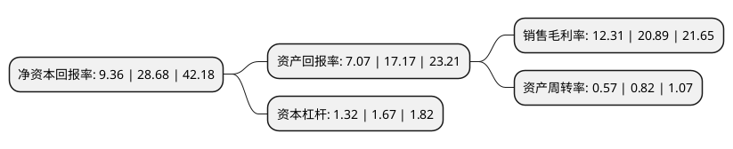

> 本页面由自动化程序生成于 2022年5月20日 01:21
> 内容可能存在错误，如有bug请提交issue至：https://github.com/Eroleice/doc-pi/issues
{.is-warning}

# 上市公司基本情况

## 基本资料

深圳奥雅设计股份有限公司（以下简称“奥雅设计”）成立于2001年12月14日，深圳市。于2021年02月26日在深交所创业板上市。

奥雅设计注册资本6,000万元，主要从事景观设计及以创意设计为主导的EPC总承包业务，具体包括:策划与经济分析，概念性规划，生态规划与设计，城市设计，景观园林设计，建筑设计，室内装饰设计，软装设计，儿童空间与活动设施设计，平面视觉和产品设计等。以下是详细信息：

- 公司名称: 深圳奥雅设计股份有限公司
- 股票代码: 300949.SZ
- 所在地: 广东 - 深圳市
- 成立日期: 2001年12月14日
- 注册资本: 6,000万元
- 法定代表人: 李宝章
- 主营业务: 主要从事景观设计及以创意设计为主导的EPC总承包业务，具体包括:策划与经济分析，概念性规划，生态规划与设计，城市设计，景观园林设计，建筑设计，室内装饰设计，软装设计，儿童空间与活动设施设计，平面视觉和产品设计等
- 公司官网: www.aoya-hk.com
- 公司介绍: 公司是国家级高新技术企业，主要从事景观设计及以创意设计为主导的EPC总承包业务，具体包括：策划与经济分析、概念性规划、生态规划与设计、城市设计、景观园林设计、建筑设计、室内装饰设计、软装设计、儿童空间与活动设施设计、平面视觉和产品设计等。公司致力于成为美好人居环境的综合服务商。自成立以来，景观设计一直是公司的核心业务。公司秉承“人本、自然”的设计理念，在实践中不断尝试将现代景观设计理念应用于地域性场景中，完成了上千项兼具功能性与艺术性的设计作品。基于上述积累，公司将生态学、经济学和社会学的知识和理念融入到策划、规划项目中，从而形成综合设计业务。公司拥有风景园林工程设计专项甲级资质、城市规划编制乙级资质及建筑行业(建筑工程)乙级资质，曾获得“全球人居环境设计奖”、“北京市公共空间城市设计最佳奖”、“国家优质工程银质奖”等奖项，并被各地政府、行业组织、地产企业评为“全国十佳优秀园林企业”、“中国二十大影响力建筑、景观设计公司”等。

## 股东及高管情况

上市公司第一大股东为李宝章，持股34,265,250股，占比57.11%，为上市公司实际控制人。

截至2022年03月31日，上市公司的前十大股东中，共有6名自然人股东，3名机构股东，1个产品账户，其中5%以上大股东共有2名。上市公司前十大股东明细如下：

> 截至2022年03月31日，上市公司前十大股东信息如下：

| 股东名称 | 持股数量（股） | 持股比例 |
| --- | --- | --- |
| 李宝章 | 34,265,250 | 57.11% |
| 深圳奥雅和力投资管理企业(有限合伙) | 6,547,500 | 10.91% |
| 深圳奥雅合嘉投资管理企业(有限合伙) | 2,182,500 | 3.64% |
| 珠海乐朴均衡投资企业(有限合伙) | 1,695,000 | 2.83% |
| 陈丽虹 | 119,300 | 0.2% |
| 朱秀敏 | 115,900 | 0.19% |
| 蔡春生 | 105,800 | 0.18% |
| 基本养老保险基金一三零二组合 | 102,900 | 0.17% |
| 胡琦艳 | 96,700 | 0.16% |
| 何昌容 | 96,400 | 0.16% |

## 利润表分析

上市公司2021年总收入为6.11亿元，净利润为0.75亿元，实现盈利。

## 杜邦分析

> 数据列示周期：2021年 | 2020年 | 2019年
{.is-info}

上市公司的净资产收益率在近一年有所下降，下降幅度为-67.36%，其变化情况分解如下：
- 上市公司的销售毛利率在近一年下降了-41.07%，可能是生产效率的下降、商品原材料价格上涨或商品价格的下跌所致。
- 上市公司的资产周转率在近一年下降了-30.49%，可能是源自于更慢的销售回款或库存管理效果下降。
- 上市公司的财务杠杆比率在近一年下降了-20.96%，可能是减少负债降低财务费用。

