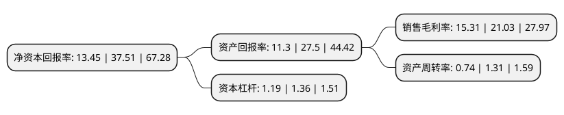

> 本页面由自动化程序生成于 2022年5月20日 01:22
> 内容可能存在错误，如有bug请提交issue至：https://github.com/Eroleice/doc-pi/issues
{.is-warning}

# 上市公司基本情况

## 基本资料

深圳瑞捷工程咨询股份有限公司（以下简称“深圳瑞捷”）成立于2010年04月12日，深圳市。于2021年04月20日在深交所创业板上市。

深圳瑞捷注册资本6,837.89万元，专业从事建设工程第三方评估，管理和咨询服务，为房地产开发企业，公共工程建设单位及其他委托单位等客户提供专业的工程评估，驻场管理和管理咨询服务以下是详细信息：

- 公司名称: 深圳瑞捷工程咨询股份有限公司
- 股票代码: 300977.SZ
- 所在地: 广东 - 深圳市
- 成立日期: 2010年04月12日
- 注册资本: 6,837.89万元
- 法定代表人: 黄新华
- 主营业务: 专业从事建设工程第三方评估，管理和咨询服务，为房地产开发企业，公共工程建设单位及其他委托单位等客户提供专业的工程评估，驻场管理和管理咨询服务
- 公司官网: www.szridge.com
- 公司介绍: 公司是一家专业从事建设工程第三方评估、管理和咨询服务的企业，是国内建设工程质量与安全风险第三方评估咨询业务的开拓者之一。自2010年成立以来，公司致力于为房地产开发企业、公共工程建设单位及其他委托单位等客户提供专业的工程评估、驻场管理和管理咨询服务，协助客户清晰掌握旗下建设项目总体质量及安全风险状态，提升工程品质，降低安全风险，促进客户项目管理水平、运营安全管理水平和综合效益的提升。经过多年积累，“瑞捷咨询”品牌在行业内享有较高的知名度和认可度，并多次获得了融创中国、保利发展、龙湖集团、招商蛇口等企业授予的“优秀供应商”、“优秀合作单位”、“优秀合作伙伴”、“最佳同路人奖”、“优秀咨询单位”等多项荣誉。

## 股东及高管情况

上市公司第一大股东为范文宏，持股17,350,200股，占比25.37%，**疑似为**上市公司实际控制人。

截至2022年03月31日，上市公司的前十大股东中，共有2名自然人股东，5名机构股东，3个产品账户，其中5%以上大股东共有4名。上市公司前十大股东明细如下：

> 未能通过持股比例判定出上市公司实际控制人（持股30%以上）
> 可能存在通过间接持股、联合持股、协议控制等方式拥有实际控制权的主体，具体请参考上市公司定期公告！
{.is-warning}

> 截至2022年03月31日，上市公司前十大股东信息如下：

| 股东名称 | 持股数量（股） | 持股比例 |
| --- | --- | --- |
| 范文宏 | 17,350,200 | 25.37% |
| 黄新华 | 16,669,800 | 24.38% |
| 深圳市瑞皿投资咨询有限公司 | 5,783,400 | 8.46% |
| 深圳市瑞可投资咨询有限公司 | 5,556,600 | 8.13% |
| 深圳市瑞华捷投资合伙企业(有限合伙) | 2,520,000 | 3.69% |
| 深圳市瑞宏捷投资合伙企业(有限合伙) | 2,520,000 | 3.69% |
| 中国工商银行股份有限公司-申万菱信新经济混合型证券投资基金 | 835,481 | 1.22% |
| 中国农业银行股份有限公司-申万菱信乐享混合型证券投资基金 | 453,981 | 0.66% |
| 东北证券股份有限公司 | 305,800 | 0.45% |
| 中国民生银行股份有限公司-浙商聚潮新思维混合型证券投资基金 | 293,150 | 0.43% |

## 利润表分析

上市公司2021年总收入为7.78亿元，净利润为1.19亿元，实现盈利。

## 杜邦分析

> 数据列示周期：2021年 | 2020年 | 2019年
{.is-info}

上市公司的净资产收益率在近一年有所下降，下降幅度为-64.14%，其变化情况分解如下：
- 上市公司的销售毛利率在近一年下降了-27.2%，可能是生产效率的下降、商品原材料价格上涨或商品价格的下跌所致。
- 上市公司的资产周转率在近一年下降了-43.51%，可能是源自于更慢的销售回款或库存管理效果下降。
- 上市公司的财务杠杆比率在近一年下降了-12.5%，可能是减少负债降低财务费用。

