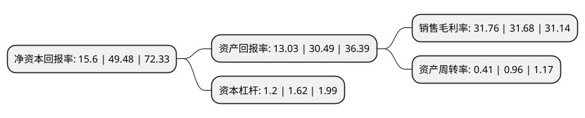

> 本页面由自动化程序生成于 2022年5月20日 01:22
> 内容可能存在错误，如有bug请提交issue至：https://github.com/Eroleice/doc-pi/issues
{.is-warning}

# 上市公司基本情况

## 基本资料

上海尤安建筑设计股份有限公司（以下简称“尤安设计”）成立于2004年01月06日，上海市。于2021年04月20日在深交所创业板上市。

尤安设计注册资本8,000万元，公司主要从事建筑设计业务的研发，咨询与技术服务。以下是详细信息：

- 公司名称: 上海尤安建筑设计股份有限公司
- 股票代码: 300983.SZ
- 所在地: 上海 - 上海市
- 成立日期: 2004年01月06日
- 注册资本: 8,000万元
- 法定代表人: 陈磊
- 主营业务: 公司主要从事建筑设计业务的研发，咨询与技术服务
- 公司官网: www.uachina.com.cn
- 公司介绍: 公司主要从事建筑设计业务的研发、咨询与技术服务。公司以方案设计为轴心，聚焦于概念设计、方案设计、初步设计等建筑设计的前端各环节；并根据下游客户需求，提供包括施工图设计及施工配合在内的一体化建筑设计解决方案。公司业务范围涵盖居住建筑、公共建筑及功能混合型社区等领域。公司拥有建筑行业(建筑工程)甲级资质，子公司尤安建筑拥有建筑设计事务所甲级资质。公司是上海市科学技术委员会、上海市财政局、国家税务总局上海市税务局联合认定的高新技术企业，被上海市绿色建筑协会评为上海市绿色建筑设计单位。公司设计作品曾荣获“全国勘察设计行业优秀勘察设计奖-一等奖”、“上海市建筑学会建筑创作奖-优秀奖”、“中国房地产优秀品牌项目”、“全国人居生态建筑金奖”、“REARD全球地产设计大奖-金奖”等多个国家与行业颁发的重要奖项。

## 股东及高管情况

上市公司第一大股东为宁波尤埃投资中心(有限合伙)，持股26,347,200股，占比32.93%，为上市公司实际控制人。

截至2022年03月31日，上市公司的前十大股东中，共有8名自然人股东，1名机构股东，1个产品账户，其中5%以上大股东共有4名。上市公司前十大股东明细如下：

> 截至2022年03月31日，上市公司前十大股东信息如下：

| 股东名称 | 持股数量（股） | 持股比例 |
| --- | --- | --- |
| 宁波尤埃投资中心(有限合伙) | 26,347,200 | 32.93% |
| 施泽淞 | 8,974,080 | 11.22% |
| 余志峰 | 8,974,080 | 11.22% |
| 叶阳 | 8,974,080 | 11.22% |
| 杨立峰 | 1,682,640 | 2.1% |
| 陈磊 | 1,682,640 | 2.1% |
| 张晟 | 1,682,640 | 2.1% |
| 潘允哲 | 1,682,640 | 2.1% |
| 交通银行股份有限公司-广发中证基建工程交易型开放式指数证券投资基金 | 408,300 | 0.51% |
| 张良 | 236,700 | 0.3% |

## 利润表分析

上市公司2021年总收入为9.55亿元，净利润为3.03亿元，实现盈利。

## 杜邦分析

> 数据列示周期：2021年 | 2020年 | 2019年
{.is-info}

上市公司的净资产收益率在近一年有所下降，下降幅度为-68.47%，其变化情况分解如下：
- 上市公司的销售毛利率在近一年上升了0.25%，可能是生产效率的提升、商品原材料价格下跌或商品价格的上涨所致。
- 上市公司的资产周转率在近一年下降了-57.29%，可能是源自于更慢的销售回款或库存管理效果下降。
- 上市公司的财务杠杆比率在近一年下降了-25.93%，可能是减少负债降低财务费用。

