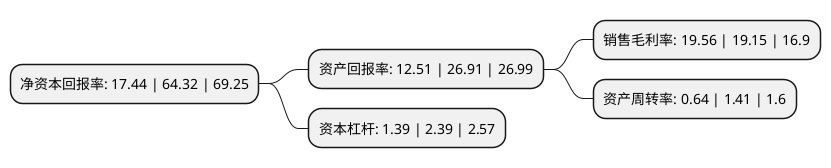

> 本页面由自动化程序生成于 2022年5月20日 01:22
> 内容可能存在错误，如有bug请提交issue至：https://github.com/Eroleice/doc-pi/issues
{.is-warning}

# 上市公司基本情况

## 基本资料

深圳市蕾奥规划设计咨询股份有限公司（以下简称“蕾奥规划”）成立于2008年05月07日，深圳市。于2021年05月07日在深交所创业板上市。

蕾奥规划注册资本6,000万元，主营业务包括规划设计业务和工程设计业务，其中，规划设计业务包括城乡规划，专项规划，规划咨询等;工程设计业务包括景观工程设计和市政工程设计等。以下是详细信息：

- 公司名称: 深圳市蕾奥规划设计咨询股份有限公司
- 股票代码: 300989.SZ
- 所在地: 广东 - 深圳市
- 成立日期: 2008年05月07日
- 注册资本: 6,000万元
- 法定代表人: 王富海
- 主营业务: 主营业务包括规划设计业务和工程设计业务，其中，规划设计业务包括城乡规划，专项规划，规划咨询等;工程设计业务包括景观工程设计和市政工程设计等
- 公司官网: www.lay-out.com.cn
- 公司介绍: 公司针对城镇化过程中的现实问题和需求，致力于为政府及各类开发建设主体提供精准有效并兼具操作性的建设规划解决方案。公司主营业务包括规划设计业务和工程设计业务，其中，规划设计业务包括城乡规划、专项规划、规划咨询等；工程设计业务包括景观工程设计和市政工程设计等。规划设计和工程设计均是城乡开发建设的必经环节。规划设计是在研究区域国土空间格局基础上，提出城市和乡村地区的未来发展方向和功能定位，对包括土地利用、区域布局、市政交通及建筑景观等方面建设内容作出综合安排和部署；工程设计则是根据具体建设工程的要求，在论证分析建设工程所需的技术、经济、资源、环境等条件基础上提出的可指导建设施工的设计方案。两者都属于专业技术服务，方向不同，但又紧密联系，规划设计预定的部分效果需要工程设计予以支撑和实现，工程设计需要以经批准或者确定的规划设计成果为依据，不得违反规划设计成果的控制性要求。

## 股东及高管情况

上市公司第一大股东为王富海，持股6,566,895股，占比10.94%，**疑似为**上市公司实际控制人。

截至2022年03月31日，上市公司的前十大股东中，共有9名自然人股东，1名机构股东，其中5%以上大股东共有5名。上市公司前十大股东明细如下：

> 未能通过持股比例判定出上市公司实际控制人（持股30%以上）
> 可能存在通过间接持股、联合持股、协议控制等方式拥有实际控制权的主体，具体请参考上市公司定期公告！
{.is-warning}

> 截至2022年03月31日，上市公司前十大股东信息如下：

| 股东名称 | 持股数量（股） | 持股比例 |
| --- | --- | --- |
| 王富海 | 6,566,895 | 10.94% |
| 深圳市蕾奥企业管理咨询合伙企业(有限合伙) | 4,916,115 | 8.19% |
| 王雪 | 3,127,095 | 5.21% |
| 陈宏军 | 3,127,095 | 5.21% |
| 朱旭辉 | 3,127,095 | 5.21% |
| 牛慧恩 | 2,188,980 | 3.65% |
| 金铖 | 2,188,980 | 3.65% |
| 蒋峻涛 | 1,979,685 | 3.3% |
| 邓军 | 1,979,685 | 3.3% |
| 张震宇 | 1,665,720 | 2.78% |

## 利润表分析

上市公司2021年总收入为5.25亿元，净利润为1.02亿元，实现盈利。

## 杜邦分析

> 数据列示周期：2021年 | 2020年 | 2019年
{.is-info}

上市公司的净资产收益率在近一年有所下降，下降幅度为-72.89%，其变化情况分解如下：
- 上市公司的销售毛利率在近一年上升了2.14%，可能是生产效率的提升、商品原材料价格下跌或商品价格的上涨所致。
- 上市公司的资产周转率在近一年下降了-54.61%，可能是源自于更慢的销售回款或库存管理效果下降。
- 上市公司的财务杠杆比率在近一年下降了-41.84%，可能是减少负债降低财务费用。

