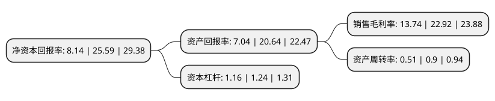

> 本页面由自动化程序生成于 2022年5月20日 01:22
> 内容可能存在错误，如有bug请提交issue至：https://github.com/Eroleice/doc-pi/issues
{.is-warning}

# 上市公司基本情况

## 基本资料

上海霍普建筑设计事务所股份有限公司（以下简称“霍普股份”）成立于2008年06月24日，上海市。于2021年07月28日在深交所创业板上市。

霍普股份注册资本4,239万元，建筑工程设计，装饰设计，环境景观设计，建筑专业领域内的技术咨询，技术服务(依法须经审批的项目，经相关部门批准后方可开展经营活动)。致力于在城市综合体，居住建筑，旅游养老建筑向客户提供一体化设计方案，拥有一系列住宅标准化产品。以下是详细信息：

- 公司名称: 上海霍普建筑设计事务所股份有限公司
- 股票代码: 301024.SZ
- 所在地: 上海 - 上海市
- 成立日期: 2008年06月24日
- 注册资本: 4,239万元
- 法定代表人: 龚俊
- 主营业务: 建筑工程设计，装饰设计，环境景观设计，建筑专业领域内的技术咨询，技术服务(依法须经审批的项目，经相关部门批准后方可开展经营活动)致力于在城市综合体，居住建筑，旅游养老建筑向客户提供一体化设计方案，拥有一系列住宅标准化产品
- 公司官网: www.hyp-arch.com
- 公司介绍: 公司拥有建筑设计甲级资质，办公地址设于中国上海浦东新区嘉里城，办公面积约2800平方米，现有建筑专业设计人员约200人。公司拥有一支经验丰富、精益求精的高水准、国际化专业设计团队，致力于建筑设计、城市设计等诸多领域的发展，在高端住宅和城市综合体设计领域，表现尤为突出。凭借雄厚的设计实力，国际化的设计理念，霍普建筑在中国境内已完成大量优秀设计作品并付诸实施，在业内取得了较高的知名度和良好的声誉。

## 股东及高管情况

上市公司第一大股东为上海霍普投资控股有限公司，持股27,000,000股，占比63.69%，为上市公司实际控制人。

截至2022年03月31日，上市公司的前十大股东中，共有7名自然人股东，3名机构股东，其中5%以上大股东共有1名。上市公司前十大股东明细如下：

> 截至2022年03月31日，上市公司前十大股东信息如下：

| 股东名称 | 持股数量（股） | 持股比例 |
| --- | --- | --- |
| 上海霍普投资控股有限公司 | 27,000,000 | 63.69% |
| 龚俊 | 1,800,000 | 4.25% |
| 上海霍璞企业管理合伙企业(有限合伙) | 1,090,000 | 2.57% |
| 赵恺 | 900,000 | 2.12% |
| 宋越 | 700,000 | 1.65% |
| 成立 | 300,000 | 0.71% |
| 王国良 | 212,200 | 0.5% |
| 曹永明 | 131,000 | 0.31% |
| 钟国强 | 128,600 | 0.3% |
| 华泰证券股份有限公司 | 92,306 | 0.22% |

## 利润表分析

上市公司2021年总收入为3.41亿元，净利润为0.46亿元，实现盈利。

## 杜邦分析

> 数据列示周期：2021年 | 2020年 | 2019年
{.is-info}

上市公司的净资产收益率在近一年有所下降，下降幅度为-68.19%，其变化情况分解如下：
- 上市公司的销售毛利率在近一年下降了-40.05%，可能是生产效率的下降、商品原材料价格上涨或商品价格的下跌所致。
- 上市公司的资产周转率在近一年下降了-43.33%，可能是源自于更慢的销售回款或库存管理效果下降。
- 上市公司的财务杠杆比率在近一年下降了-6.45%，可能是减少负债降低财务费用。

