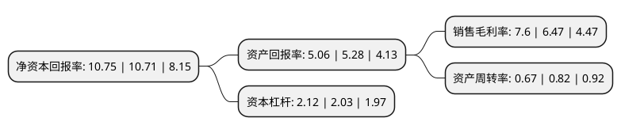

> 本页面由自动化程序生成于 2022年5月20日 01:22
> 内容可能存在错误，如有bug请提交issue至：https://github.com/Eroleice/doc-pi/issues
{.is-warning}

# 上市公司基本情况

## 基本资料

中粮工程科技股份有限公司（以下简称“中粮工科”）成立于1993年03月31日，无锡市。于2021年09月09日在深交所创业板上市。

中粮工科注册资本51,227.425万元，主营业务主要分为设计咨询，机电工程系统交付和工程承包等专业工程服务业务板块以及设备制造业务板块以下是详细信息：

- 公司名称: 中粮工程科技股份有限公司
- 股票代码: 301058.SZ
- 所在地: 江苏 - 无锡市
- 成立日期: 1993年03月31日
- 注册资本: 51,227.425万元
- 法定代表人: 姚专
- 主营业务: 主营业务主要分为设计咨询，机电工程系统交付和工程承包等专业工程服务业务板块以及设备制造业务板块
- 公司官网: www.cofcoet.com
- 公司介绍: 中粮工科是为小麦、稻米、油脂、玉米及饲料加工行业、粮食物流行业、农产品储藏行业、冷链仓储物流等行业的工程建设项目提供多样化服务的综合性设计咨询单位和工程承包商，也是粮油设备制造行业领先的制造商，为客户提供工程前期咨询、规划、设计、工程承包、系统交付、设备制造等专业化高质量的全程服务。公司拥有农粮加工行业种类齐全的高等级业务资质，是我国粮油及冷链等领域一流的综合性工程服务商及设备制造商。公司自成立以来牢牢把握技术驱动发展的主线，大力实施技术创新，拥有行业一流的技术水平。公司拥有国务院特殊津贴专家12人，各类注册工程师300余人；拥有4个国家级技术中心，4个国家级实验室及6个国家级检测中心；是全国粮油标准化技术委员会粮油机械分技术委员会、中国工程建设标准化协会商贸分会、全国制冷标准化技术委员会、中国农业机械工业协会粮油加工机械分会、中国粮油学会食品分会、中国粮油学会油脂分会的会长单位；拥有行业内唯一一家以粮食工程装备为研究内容的“粮食加工机械装备国家工程实验室”。

## 股东及高管情况

上市公司第一大股东为中谷粮油集团有限公司，持股202,243,856股，占比39.48%，为上市公司实际控制人。

截至2022年03月31日，上市公司的前十大股东中，共有8名机构股东，2个产品账户，其中5%以上大股东共有3名。上市公司前十大股东明细如下：

> 截至2022年03月31日，上市公司前十大股东信息如下：

| 股东名称 | 持股数量（股） | 持股比例 |
| --- | --- | --- |
| 中谷粮油集团有限公司 | 202,243,856 | 39.48% |
| 上海复星惟实一期股权投资基金合伙企业(有限合伙) | 83,961,600 | 16.39% |
| 共青城盛良投资管理合伙企业(有限合伙) | 37,572,900 | 7.33% |
| 深圳市明诚金融服务有限公司 | 17,492,000 | 3.41% |
| 合肥美亚光电技术股份有限公司 | 17,492,000 | 3.41% |
| 共青城盛良二豪投资合伙企业(有限合伙) | 15,013,058 | 2.93% |
| 共青城盛良一豪投资合伙企业(有限合伙) | 13,226,117 | 2.58% |
| 共青城盛良四豪投资合伙企业(有限合伙) | 12,318,900 | 2.4% |
| 共青城盛良三豪投资合伙企业(有限合伙) | 10,993,814 | 2.15% |
| 全国社保基金四一四组合 | 5,899,934 | 1.15% |

## 利润表分析

上市公司2021年总收入为21.69亿元，净利润为1.64亿元，实现盈利。

## 杜邦分析

> 数据列示周期：2021年 | 2020年 | 2019年
{.is-info}

上市公司的净资产收益率在近一年有所上升，上升幅度为0.37%，其变化情况分解如下：
- 上市公司的销售毛利率在近一年上升了17.47%，可能是生产效率的提升、商品原材料价格下跌或商品价格的上涨所致。
- 上市公司的资产周转率在近一年下降了-18.29%，可能是源自于更慢的销售回款或库存管理效果下降。
- 上市公司的财务杠杆比率在近一年上升了4.43%，可能是增加负债扩大生产规模。

