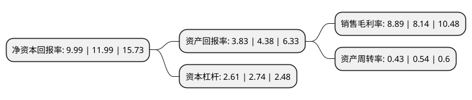

> 本页面由自动化程序生成于 2022年5月20日 01:22
> 内容可能存在错误，如有bug请提交issue至：https://github.com/Eroleice/doc-pi/issues
{.is-warning}

# 上市公司基本情况

## 基本资料

金埔园林股份有限公司（以下简称“金埔园林”）成立于1998年06月26日，南京市。于2021年11月12日在深交所创业板上市。

金埔园林注册资本10,560万元，公司主营业务为园林绿化建设项目的设计，施工以及苗木花卉种植与销售业务。以下是详细信息：

- 公司名称: 金埔园林股份有限公司
- 股票代码: 301098.SZ
- 所在地: 江苏 - 南京市
- 成立日期: 1998年06月26日
- 注册资本: 10,560万元
- 法定代表人: 王宜森
- 主营业务: 公司主营业务为园林绿化建设项目的设计，施工以及苗木花卉种植与销售业务
- 公司官网: www.nj-jp.com
- 公司介绍: 公司自成立以来便从事园林绿化建设项目的施工，并经过长期的实践和积累，逐步建立了集技术研发、规划设计、建设施工、苗木种植及后续养护的一体化经营能力，各项业务之间实现了优势互补、协同发展，实现了项目成本控制能力增强、经营模式及效率升级和质量品牌影响度提升等多重目标。公司主营业务为园林绿化建设项目的设计、施工以及苗木花卉种植与销售业务。近年来，公司已逐步积累了丰富的城市生态环境整体提升项目实践经验，围绕着国家提出的“城市双修”理念及海绵城市等政策的指导，重点布局和研究中小城市生态环境整体提升的运作模式，从“水、路、绿、景、城”五维度修复城市景观面貌，通过设计、施工一体化等模式，使业务理念转化成为业务收入。公司所承做项目获得过历年度“南京市优质工程奖‘金陵杯’”、“江苏省优质工程奖‘扬子杯’”、“江苏省绿化优质工程”、“江苏省绿色施工示范工程”、“2015-2016年度广东省风景园林优质样板工程银奖”、中国风景园林协会颁布的“优秀园林绿化工程奖银奖”等奖项。“金埔”商标荣获了江苏省工商行政管理局颁发的“江苏省著名商标”称号。

## 股东及高管情况

上市公司第一大股东为王宜森，持股25,480,000股，占比24.13%，**疑似为**上市公司实际控制人。

截至2022年03月31日，上市公司的前十大股东中，共有3名自然人股东，5名机构股东，2个产品账户，其中5%以上大股东共有3名。上市公司前十大股东明细如下：

> 未能通过持股比例判定出上市公司实际控制人（持股30%以上）
> 可能存在通过间接持股、联合持股、协议控制等方式拥有实际控制权的主体，具体请参考上市公司定期公告！
{.is-warning}

> 截至2022年03月31日，上市公司前十大股东信息如下：

| 股东名称 | 持股数量（股） | 持股比例 |
| --- | --- | --- |
| 王宜森 | 25,480,000 | 24.13% |
| 珠海铧创投资管理有限公司 | 8,000,000 | 7.58% |
| 南京高科新创投资有限公司 | 6,250,000 | 5.92% |
| 王建优 | 5,000,000 | 4.73% |
| 南京金麟企业管理中心(有限合伙) | 4,500,000 | 4.26% |
| 苏州新区高新技术产业股份有限公司 | 4,500,000 | 4.26% |
| 金雪梅 | 3,230,800 | 3.06% |
| 深圳市海盛投资基金管理有限公司 | 2,250,000 | 2.13% |
| 长江证券资管-宁波银行-长江资管星耀金埔园林员工参与创业板战略配售集合资产管理计划 | 2,144,012 | 2.03% |
| 南京丽森企业管理中心(有限合伙) | 2,000,000 | 1.89% |

## 利润表分析

上市公司2021年总收入为9.58亿元，净利润为0.85亿元，实现盈利。

## 杜邦分析

> 数据列示周期：2021年 | 2020年 | 2019年
{.is-info}

上市公司的净资产收益率在近一年有所下降，下降幅度为-16.68%，其变化情况分解如下：
- 上市公司的销售毛利率在近一年上升了9.21%，可能是生产效率的提升、商品原材料价格下跌或商品价格的上涨所致。
- 上市公司的资产周转率在近一年下降了-20.37%，可能是源自于更慢的销售回款或库存管理效果下降。
- 上市公司的财务杠杆比率在近一年下降了-4.74%，可能是减少负债降低财务费用。

