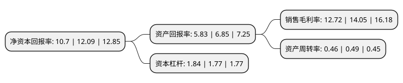

> 本页面由自动化程序生成于 2022年5月20日 01:23
> 内容可能存在错误，如有bug请提交issue至：https://github.com/Eroleice/doc-pi/issues
{.is-warning}

# 上市公司基本情况

## 基本资料

福建省招标股份有限公司（以下简称“招标股份”）成立于2016年12月08日，福州市。于2022年01月11日在深交所创业板上市。

招标股份注册资本27,520.482万元，主营业务包括工程监理，试验检测，招标服务，测绘与地理信息服务，勘察设计以及其他工程咨询服务以下是详细信息：

- 公司名称: 福建省招标股份有限公司
- 股票代码: 301136.SZ
- 所在地: 福建 - 福州市
- 成立日期: 2016年12月08日
- 注册资本: 27,520.482万元
- 法定代表人: 张亲议
- 主营业务: 主营业务包括工程监理，试验检测，招标服务，测绘与地理信息服务，勘察设计以及其他工程咨询服务
- 公司官网: www.fjzbgf.com
- 公司介绍: 公司专注于工程咨询业务数十年，是专业从事工程监理、试验检测、招标服务、测绘与地理信息服务、勘察设计以及其他技术服务的综合性工程咨询服务提供商。公司提供的工程咨询服务能够帮助客户提高工程建设的质量、效率，降低建设成本。公司的业务覆盖公路、水运、建筑、市政、水利水电、自然资源、海洋、机电安装、农林、铁路等多个领域。

## 股东及高管情况

上市公司第一大股东为福建省招标采购集团有限公司，持股148,500,000股，占比53.96%，为上市公司实际控制人。

截至2022年03月31日，上市公司的前十大股东中，共有9名机构股东，1个产品账户，其中5%以上大股东共有1名。上市公司前十大股东明细如下：

> 截至2022年03月31日，上市公司前十大股东信息如下：

| 股东名称 | 持股数量（股） | 持股比例 |
| --- | --- | --- |
| 福建省招标采购集团有限公司 | 148,500,000 | 53.96% |
| 福建省国企改革重组投资基金(有限合伙) | 12,384,217 | 4.5% |
| 漳州市龙海区国有资产投资经营有限公司 | 10,320,181 | 3.75% |
| 福建漳龙投资有限公司 | 10,320,181 | 3.75% |
| 福建省永旭一号投资合伙企业(有限合伙) | 9,030,000 | 3.28% |
| 福建省港口集团有限责任公司 | 6,653,992 | 2.42% |
| 福建省永旭三号投资合伙企业(有限合伙) | 6,325,000 | 2.3% |
| 福建省永旭二号投资合伙企业(有限合伙) | 5,960,000 | 2.17% |
| 福建省健坤德行资产管理有限责任公司 | 2,064,036 | 0.75% |
| 福建省六一八产业发展有限公司 | 1,500,000 | 0.55% |

## 杜邦分析

> 数据列示周期：2021年 | 2020年 | 2019年
{.is-info}

上市公司的净资产收益率在近一年有所下降，下降幅度为-11.5%，其变化情况分解如下：
- 上市公司的销售毛利率在近一年下降了-9.47%，可能是生产效率的下降、商品原材料价格上涨或商品价格的下跌所致。
- 上市公司的资产周转率在近一年下降了-6.12%，可能是源自于更慢的销售回款或库存管理效果下降。
- 上市公司的财务杠杆比率在近一年上升了3.95%，可能是增加负债扩大生产规模。

